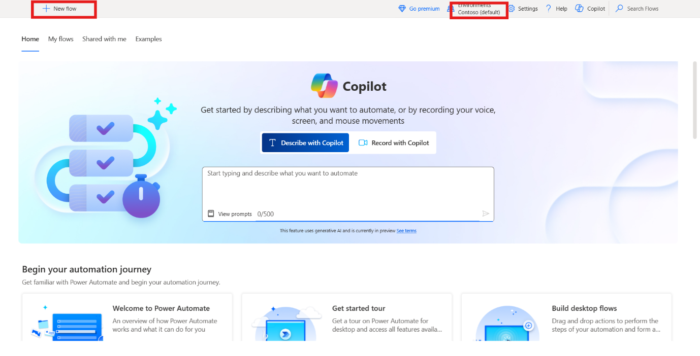

# Lab 10 - Progettare un flusso per generare username e password

**Obiettivo:** l'obiettivo di questo lab è creare e testare un flusso di
Power Automate Desktop che genera un nome utente e una password casuale
in base all'input dell'utente. Completando questo lab, i partecipanti
impareranno come progettare e automatizzare un flusso utilizzando le
azioni di Power Automate Desktop, tra cui la gestione della
manipolazione del testo e la generazione di testo casuale.

**Tempo stimato:** 20 minuti

# Attività 1: Creare un flusso desktop di Power Automate

1.  Accedere e aprire **Power Automate Desktop with office 365 tenant**
    e scegliere un ambiente (**Contoso**). Nell'angolo in alto a
    sinistra seleziona **+ New flow.**

- 

2.  Inserire il nome del flusso +++**Generate Username and
    Password**+++, conferma che il **Power Fx** è disattivato e fare
    clic su **Create**.

- 

3.  Da barra delle Actions sinistra, cercare +++**Display input
    dialog**+++ azione e fare doppio clic sull'azione da selezionare.

- 

4.  Impostare la proprietà **Input dialog title** su +++**Name
    Input**+++ e la proprietà **Input dialog message** su +++**Please
    enter your first and last name (for example, Adele Vance)**+++.
    Questa azione visualizza un messaggio che richiede l'input
    all'utente. Fare clic sul pulsante **Save**.

- 

5.  Da sinistra, nella barra delle Actions, cercare +++**Split text**+++
    azione e fare doppio clic sull'azione da selezionare.

- 

6.  Nel campo **Text to split** dell'azione Split text, inserire
    +++**%UserInput%**+++ e quindi fare clic su **Save**.

- 

7.  Da sinistra, nella barra delle Actions, cercare +++**Change text
    case**+++ azione e fare doppio clic sull'azione da selezionare.

- 

8.  Nel campo Testo da convertire, inserire +++**%TextList\[0\]%**+++.

9.  Con l'indice di una variabile di tipo elenco, specificare il primo
    elemento dell'elenco, ovvero il nome. Impostare Converti in **Lower
    case** e quindi fare clic su **Save**.

- 

10. Da sinistra, nella barra delle Actions, cercare +++**Change text
    case**+++ azione e fare doppio clic sull'azione da selezionare.

- 

11. Nel campo **Text to convert**, inserire +++**%TextList\[1\]%**+++.

12. Con l'indice di una variabile di tipo elenco, specificare il primo
    elemento dell'elenco, ovvero il nome. Imposta la proprietà Converti
    in su **Lower case** e quindi fare clic su **Save**.

- 

13. Da sinistra, nella barra delle Actions, cercare +++**Get
    subtext**+++ azione e fare doppio clic sull'azione da selezionare.

- 

14. Nel campo Original text, inserire +++**%TextWithNewCase%**+++, Nella
    sezione Start index, imposta Posizione carattere su +++**0**+++

15. Nella sezione Length, impostare Numero di caratteri su +++**1**+++.
    Questa impostazione ottiene il primo carattere della stringa di
    testo.

16. Fare clic su **Save**.

- 

17. Per generare una password casuale, aggiungi un **Create random
    text**. Le proprietà dell'azione possono essere lasciate ai valori
    predefiniti. Quindi fare clic su **Save.**

- 

18. Da sinistra, nella barra delle Actions, cercare +++**Display
    message**+++ azione e fare doppio clic sull'azione da selezionare.

- 

19. Nel campo **Message box title**, inserire +++**Username &
    Password**+++, e nel campo **Message to display**, inserire il
    seguente contenuto:

- +++Hello, %UserInput%, your username is: %SubText%%TextWithNewCase2% Your temporary password is: %RandomText%+++

20. Viene visualizzato il nome utente (prima lettera del nome, combinata
    con il cognome) e il risultato dell'azione **Generate random text** 
    viene visualizzato come password dell'utente. Fare clic sul pulsante
    **Save**.

- 

21. Il **flusso completato** dovrebbe essere simile alla figura
    seguente.

- 

# Attività 2: Testare il flusso

1.  Fare clic sul pulsante **Run** per testare il flusso.

- 

2.  Inserire il **First and Last Name** a scopo di test e fare clic sul
    pulsante **Ok**.

- 

3.  L'**output finale** del test case è simile a quello riportato di
    seguito.

- 

**Conclusione:** In questo laboratorio, i partecipanti hanno progettato
e testato con successo un flusso di Power Automate Desktop che genera un
nome utente e una password casuali in base all'input dell'utente.
Utilizzando azioni di manipolazione del testo, come la divisione, il
cambio di maiuscole e minuscole e la generazione di testo casuale, i
partecipanti hanno acquisito esperienza pratica nell'automazione di
attività specifiche dell'utente. Il flusso illustra come creare
dinamicamente un nome utente e una password utilizzando le funzionalità
di base di Power Automate Desktop. Questo laboratorio getta le basi per
la creazione di flussi di automazione più complessi nelle attività
future.
