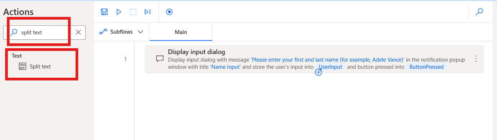
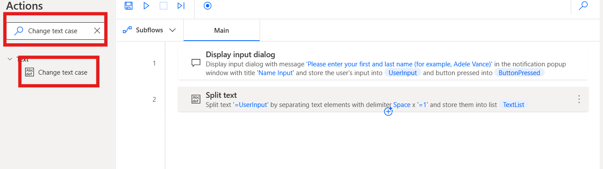
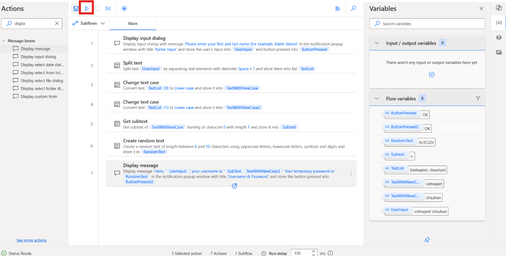

# Lab 10 - Entwerfen eines Flows zum Generieren von Benutzername und Passwort

**Ziel:** Das Ziel dieses Labs besteht darin, einen Power Automate
Desktop-Flow zu erstellen und zu testen, der einen Benutzernamen und ein
zufälliges Passwort basierend auf Benutzereingaben generiert. Nach
Abschluss dieses Labs lernen die Teilnehmer, wie sie einen Flow mithilfe
von Power Automate Desktop-Aktionen entwerfen und automatisieren,
einschließlich der Handhabung von Textmanipulation und der Generierung
von zufälligem Text.

**Geschätzte Zeit:** 20 Minuten

# Aufgabe 1: Erstellen eines Power Automate Desktop-Flows

1.  Melden Sie sich an, öffnen Sie **Power Automate Desktop with Office
    365 tenant**, und wählen Sie eine Umgebung (**Contoso**) aus. Wählen
    Sie in der oberen linken Ecke **+ New flow** aus**.**

- 

2.  Geben Sie den Flow-Namen **+++Generate Username and Password+++**
    ein, bestätigen Sie, dass **Power** **Fx** ausgeschaltet ist, und
    klicken Sie auf **Create**.

- 

3.  Suchen Sie in der linken Aktionsleiste die Aktion **+++Display input
    dialog+++** und doppelklicken Sie auf die auszuführende Aktion.

- 

4.  Legen Sie die Eigenschaft **Input dialog title** auf **+++Name
    Input+++** und die Eigenschaft **Input dialog message** auf
    +++**Please enter your first and last name** (**for example, Adele
    Vance**)+++. Bei dieser Aktion wird eine Meldung angezeigt, in der
    der Benutzer zur Eingabe aufgefordert wird. Klicken Sie auf die
    Schaltfläche **Save**.

- 

5.  Suchen Sie in der linken Aktionsleiste nach **+++Split text+++**
    Aktion und doppelklicken Sie auf die Aktion, um sie auszuwählen.

- 

6.  Geben Sie im Feld **Text to split** der Aktion „Split
    text“+++**%UserInput%**+++ ein und klicken Sie dann auf **Save**

- 

7.  Suchen Sie in der linken Aktionsleiste nach **+++Change text
    case+++** und doppelklicken Sie auf die Aktion, um sie auszuwählen.

- 

8.  Geben Sie im Feld “Text to convert” +++**%TextList\[0\]%**+++ ein.

9.  Geben Sie mit dem Index einer Variablen vom Typ "Liste" das erste
    Element der Liste an, bei dem es sich um den ersten Namen handelt.
    Stellen Sie die Option Konvertieren in **Lower case** ein und
    klicken Sie dann auf **Save**

- 

10. Suchen Sie in der linken Aktionsleiste nach **+++Change text
    case+++** und doppelklicken Sie auf die Aktion, um sie auszuwählen.

- 

11. Geben Sie im Aktionsfeld **Text to convert**
    +++**%TextList\[1\]%**+++ ein.

12. Geben Sie mit dem Index einer Variablen vom Typ "Liste" das erste
    Element der Liste an, bei dem es sich um den ersten Namen handelt.
    Setzen Sie die Eigenschaft „Convert to“auf **Lowercase** und klicken
    Sie dann auf **Save.**

- 

13. Suchen Sie in der linken Aktionsleiste nach **+++Get subtext+++**
    Aktion und doppelklicken Sie auf die Aktion, um sie auszuwählen.

- 

14. Geben Sie im Feld Originaltext +++**%TextWithNewCase%**+++ ein.
    Legen Sie im Abschnitt Startindex die Zeichenposition auf
    +++**0**+++ fest.

15. Legen Sie im Abschnitt Länge die Anzahl der Zeichen auf +++**1**+++
    fest. Mit dieser Einstellung wird das erste Zeichen der
    Textzeichenfolge abgerufen.

16. Klicken Sie auf **Save**.

- 

17. Um ein zufälliges Passwort zu generieren, fügen Sie die Aktion
    **Create a random text** . Die Eigenschaften der Aktion können auf
    ihren Standardwerten belassen werden. Klicken Sie dann auf **Save.**

- 

18. Suchen Sie in der linken Aktionsleiste nach **+++Display
    message+++** Aktion und doppelklicken Sie auf die Aktion, um sie
    auszuwählen.

- 

19. Geben Sie im Feld **Message box title +++Username & Password+++**
    ein, und geben Sie im Feld **Message to display** den folgenden
    Inhalt ein:

> `+++Hello, %``UserInput``%, your username is: %``SubText``%%TextWithNewCase2% Your temporary password is: %``RandomText``%+++`

20. Der Benutzername (erster Buchstabe des Vornamens, kombiniert mit dem
    Nachnamen) wird angezeigt, und das Ergebnis der Aktion **Generate
    random text** wird als Passwort des Benutzers angezeigt. Klicken Sie
    auf die Schaltfläche **Save**.

- 

21. Der abgeschlossene Flow sollte wie in der folgenden Abbildung
    aussehen.

- 

# Aufgabe 2: Testen des Flows

1.  Klicken Sie auf die Schaltfläche **Run**, um den Flow zu testen.

- 

2.  Geben Sie den **First and Last name** für den Test ein und klicken
    Sie auf die Schaltfläche **OK**.

- 

3.  Die endgültige Ausgabe des Testfalls sieht einmal wie folgt aus.

- 

**Fazit:** In diesem Lab haben die Teilnehmer erfolgreich einen Power
Automate Desktop-Flow entworfen und getestet, der basierend auf
Benutzereingaben einen Benutzernamen und ein zufälliges Passwort
generiert. Durch den Einsatz von Textmanipulationsaktionen, wie z. B.
Aufteilen, Ändern der Groß- und Kleinschreibung und Generieren von
zufälligem Text, sammelten die Teilnehmer praktische Erfahrungen in der
Automatisierung benutzerspezifischer Aufgaben. Der Flow veranschaulicht,
wie Sie mithilfe grundlegender Power Automate Desktop-Funktionen
dynamisch einen Benutzernamen und ein Passwort erstellen. Dieses Lab
legt den Grundstein für die Erstellung komplexerer Automatisierungsflows
in zukünftigen Aufgaben.
