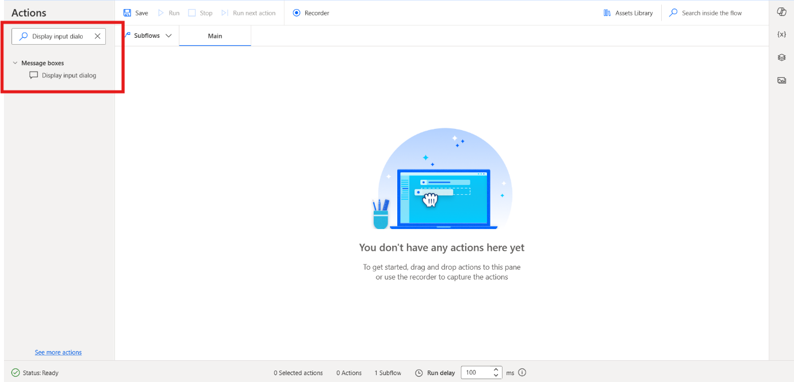
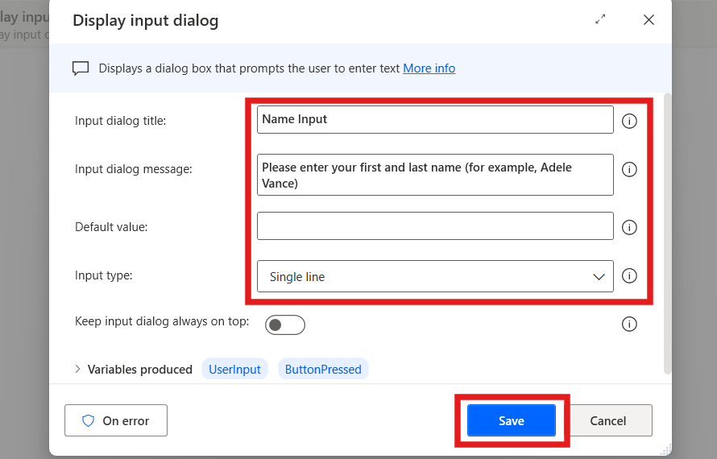
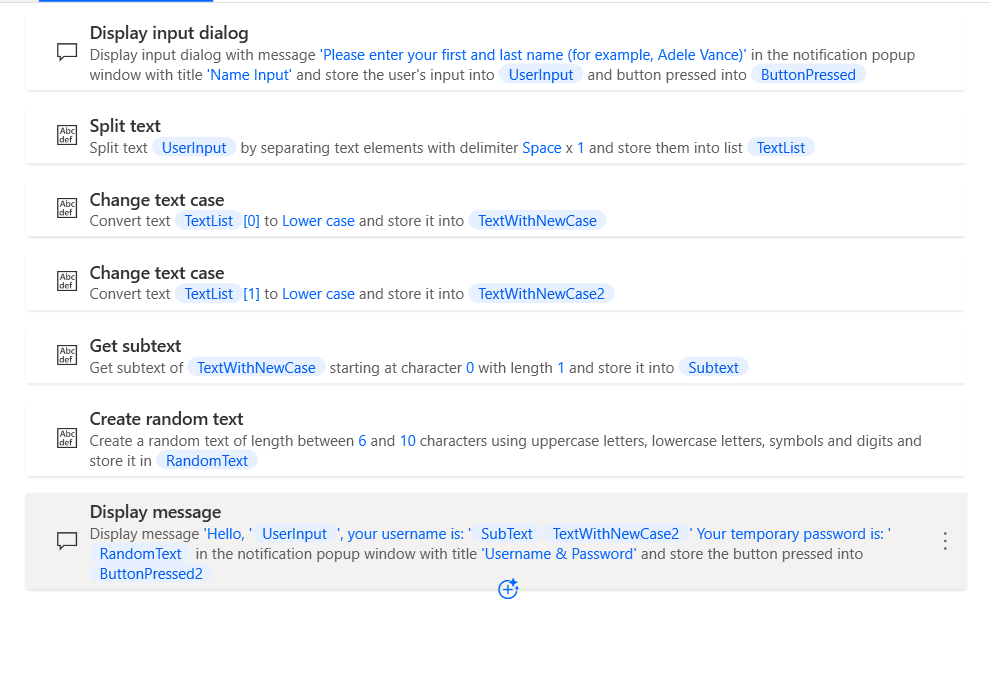

**ラボ10－ユーザー名とパスワードを生成するフローを設計する**

**目的：**このラボの目的は、ユーザー入力に基づいてユーザー名とランダムパスワードを生成するPower
Automate
Desktopフローを作成し、テストすることです。このラボを完了することで、参加者はPower
Automate
Desktopアクションを使用してフローを設計および自動化する方法（テキスト操作の処理やランダムテキストの生成など）を習得します。

**所要時間：** 20分

## タスク１： Power Automate デスクトップ フローを作成する

1.  **Power Automate Desktop with office 365
    tenant**にログインし、環境（ **Contoso** ）を選択します。左上隅の**+
    New flow**を選択します。

> 

2.  フロー名 +++**Generate Username and Password**+++を入力し、 **Power
    Fx**をオフにしていることを確認して、**Create**をクリックします。

> 

3.  左側のアクション バーから +++**Display input
    dialog**+++アクションを検索し、アクションをダブルクリックして選択します。

> 

4.  **Input dialog title**プロパティを**+++Name
    Input+++**に設定し、**Input dialog message**プロパティを+++**Please
    enter your first and last name (for example, Adele
    Vance)**+++に設定します。このアクションにより、ユーザーに入力を促すメッセージが表示されます。**Save**ボタンをクリックします。

> 

5.  左側のアクション バーから+++**Split
    text**+++アクションを検索し、アクションをダブルクリックして選択します。

> 

6.  分割アクションの**Text to
    split**フィールドに+++**%UserInput%**+++**と入力し、Save**をクリックします。

> 

7.  左側のアクション バーから+++**Change text
    case**+++アクションを検索し、アクションをダブルクリックして選択します。

> 

8.  変換するテキストフィールドに+++**%TextList\[0\]%**+++と入力します。

9.  リスト型変数のインデックスを使用して、リストの最初の項目（名）を指定します。「**Convert
    to**」を**Lower case**に設定し、**Save**をクリックします。

> 

10. 左側のアクション バーから +++**Change text
    case**+++アクションを検索し、アクションをダブルクリックして選択します。

> 

11. アクションの**Text to convert**フィールドに+++ **% TextList \[1\]%**
    +++と入力します。

12. リスト型変数のインデックスを使用して、リストの最初の項目（名）を指定します。「**Convert
    to**」プロパティを**Lower case**に設定し、**Save**をクリックします。

> 

13. 左側のアクション バーから+++**Get
    subtext**+++アクションを検索し、アクションをダブルクリックして選択します。

> 

14. 元のテキストフィールドに+++**%TextWithNewCase%**+++と入力し、Startインデックスセクションで文字位置を
    +++ **0** +++に設定します。

15. 長さセクションで、文字数を「+++ **1**
    +++」に設定します。この設定により、テキスト文字列の最初の文字が取得されます。

16. **Save**をクリックします。

> 

17. ランダムなパスワードを生成するには、**Create random
    text**アクションを追加します。アクションのプロパティはデフォルト値のままにしておきます。**Save**をクリックします。

> 

18. 左側のアクション バーから +++**Display
    message**+++アクションを検索し、アクションをダブルクリックして選択します。

> 

19. **Message box title**フィールドに**+++Username &
    Password+++**と入力し、**Message to
    display** フィールドに次の内容を入力します：

> +++Hello, %UserInput%, your username is: %SubText%%TextWithNewCase2% Your   temporary password is: %RandomText%+++

20. ユーザー名（名の最初の文字と姓を組み合わせたもの）が表示され、**Generate
    random
    text**アクションの結果がユーザーのパスワードとして表示されます。
    **Save**ボタンをクリックしてください。

> 

21. **Completed flow**は次の図のようになります。

> 

## タスク２：フローをテストする

1.  フローをテストするには、**Run**ボタンをクリックします。

> 

2.  テスト目的で**First and Last
    Name**を入力し、**OK**ボタンをクリックします。

> 

3.  テストケースの**最終出力**は以下のようになります。

> 

**まとめ：**このラボでは、参加者はユーザー入力に基づいてユーザー名とランダムなパスワードを生成するPower
Automate
Desktopフローを設計し、テストしました。テキストの分割、大文字と小文字の変換、ランダムテキストの生成といったテキスト操作アクションを活用することで、参加者はユーザー固有のタスクの自動化に関する実践的な経験を積むことができました。このフローでは、Power
Automate
Desktopの基本機能を用いてユーザー名とパスワードを動的に生成する方法を実演しています。このラボは、将来のタスクにおいてより複雑な自動化フローを構築するための基盤となります。
