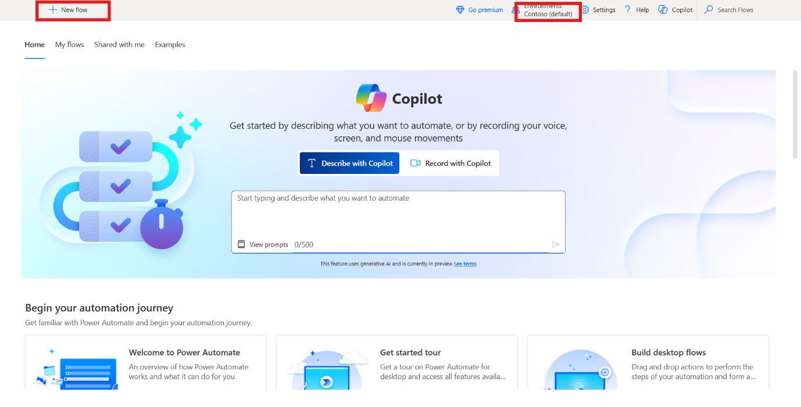
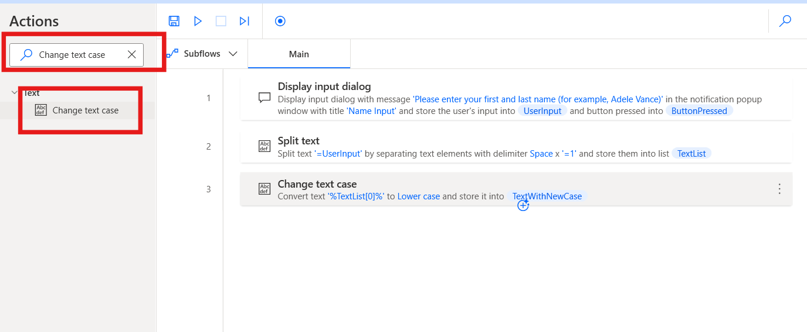
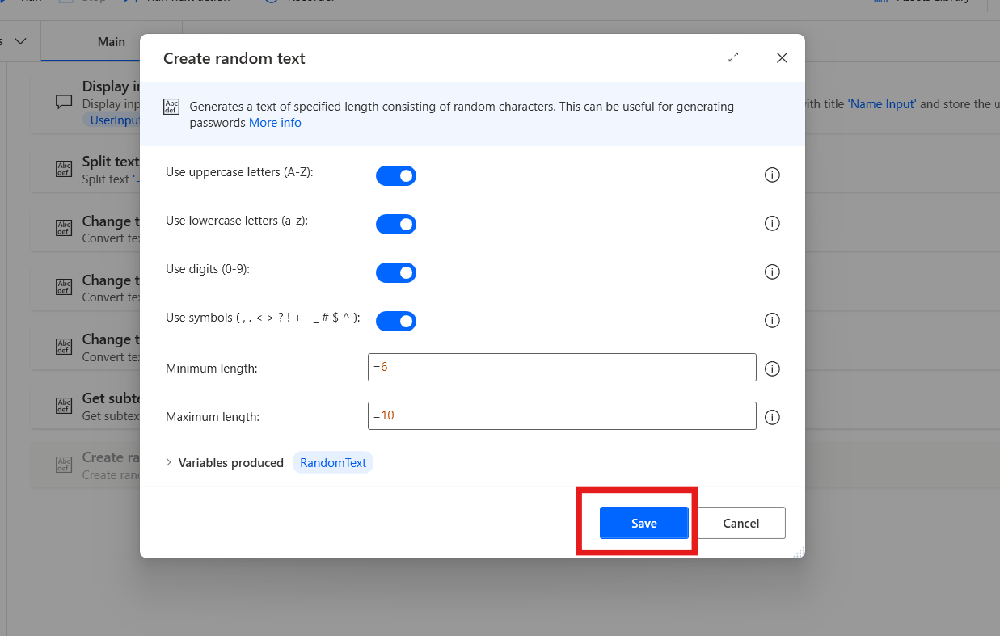
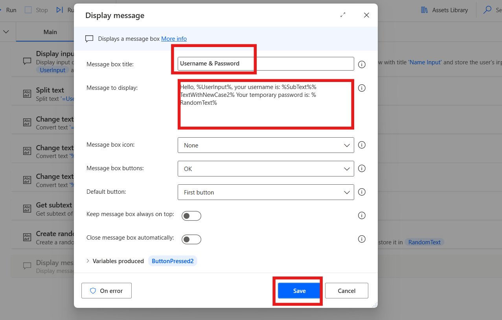
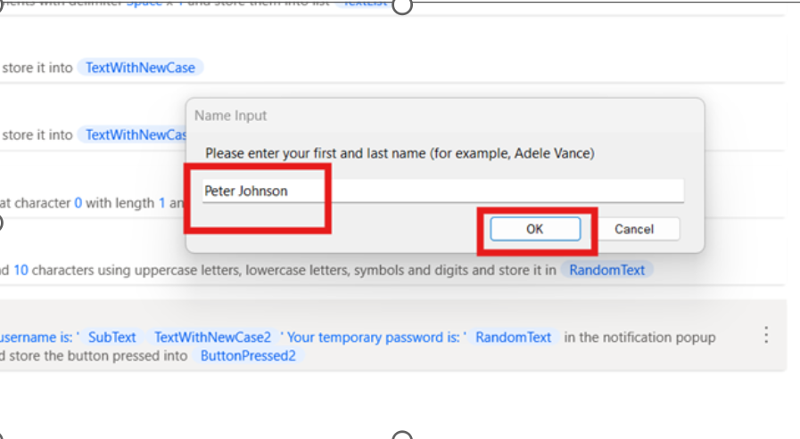
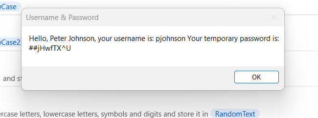

Laboratorio 10 - Diseñe un flow para generar username y contraseña

**Objetivo:** El objetivo de este alboratorio es crear y probar un Power
Automate Desktop flow que genera un username, y una contraseña aleatoria
en función del user input. Al completar este laboratorio, los
participantes aprenderán a diseñar y automatizar un flow con Power
Automate Desktop actions, incluidos el handling text manipulation y la
generación de texto aleatorio.

**Duración estimada:** 20 minutos

## Tarea 1: Cree un Power Automate Desktop Flow

1.  Inicie sesión y abra **Power Automate Desktop with office 365
    tenant** y elija un environment (**Contoso**). Desde la esquina
    superior izquierda, seleccione **+ New flow.**

> 

2.  Introduzca el Flow name +++**Generate Username and Password**+++,
    active **Power Fx** y haga clic en **Create**.

> 

3.  Desde el Actions bar izquierdo, busque +++**Display input
    dialog**+++ action y haga doble clic en el action para
    seleccionarlo.

> 

4.  Establezca el **Input dialog title** property a +++**Name
    Input**+++ y el **Input dialog message** property a +++**Please
    enter your first and last name (for example, Adele Vance)**+++. Esta
    action muestra un mensaje que pide al usuario el input. Haga clic en
    el botón **Save**.

> 

5.  Desde el Actions bar izquierdo, busque +++**Split text**+++ action y
    haga doble clic en el action para seleccionarlo.

> 

6.  En el **Text to split** field del Split text action,
    introduzca +++**=UserInput**+++ y haga clic en **Save**.

> 

7.  Desde el Actions bar izquierdo, busque +++**Change text case**+++
    action y haga doble clic en el action para seleccionarlo.

> 

8.  En el campo Text to convert, introduzca +++**%TextList\[0\]%**+++.

9.  Con el índice de list type variable, proporcione el primper elemento
    de la lista, los que es first name. Establezca el Convert to
    como **Lower case** y haga clic en **Save**.

> 

10. Desde el Actions bar izquierdo, busque +++**Change text case**+++
    action y haga doble clic en el action para seleccionarlo.

> 

11. En el campo **Text to convert** de action, introduzca
    +++**%TextList\[1\]%**+++.

12. Con el índice de list type variable, proporcione el primper elemento
    de la lista, lo que es first name. Establezca el Convert to property
    a **Lower case** y haga clic en **Save**.

> 

13. Desde el Actions bar izquierdo, busque +++**Get subtext**+++ action
    y haga doble clic en action para seleccionarlo.

> 

14. En el campo Original text, introduzca +++**%TextWithNewCase%**+++,
    en la sección Start index, establezca Character position a
    +++**0**+++

15. En la sección Length, establezca el Number of chars a +++**1**+++.
    Esta configuración obtiene el primer carácter del text string.

16. Haga clic en **Save**.

> 

17. Para generar una contraseña aleatoria, agregue un **Create random
    text** action. Se puede dejar los properties de action en sus
    valores predeterminados. Luego, haga clic en **Save.**

> 

18. Desde el Actions bar izquierdo, busque +++**Display message**+++
    action y haga doble clic en action para seleccionarlo.

> 

19. En el **Message box title** field, introduzca +++**Username &
    Password**+++, y en el **Message to display** field, introduzca el
    siguiente contenido:

> +++Hello, %UserInput%, your username is: %SubText%%TextWithNewCase2%
> Your temporary password is: %RandomText%+++

20. Se ve el username (Primera letra del nombre, combinada con el
    apellido) y el resultado de **Generate random text** action se
    muestra como la contraseña del usuario. Haga clic en el
    botón **save**.

> 

21. Se debe ver el **completed flow** así.

> 

## Tarea 2: Pruebe el flow

1.  Haga clic en el botón **Run** para probar el flow.

> 

2.  Introduzca **First and Last Name** para testing purpose y haga clic
    en el botón **Ok**.

> 

3.  El **Final output** del test case se debe ver así.

> 

**Conclusión:** En este laboratorio, Los participantes diseñaron y
probaron con éxito un Power Automate Desktop flow que genera un nombre
de usuario y una contraseña aleatorios en función de la entrada del
usuario. Al utilizar acciones de manipulación de texto, como dividir,
cambiar mayúsculas y minúsculas y generar texto aleatorio, los
participantes adquirieron experiencia práctica en la automatización de
tareas específicas del usuario. El flujo muestra cómo crear
dinámicamente un nombre de usuario y una contraseña mediante las
características básicas de Power Automate Desktop. Este laboratorio
sienta las bases para crear flujos de automatización más complejos en
tareas futuras.
