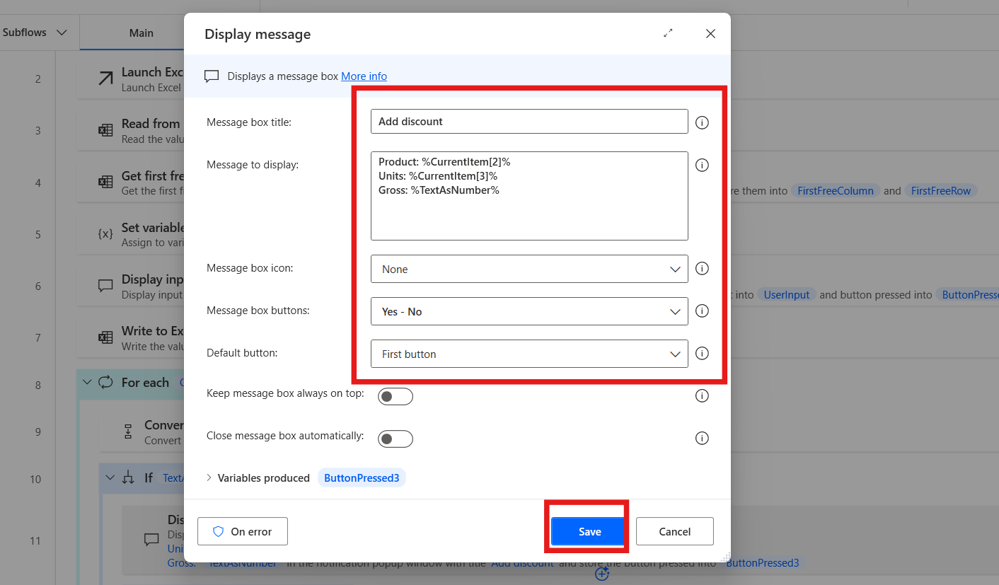
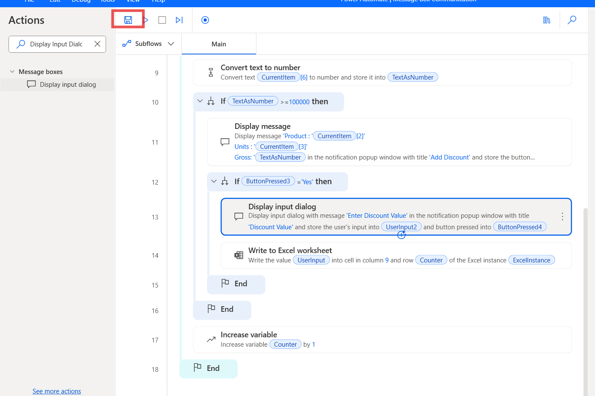
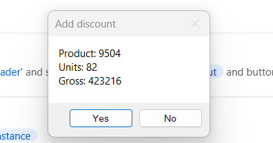

# 實驗 11 - 開發一個有人值守的流程，用於讀取訂單並提示用戶選擇折扣

**目標：** 本實驗的目標是開發一個 **attended Power Automate Desktop
flow**，該流可自動執行從 Excel
文件讀取訂單的過程，並提示用戶根據特定條件應用折扣。參與者將創建一個流，該流讀取數據，檢查訂單金額是否超過特定閾值，並提示用戶決定是否應用折扣，並可選擇輸入折扣值。然後，該流程將使用應用的折扣更新
Excel 工作表。

**預計時間：** 25 分鐘

### 任務 1：創建 Power Automate 桌面流

1.  打開 **Power automate** 桌面並使用 **office 365 tenant
    credential**。

2.  選擇環境 **Contoso**，然後單擊 **+ New then Flow** 並開始創建新流。

- 

3.  輸入 +++**Message Box Communication**+++ 作為流名稱，並確認 Power Fx
    enable （Preview） 已關閉。然後點擊 **Create**。

- 

4.  首先提示用戶選擇一個 Excel 文件。添加 +++**Display select file
    dialog**+++作，並將 File filter 字段配置為僅允許 xlsx 文件。

- 

5.  輸入**Dialog Title** +++ **Select Excel**+++，輸入文件夾在 **initial
    folder** 中的位置 **+++ C：**文件+++ 過濾器 as **\*.xlsx**然後單擊
    **Save** 按鈕。

- 

6.  在從所選文件中讀取任何數據之前，您必須使用 **Launch
    Excel**作啟動該文件。從作中添加 **Launch Excel**。然後配置以下設置。

    - 啟動 Excel: **add open the following document**

    - 文檔路徑: +++**%SelectedFile%**+++

    &nbsp;

    - 點擊保存按鈕

- 

7.  要從 Excel 文件中讀取數據，請添加從 **Excel 工作表讀取**作在 Excel
    實例中輸入 **%ExcelInstance%**，然後在檢索字段中選擇 **All available
    values from worksheet**。點擊 **Save** 按鈕。

- 

8.  添加 **Get first free column/row from Excel worksheet** 作，以檢索
    Excel 工作表中的第一個空閒列和行。在 **Excel 實例中輸入**
    %ExcelInstance%，然後單擊**save**按鈕。

- 

9.  添加一個名為 **Counter** 的 Set Variable from作 並將其初始化為
    **1**，然後單擊保存。

- 

10. 從作中添加 **Display input dialog** 並配置以下字段。

    - **Input Dialog Title**: +++**Header**+++

    - **Input Dialog Message**: +++**Enter the Header**+++

    - **Default Value**: +++**Discount**+++

    - 點擊**save**按鈕。

- 

11. 從作中添加 **Write to Excel worksheet**
    並使用以下詳細信息對其進行配置:

    - **Excel instance**: %ExcelInstance%

    - **Value to write**: +++**%UserInput%**+++

    - **Write role**: On specific cell

    - **Column**: +++**9**+++

    - **Row**: +++**%Counter%**+++

    - 點擊**save**按鈕。

- 

12. 添加一個 **For each** 循環 for作以迭代檢索到的數據，並將
    +++**%ExcelData%**+++ 添加到要迭代的值部分。然後點擊 Save。

- 

13. 要檢查 **Gross** 列（G 列或工作表中的第六列，在工作表中列的名稱為
    “6”）的值，請添加 **convert text to number** 作。配置文本以轉換為
    +++**%CurrentItem\[6\]%**+++，然後單擊保存按鈕。

- 

14. 添加 **If**作以檢查它是否超過 100,000 並配置它，如下所示:

    - **First operand**: +++**%TextAsNumber%**+++

    - **Operator**: Greater than or equal to (\>=)

    - **Second Operand**: +++**100000**+++

- 

15. 在 **If** 下添加 **Display
    message**作，以向用戶提供必要的信息，並提示他們選擇 **Yes** 或
    **No**。然後點擊 **Save** 按鈕。在 **it** 中輸入以下詳細信息:

    - **Message Box title**: +++**Add discount**+++
    - **Message to display**:
      - +++**Product:** %CurrentItem\[2\]%+++
      - +++**Units**: %CurrentItem\[3\]%+++
      - +++**Gross:** %TextAsNumber%+++
    - **Message box button**: Yes – No

- 

16. 在 Display message action 下添加第二個
    **If**作，以檢查在上一步中按下了哪個按鈕。在相關字段中輸入以下詳細信息:

- **First** **operand**: +++%ButtonPressed3%+++

- **Operator:** Equal to (=)

- **Second operand:** +++Yes+++

 

- 

17. 在第二個 If Add **Display Input Dialog**
    作下。在字段中添加給定的以下參數，然後單擊 **Save** 按鈕。

Input dialog title: +++Discount Value+++

Input dialog message: +++Enter the Discount Value+++

18. 添加 **Write to excel worksheet** 作在第二個 **IF**
    作下方，並在其中輸入以下詳細信息:

- **Excel instance:** +++%ExcelInstance%+++

- **Value to writer**: +++%UserInput2%+++

- **Write mode:** On specific cell

- **Column:** +++9+++

- **Row:** +++%Counter%+++

&nbsp;

- 

19. 在 第一 **IF End，** 添加作**Increase Variable 下，** 添加變量名稱為
    **%Counter%** ，增加 **1** ，然後單擊 **Save** 按鈕。

> 

20. 從頂部欄**Save** 測試的流程。

- 

# 任務 2：測試流

1.  單擊 **Run** 按鈕執行測試。

> 

2.  第一個工作表文件夾將打開，從中選擇 **excel file**。

> 

3.  標題窗口將彈出，因為我們將 折扣 設置為默認單擊 **OK** 按鈕。

> 

4.  出現 **Add Discount** 窗口，顯示此產品超過 **100000，**選擇 **yes**
    或 **no**。在此測試中，我們選擇 **yes**
    （**是的**，我們為此產品提供折扣。

> 

5.  然後輸入 **Discount Value** 對於測試，我們輸入 **10000**，然後單擊
    **ok**。

> 

6.  在 Sheet 中，discount 值將更新。

7.   所有產品的循環都在**連續**運行。

### 結論：

在本實驗中，參與者開發了一個有人值守的 Power Automate Desktop 流，該流從
Excel文件中讀取訂單數據，檢查訂單金額是否超過設定的閾值，並提示用戶應用折扣。該流程允許用戶通過提示與流程交互並輸入折扣值，從而有效地自動化決策過程。此實驗室提供自動化涉及
Excel、用戶輸入和條件邏輯的任務的實踐經驗，使參與者能夠使用 Power
Automate Desktop 簡化類似的業務流程。
