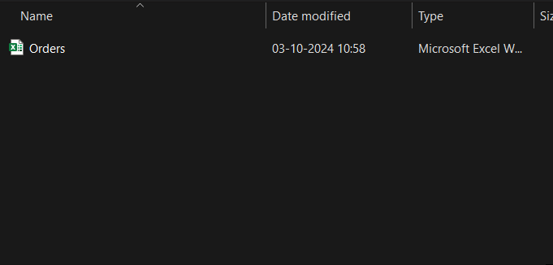

**ラボ11－注文を読み取り、ユーザーに割引の選択を促す有人フローを開発する**

**目標：**このラボの目標は、 Excel
ファイルから注文を読み取り、特定の条件に基づいてユーザーに割引を適用するよう促すプロセスを自動化する、**attended
Power Automate Desktop
flow**を開発することです。参加者は、データを読み取り、注文金額が特定のしきい値を超えているかどうかを確認し、ユーザーに割引を適用するかどうかを尋ね、割引額を入力するオプションを表示するフローを作成します。フローは、適用された割引をExcel
シートに反映します。

**所要時間：** 25分

**タスク１：Power Automate デスクトップ フローを作成する**

1.  **Power automate desktop**を開くで、**office 365 tenant
    credential**を使用してログインします。

2.  環境**Contoso**を選択し、**+ New
    flow**をクリックして、新しいフローの作成を開始します。

> 

3.  フロー名として+++**Message Box Communication**+++と入力し、Power Fx
    enable
    (Preview)のチェックボックスがオフにしていることを確認します。**Create**をクリックします。

> 

4.  まず、ユーザーにExcelファイルの選択を促します。+++**Display select
    file
    dialog**+++アクションを追加し、ファイルフィルターフィールドでxlsxファイルのみを許可するように設定します。

> 

5.  **Dialog Title**を+++**Select
    Excel**+++として入力し、**initial folderにフォルダー**の場所として+++
    C:
    Files+++を入力し、**\*.xlsx**としてフィルタリングし、**save**ボタンをクリックします。

> 

6.  選択したファイルからデータを読み取る前に、**Launch
    Excel**アクションを使用してファイルを起動する必要があります。アクションに**Launch
    Excel**を追加し、以下の設定を行います。

    - Excelを起動: **add open the following document**

    - ドキュメントパス: **+++ % SelectedFile % +++**

    - 保存ボタンをクリックしてください

> 

7.  Excel ファイルからデータを読み取るには、**Read from Excel
    worksheet**を追加します。Excel
    インスタンスに**%ExcelInstance%**と入力し、取得フィールドで**All
    available values from
    worksheet**を選択します。**Save**ボタンをクリックします。

> 

8.  Excelワークシートの最初の空き列と行を取得するには**Get first free
    column/row from Excel
    worksheet**アクションを追加します。Excelインスタンスに**%
    ExcelInstance %**と入力し、**save**ボタンをクリックします。

> 

9.  **Counter**という名前のアクションから変数の設定を追加し、それを**1**に初期化してから、saveをクリックします。

> 

10. アクションから**Display input
    dialog**を追加し、次のフィールドを構成します。

    - **Input Dialog Title: +++Header+++**

    - **Input Dialog Message: +++Enter the Header+++**

    - **Default Value: +++Discount+++**

    - **save**ボタンをクリックします。

> 

11. アクションから **Write to Excel
    worksheet**を追加し、次の詳細を設定します:

    - **Excel instance: %ExcelInstance%**

    - **Value to write: +++%UserInput%+++**

    - **Write role: On specific cell**

    - **Column: +++9+++**

    - **Row: +++%Counter%+++**

    - **save**ボタンをクリックします。

> 

12. 取得したデータを繰り返し処理するために、アクションに**For
    each**ループを追加し、繰り返し処理セクションの値に**+++%ExcelData%+++**を追加してください。その後、**save**をクリックします。

> 

13. **Gross**列（ワークシートのG列、つまり6列目）の値を確認するには、**convert
    text to number**アクションを追加します。テキストを +++ **%
    CurrentItem \[6\]%** +++
    と変換するように設定し、saveボタンをクリックします。

> 

14. 100,000
    を超えているかどうかを確認する**If**アクションを追加し、以下のように構成します:

> **First operand: +++%TextAsNumber%+++**
>
> **Operator: Greater than or equal to (\>=)**
>
> **Second Operand: +++100000+++**
>
> 

15. **If**の下に**Display
    message**アクションを追加し、ユーザーに必要な情報を提供し、**Yes**または**No**の選択を求めます。
    **Save**ボタンをクリックします。以下の情報を入力します：

- **Message Box title: +++Add discount+++**

- **Message to display:**

&nbsp;

- **+++Product: %CurrentItem\[2\]%+++**

- **+++Units: %CurrentItem\[3\]%+++**

- **+++Gross: %TextAsNumber%+++**

&nbsp;

- **Message box button: Yes – No**

> 

16. メセッジ表示アクションの下に2つ目の**If**アクションを追加し、前のステップでどのボタンが押されたかを確認します。該当するフィールドに以下の情報を入力します：

- **First operand: +++%ButtonPressed3%+++**

- **Operator: Equal to (=)**

- **Second operand: +++Yes+++**

> 

17. 2番目のIfの下に「**Display Input
    Dialog**」アクションを追加しで、以下のパラメータをフィールドに追加し、**Save**ボタンをクリックします。

> Input dialog title: +++Discount Value+++
>
> Input dialog message: +++Enter the Discount Value+++
>
> 

18. 2番目のIFアクションの下にWrite to excel
    worksheetアクションを追加し、次の詳細を入力します：

- **Excel instance:** +++%ExcelInstance%+++

- **Value to writer**: +++%UserInput2%+++

- **Write mode:** On specific cell

- **Column:** +++9+++

- **Row:** +++%Counter%+++

> 

20. 最初の**IF End**の下にアクション「**Increase
    Variable**」を追加し、変数名を「**%Counter%**」として追加し、**1**ずつ増加して「Save」ボタンをクリックします

> 

21. 上部のバーからテスト用フローを**Save**します。

**タスク２：フローをテストする。**

1.  テストを実行するには、**Run**ボタンを押します。

> 

2.  最初のシートフォルダが開き、
    **excel file**を選択します。

3.  **Discount**をデフォルトとして設定したら、ヘーダウィンドがポップアップします。
    **OK**ボタンをクリックします。

> 

4.  **Add Discount**ウィンドウが表示され、この製品の価格が **100000**
    と表示し、**yes**または**no**を選択してください。このテストでは**yes（yes**、この商品を割引します）を選択します。

5.  次に**Discount
    Value**を入力してください テストでは**10000**と入力して**OK**をクリックします。

> 

6.  シートで割引値が更新されます。

> 

7.  ループはすべての製品に対して継続的に実行されます

**結論：**

このラボでは、参加者がPower Automate
Desktopの有人フローを開発しました。このフローは、Excelファイルから注文データを読み取り、注文金額が設定されたしきい値を超えているかどうかを確認し、ユーザーに割引を適用するよう促します。このフローは、ユーザーがプロンプトを通じてフローを操作し、割引値を入力できるようにすることで、意思決定プロセスを効率的に自動化します。このラボでは、Excel、ユーザー入力、条件付きロジックを含むタスクの自動化に関する実践的な体験を提供し、参加者がPower
Automate
Desktopを使用して同様のビジネスプロセスを効率化できるようにします。
