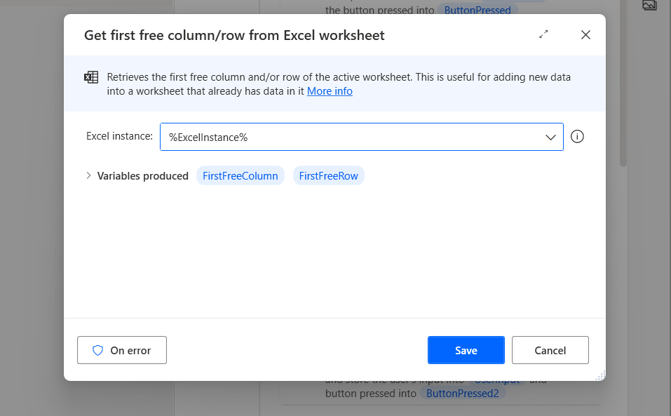
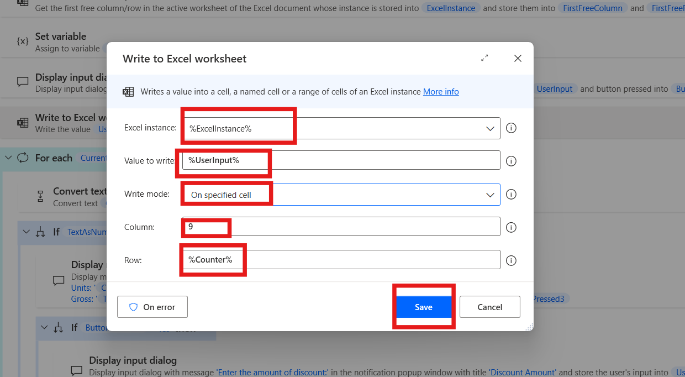
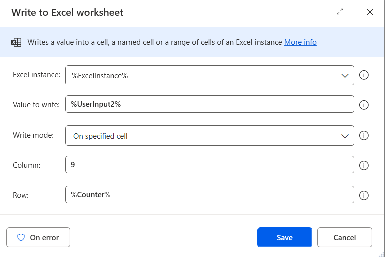
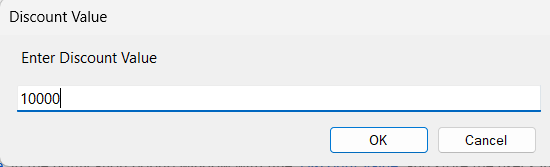
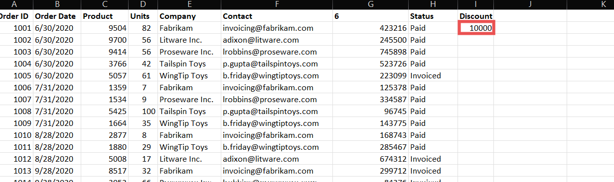

Laboratorio 11 – Desarrolle un Attended Flow que lea los Orders y pide a
los usuarios seleccionar un descuento

**Objetivo:** El objetivo de este laboratorio es desarrollar
un **attended Power Automate Desktop flow** que automatiza el proceso de
leer orders desde un archivo Excel y pide a los usuarios aplicar un
descuento en función de ciertas condiciones. Los participantes crearán
un flow que lee datos, averigua si el importe del pedido supera el
límite y pide al usuario decidir so quiere aplicar un descuento, con la
opción de introducir el valor del descuento. El flow actualiza el Excel
con el descuento aplicado.

**Duración estimada:** 25 minutos

Tarea 1: Cree Power Automate desktop flow

1.  Abra **Power automate desktop** e inicie sesión con sus **office 365
    tenant credentials**.

2.  Elija el environment **Contoso** y haga clic en el **+ New flow** y
    empiece a crear un nuevo flow.

> 

3.  Introduzca +++**Message Box Communication**+++ como flow name y
    seleccione la casilla Power Fx enable (Preview). Luego haga clic
    en **Create**.

> 

4.  Empiece con pedir al usuario que seleccione un archivo Excel.
    Agregue la acción +++**Display select file dialog**+++ y configure
    el File filter field para permitir solo los archivos xlsx.

> 

5.  Introduzca **Dialog Title** como +++**Select Excel**+++, introduzca
    la ubicación de la carpeta en el **initial** **folder** como C:\Lab
    Files\Orders File Filter como **\*.xlsx** y haga clic en el botón
    save.

> 

6.  Antes de leer datos del archivo sleccionado, tiene que iniciarlo con
    la acción **Launch Excel**. Agregue **Launch Excel** desde el
    action. Configure la siguiente configuración.

    - Launch Excel: **add open the following document**

    - Document path: +++**%SelectedFile%**+++

    - Haga clic en el botón save

> 

7.  Para leer los datos desde el archivo Excel, agregue el Read desde
    Excel worksheet action introduzca **%ExcelInstance%** en el excel
    instance y **seleccione All available values from worksheet** en el
    campo Retrieve. Haga clic en el botón **Save.**

> 

8.  Agregue la acción **Get first free column/row from Excel
    worksheet** para recuperar la primera columna vacía en el Excel
    worksheet. Introduzca **%ExcelInstance%** en el Excel instance y
    haga clic en el botón **save**.

> 

9.  Agregue un Set Variable desde la acción llamada **Counter** e
    iniciarlo a **1** y haga clic en save.

> 

10. Agregue el diálogo Display input desde la acción y configure los
    siguientes campos.

    - **Input Dialog Title**: +++**Header**+++

    - **Input Dialog Message**: +++**Enter the Header**+++

    - **Default Value**: +++**Discount**+++

    - Haga clic en el botón **save**.

> 

11. Agregue Write to Excel worksheet desde actions y configúrelo con los
    siguientes detalles:

    - **Excel instance**: %ExcelInstance%

    - **Value to write**: +++**%UserInput%**+++

    - **Write role**: On specific cell

    - **Column**: +++**9**+++

    - **Row**: +++**%Counter%**+++

    - Haga clic en el botón **save**.

> 

12. Agregue un **For each** loop para action para iterar a través de los
    datos recuperados y agregue el +++**%ExcelData%**+++ en la sección
    value to iterate. Luego haga clic en save.

> 

13. Para averiguar el valor de la columna **Gross** (columna G o la
    columna sexta en el worksheet), agregue la acción convert text to
    number. Configure text to convert como +++**%CurrentItem\[6\]%**+++
    y haga clic en then click en el botón save.

> 

14. Agregue un **If** action para averiguar si supera 100,000 y
    configúrelo así:

    - **First operand**: +++**%TextAsNumber%**+++

    - **Operator**: Greater than or equal to (\>=)

    - **Second Operand**: +++**100000**+++

> 

15. Agregue el **Display message** action en **If**, para proporcionar
    la información necesaria al usuario, y haga un prompt para
    elegir **Yes** o **No**. Then luego haga clic en el botón **Save**.
    Introduzca los siguientes detalles en ello:

    - **Message Box title**: +++**Add discount**+++

    - **Message to display**:

      - +++**Product:** %CurrentItem\[2\]%+++

      - +++**Units**: %CurrentItem\[3\]%+++

      - +++**Gross:** %TextAsNumber%+++

    - **Message box button**: Yes – No

> 

16. Agregue una segunda acción **If** en Display message action para
    verificar caúl botón se presionó en el paso anterior. Introduzca los
    siguientes detalles en los campos correspondientes:

- **First** **operand**: +++%ButtonPressed3%+++

- **Operator:** Equal to (=)

- **Second operand:** +++Yes+++

> 

17. En el segundo If Agregue la acción **Display Input Dialog**. Agregue
    el siguiente parameter en el campo y haga clic en el botón **Save**.

Input dialog title: +++Discount Value+++

Input dialog message: +++Enter the Discount
Value+++. 

18. Agregue el **Write to excel worksheet** action debajo del Increase
    Variable action e introduzca los siguientes detalles en ello:

- **Excel instance:** +++%ExcelInstance%+++

- **Value to writer**: +++%UserInput2%+++

- **Write mode:** On specific cell

- **Column:** +++0+++

- **Row:** +++%Counter%+++ 

20. En el primero **IF End,** agegue la acción **Increase Variable,**
    agregue variable name como **%Counter%** ,aumente por **1** y haga
    clic en el botón Save.

> 

21. Desde la barra superior **guarde** el flow para el test.

Tarea 2: Pruebe el Flow

1.  Haga clic en el botón **Run** para ejecutar el
    test. 

2.  La primera carpeta de sheet se abrirá, seleccione
    el **excel** **file** desde ahí. 

3.  Aparecerá el header window, mientras establecemos
    el **Discount** como predeterminado. Haga clic en el botón **ok**

>  

4.  Aparece en la ventana **Add Discount**, lo que muestra que el
    producto es más de **100000**, seleccione **yes** o **no**. En esta
    prueba, seleccionamos **yes** (**yes**, we give discount on this
    product.) 

5.  Luego, el **Discount Value**, para la prueba,
    introducimos **10000** y hacemos clic
    en **ok**. 

6.  Se actualiza el dicount value en el Sheet.

> 

7.  El loop se ejecuta **de forma continúa** para todos los productos.

Conclusión:

En este laboratorio, los participantes desrrollaron un attended Power
Automate Desktop flow que lee el order data desde un archivo Excel,
averigua si el importe del pedido supera un límite establecido, y pide
al usuario que aplique un descuento. El flow automatiza el proceso de
toma de decisiones al permitir a los usuarios a interactuar con el flow
a través de prompts e introducir valores de descuentos. Este laboratorio
proporciona una experiencia práctica en automatizar las tareas que
tienen que ver con Excel, user inputs, y conditional logic, habilitando
a los participantes a agilizar procesos empresariales similares mediante
Power Automate Desktop.
