# Laboratoire 12 : création d'un flux pour organiser et gérer des fichiers et des dossiers

**Objectif :** L'objectif de ce laboratoire est d'automatiser le
processus de sauvegarde de fichiers à partir d'un dossier désigné sur le
bureau à l'aide de **Power Automate Desktop**. Les participants vont
créer un flux qui copie les fichiers d'un dossier nommé
**Contoso_Files**, les déplace vers un dossier de sauvegarde
nouvellement créé et ajoute un horodatage au fichier de sauvegarde. Ce
laboratoire fournit une expérience pratique de l'automatisation des
tâches de gestion de fichiers, notamment la création de dossiers, la
copie de fichiers et leur renommage avec des formats de date et d'heure
dynamiques.

**Temps estimé :** 20 minutes

### Tâche 1 : Créer un dossier et un Desktop flow

1.  Créez un dossier sur votre bureau et renommez-le en
    **Contoso_Files.**

- 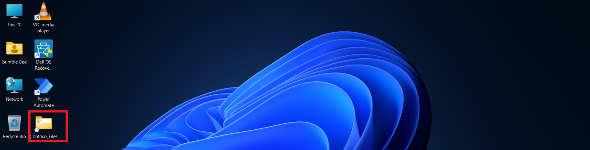

2.  **Sélectionnez Report.txt** fichier dans le **dossier C:\* folder
    and move the .**txt\*\* dans le dossier **Contoso_Files.**

- 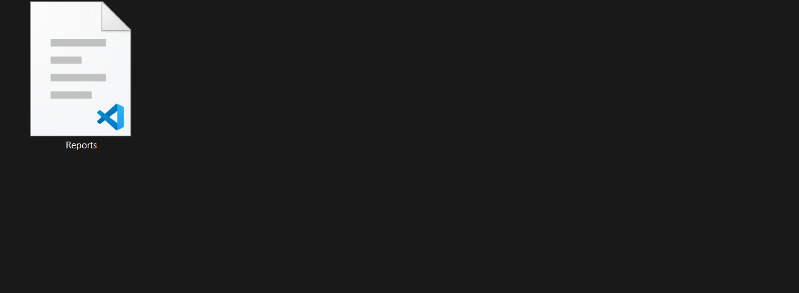

3.  Ouvrez le bureau Power Automate et **connectez-vous** avec **les
    informations d'identification de Office 365 tenant**. Choisissez
    l'environnement **Contoso** dans la barre supérieure.

- 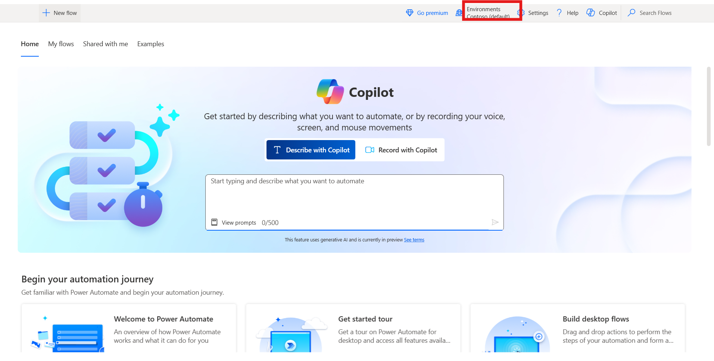

4.  Cliquez sur + **New flow** dans le coin supérieur gauche et
    commencez à créer un nouveau flux.

- 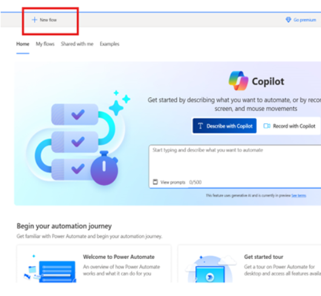

5.  Entrez +++**Backup File Flow**+++ comme nom de flux et cochez la
    case de **Power Fx enable (Preview).** Cliquez ensuite sur le bouton
    **Create**.

- 

6.  Dans la barre de navigation **Actions** de gauche , recherchez
    l'action +++**Get special folder**+++ dans l'espace de travail.
    Sélectionnez l'action en double-cliquant dessus pour l'ajouter au
    flux.

- 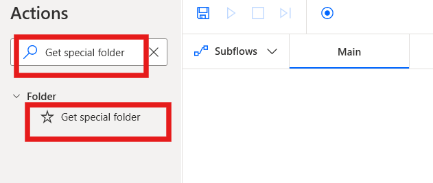

7.  Cliquez ensuite sur le bouton **Save** pour enregistrer le paramètre
    par défaut du bouton.

- 

8.  Dans la barre de navigation **Actions** de gauche , recherchez
    l'action +++**Get files in folder**+++ dans l'espace de travail.
    Sélectionnez l'action en double-cliquant dessus pour l'ajouter au
    flux.

- 

9.  Ajouter l'action **Obtenir les fichiers dans le dossier** pour
    définir le champ Dossier sur +++\*\*C :\_Files+++ **Ce paramètre
    sélectionnera le dossier que vous avez précédemment créé sur le
    bureau. Cliquez ensuite sur** le bouton save \*\*.

- 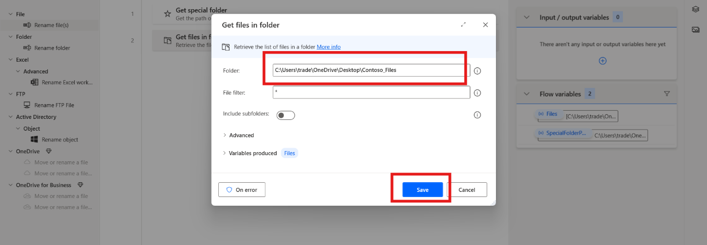

10. Dans la barre de navigation **Actions** de gauche , recherchez
    l'action ++++**Create Folder**+++ dans l'espace de travail.
    Sélectionnez l'action en double-cliquant dessus pour l'ajouter au
    flux.

- 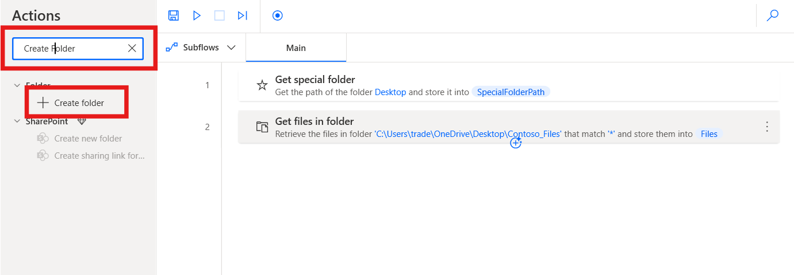

11. Dans le champ **Créer un nouveau dossier dans** l'action Créer un
    dossier, entrez +++\*\*C :\*+++ Dans le champ **Nom du nouveau
    dossier**, entrez **Contoso_Backup**. Après avoir entré les
    informations, cliquez sur le bouton **Save**.

- 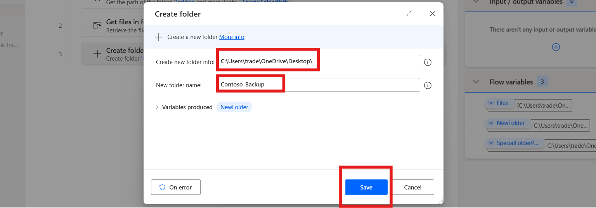

12. Dans la barre de navigation **Action**s de gauche , recherchez
    l'action +++**Copy file(s)**+++ dans l'espace de travail.
    Sélectionnez l'action en double-cliquant dessus pour l'ajouter au
    flux.

- 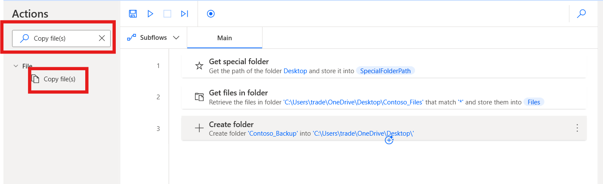

13. Définissez le **champ Fichier(s) à copier** sur +++**=Files**+++, le
    champ **Dossier de destination** sur +++\*\*C :\_Backup+++ et
    l'option déroulante +++Si le(s) fichier(s) existe+++ option
    déroulante pour écraser**. Après la configuration, cliquez sur le**
    bouton Save\*\*.

- 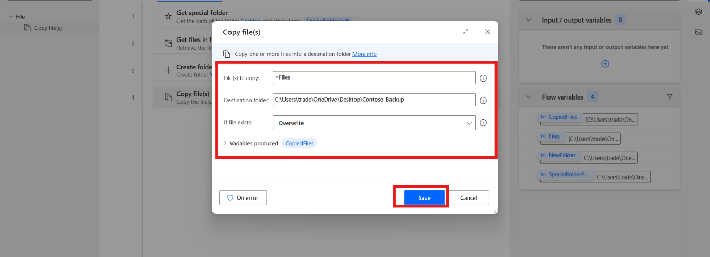

14. Dans la barre de navigation **Actions** de gauche , recherchez
    l'action +++**Rename file(s)**+++ en fonction de l'espace de
    travail. Sélectionnez l'action en double-cliquant dessus pour
    l'ajouter au flux.

- 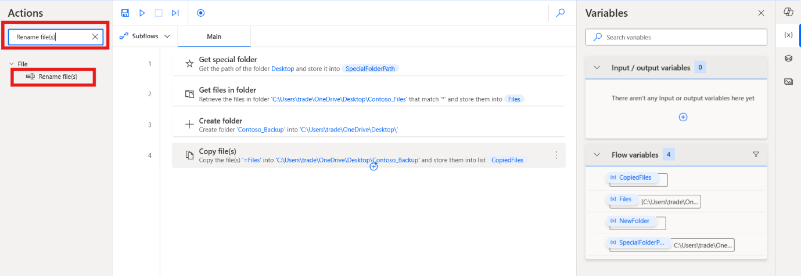

15. Définissez le**(s) champ(s) Fichier(s) à renommer** sur
    +++\*\*C:\_Backup.txt+++. Dans le menu déroulant Renommer le
    schéma**, sélectionnez l' option** Ajouter une date et une heure**.
    Définissez l'** option déroulante **Séparateur sur** Rien\*\* et l'
    option **Format DateTime** sur +++**dd.MM.yy_HH.mm**+++. Après
    l'installation, cliquez sur le bouton Enregistrer.

- 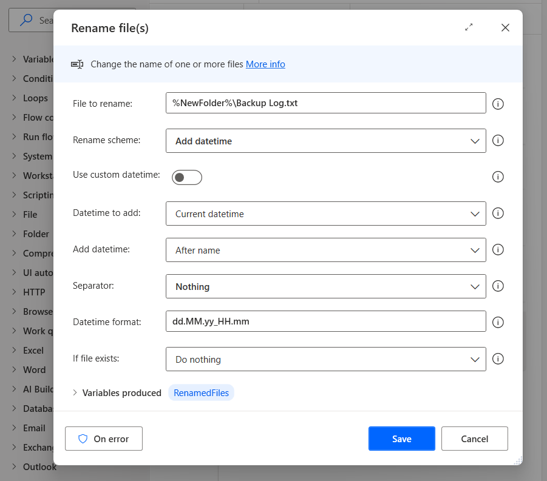

16. Le flux **terminé** doit ressembler à la capture d'écran suivante.

- 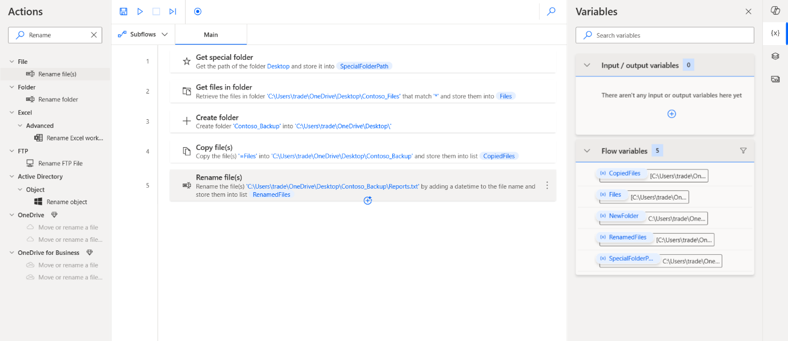

### Tâche 2 : Tester le flow

1.  Une fois le flux d'exécution terminé, vous disposez d'un nouveau
    dossier appelé Fichiers de sauvegarde sur votre bureau. Le dossier
    contient tout le contenu du dossier nommé Important et un fichier
    texte supplémentaire appelé Journal de sauvegarde, dont le nom de
    fichier ajoute la date et l'heure de la dernière exécution du flux.

- 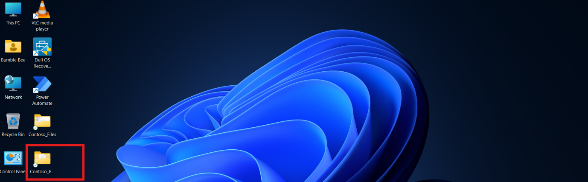

  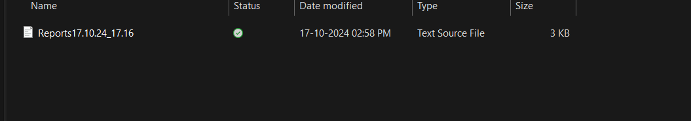

### Conclusion:

Dans ce laboratoire, les participants ont créé un Power Automate Desktop
flow pour automatiser l'organisation et la gestion des fichiers et des
dossiers. En sauvegardant des fichiers d'un dossier désigné nommé
Contoso_Files dans un dossier de sauvegarde nouvellement créé, les
participants ont acquis une expérience pratique des tâches essentielles
de gestion de fichiers, notamment la création de dossiers, la copie de
fichiers et le renommage dynamique des fichiers avec horodatage. Ce
laboratoire met en évidence l'efficacité de Power Automate Desktop pour
rationaliser les processus d'organisation des fichiers, réduire les
efforts manuels et garantir que les fichiers importants sont sauvegardés
en toute sécurité. Les participants sont repartis avec des connaissances
pratiques sur la façon de tirer parti de l'automatisation pour une
gestion efficace des fichiers, améliorant ainsi leur productivité dans
les tâches quotidiennes.
