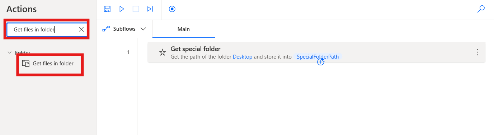

# 实验 12 - 创建用于组织和管理文件和文件夹的流程

**目标：**本实验的目标是使用 **Power Automate Desktop**
自动执行从桌面上的指定文件夹备份文件的过程。参与者将创建一个流程，从名为
**Contoso_Files**的文件夹中复制文件，将其移动到新创建的备份文件夹，并将时间戳附加到备份文件。此实验提供了自动执行文件管理任务的实践经验，包括创建文件夹、复制文件以及使用动态日期和时间格式重命名文件。

**预计时间：** 20 分钟

### 任务 1：创建文件夹和桌面流

1.  在桌面上创建一个文件夹并重命名为 **Contoso_Files。**

- 

2.  从 **C:\* folder and move the.txt**文件**，**然后将 **.**txt\*\*
    **Contoso_Files**文件。

- 

3.  打开 Power automate desktop 和 Login 为 **Office 365 tenant
    credential**。从 顶部栏中选择 environment **Contoso**。

- 

4.  单击左上角的 **+ New flow**，然后开始创建新流。

- 

5.  输入 +++ **Backup File Flow**+++ 作为流名称，然后选中 **Power Fx
    enable （Preview）** 的复选框。 然后点击 **Create**.

- 

6.  从左侧**Actions** 导航栏中，搜索 +++**Get special
    folder**+++作到工作区。双击作以将其添加到流程中。

- 

7.  然后点击 **Save** 按钮保存按钮的默认设置。

- 

8.  从左侧**Actions**导航栏中，搜索 +++ **Get files in folder**
    +++作到工作区。双击作以将其添加到流程中。

- 

9.  添加 **Get files in folder** 作，将 Folder 字段设置为
    +++\*\*C：\_Files+++**此设置将选择您之前在桌面上创建的文件夹**。**然后单击**
    Save\*\* 按钮。

- 

10. 从左侧 的 **Actions** 导航栏中，搜索 +++**Create
    Folder**+++作到工作区。双击作以将其添加到流程中。

- 

11. 在 **Create folder action** 的 **Create new folder into**
    字段中，输入 +++\*\*C：\*+++ 在 **New folder name** 字段中，输入
    **Contoso_Backup**。输入信息后 光滑 **Save**按钮。

- 

12. 从左侧的 **Actions** 导航栏中，搜索 +++**Copy file（s）**+++
    作添加到工作区。双击作以将其添加到流程中。

- 

13. 将 **File（s） to Copy** 字段设置为 **+++=Files+++**，将
    **Destination Folder** 字段设置为 +++\*\*C：\_Backup+++，并将 +++If
    File（s） Exists+++ 下拉选项设置为 **Overwrite。设置完成后，单击**
    Save\*\* 按钮。

- 

14. 从左侧的 **Actions** 导航栏中，搜索 +++**Rename file（s）**+++
    action to the workspace.双击作以将其添加到流程中。

- 

15. 将 **File（s） to rename** 字段设置为 +++\*\*C:\_Backup.txt+++。在
    Rename scheme **下拉菜单中，选择** Add datetime **选项。将** 分隔符
    **下拉选项设置为** 无\*\* ，将 **DateTime Format ** 选项设置为
    +++**dd.MM.yy_HH.mm**+++。设置完成后，点击 **Save** 按钮。

- 

16. **完成的** 流程应类似于以下屏幕截图。

- 

### 任务 2：测试流

1.  运行流程完成后，您的桌面上将有一个名为 Backup Files
    的新文件夹。该文件夹将包含名为 Important
    的文件夹的所有内容，以及一个名为 Backup Log
    的附加文本文件，该文件的文件名将附加流程运行的最后日期和时间。

- 

  

### 结论：

在本实验中，参与者成功创建了一个 Power Automate Desktop
流，以自动组织和管理文件和文件夹。通过将文件从名为 Contoso_Files
的指定文件夹备份到新创建的备份文件夹，参与者获得了基本文件管理任务的实践经验，包括文件夹创建、文件复制和带时间戳的动态文件重命名。此实验重点介绍了
Power Automate Desktop
在简化文件组织流程、减少手动工作和确保安全备份重要文件方面的有效性。参与者在毕业时获得了有关如何利用自动化进行高效文件管理的实用知识，从而提高了他们在日常任务中的工作效率。
