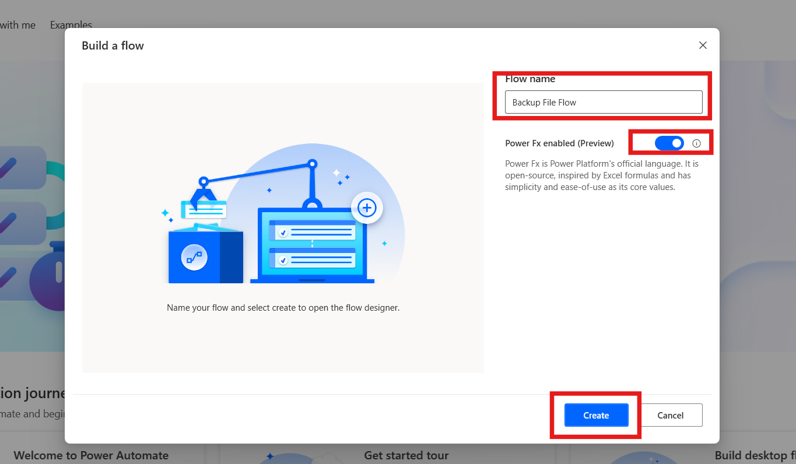

# 實驗 12 - 創建用於組織和管理文件和文件夾的流程

**目標：**本實驗的目標是使用 **Power Automate Desktop**
自動執行從桌面上的指定文件夾備份文件的過程。參與者將創建一個流程，從名為
**Contoso_Files**的文件夾中複製文件，將其移動到新創建的備份文件夾，並將時間戳附加到備份文件。此實驗提供了自動執行文件管理任務的實踐經驗，包括創建文件夾、複製文件以及使用動態日期和時間格式重命名文件。

**預計時間：** 20 分鐘

### 任務 1：創建文件夾和桌面流

1.  在桌面上創建一個文件夾並重命名為 **Contoso_Files。**

- 

2.  從 **C:\* folder and move the.txt**文件**，**然後將 **.**txt\*\*
    **Contoso_Files**文件。

- 

3.  打開 Power automate desktop 和 Login 為 **Office 365 tenant
    credential**。從 頂部欄中選擇 environment **Contoso**。

- 

4.  單擊左上角的 **+ New flow**，然後開始創建新流。

- 

5.  輸入 +++ **Backup File Flow**+++ 作為流名稱，然後選中 **Power Fx
    enable （Preview）** 的複選框。 然後點擊 **Create**.

- 

6.  從左側**Actions** 導航欄中，搜索 +++**Get special
    folder**+++作到工作區。雙擊作以將其添加到流程中。

- 

7.  然後點擊 **Save** 按鈕保存按鈕的默認設置。

- 

8.  從左側**Actions**導航欄中，搜索 +++ **Get files in folder**
    +++作到工作區。雙擊作以將其添加到流程中。

- 

9.  添加 **Get files in folder** 作，將 Folder 字段設置為
    +++\*\*C：\_Files+++**此設置將選擇您之前在桌面上創建的文件夾**。**然後單擊**
    Save\*\* 按鈕。

- 

10. 從左側 的 **Actions** 導航欄中，搜索 +++**Create
    Folder**+++作到工作區。雙擊作以將其添加到流程中。

- 

11. 在 **Create folder action** 的 **Create new folder into**
    字段中，輸入 +++\*\*C：\*+++ 在 **New folder name** 字段中，輸入
    **Contoso_Backup**。輸入信息後 光滑 **Save**按鈕。

- 

12. 從左側的 **Actions** 導航欄中，搜索 +++**Copy file（s）**+++
    作添加到工作區。雙擊作以將其添加到流程中。

- 

13. 將 **File（s） to Copy** 字段設置為 **+++=Files+++**，將
    **Destination Folder** 字段設置為 +++\*\*C：\_Backup+++，並將 +++If
    File（s） Exists+++ 下拉選項設置為 **Overwrite。設置完成後，單擊**
    Save\*\* 按鈕。

- 

14. 從左側的 **Actions** 導航欄中，搜索 +++**Rename file（s）**+++
    action to the workspace.雙擊作以將其添加到流程中。

- 

15. 將 **File（s） to rename** 字段設置為 +++\*\*C:\_Backup.txt+++。在
    Rename scheme **下拉菜單中，選擇** Add datetime **選項。將** 分隔符
    **下拉選項設置為** 無\*\* ，將 **DateTime Format ** 選項設置為
    +++**dd.MM.yy_HH.mm**+++。設置完成後，點擊 **Save** 按鈕。

- 

16. **完成的** 流程應類似於以下屏幕截圖。

- 

### 任務 2：測試流

1.  運行流程完成後，您的桌面上將有一個名為 Backup Files
    的新文件夾。該文件夾將包含名為 Important
    的文件夾的所有內容，以及一個名為 Backup Log
    的附加文本文件，該文件的文件名將附加流程運行的最後日期和時間。

- 

  

### 結論：

在本實驗中，參與者成功創建了一個 Power Automate Desktop
流，以自動組織和管理文件和文件夾。通過將文件從名為 Contoso_Files
的指定文件夾備份到新創建的備份文件夾，參與者獲得了基本文件管理任務的實踐經驗，包括文件夾創建、文件複製和帶時間戳的動態文件重命名。此實驗重點介紹了
Power Automate Desktop
在簡化文件組織流程、減少手動工作和確保安全備份重要文件方面的有效性。參與者在畢業時獲得了有關如何利用自動化進行高效文件管理的實用知識，從而提高了他們在日常任務中的工作效率。
