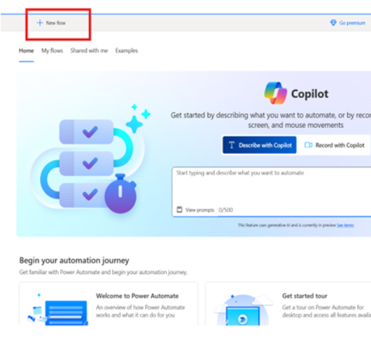
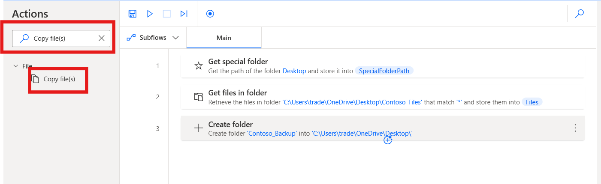

Laboratorio 12 - Cree un Flow para organizar y gestionar las carpetas y
los archivos

**Objetivo:** El objetivo de este laboratorio es automatizar el proceso
de copia de seguridad de archivos de una carpeta designada en el desktop
mediante **Power Automate Desktop**. Los participantes crearán un flujo
que copie los archivos de una carpeta denominada **Contoso_Files**, los
mueva a una carpeta de copia de seguridad recién creada y agregue una
marca de tiempo al archivo de copia de seguridad. Este laboratorio
proporciona experiencia práctica en la automatización de tareas de
administración de archivos, incluida la creación de carpetas, la copia
de archivos y el cambio de nombre de los mismos con formatos dinámicos
de fecha y hora.

**Duración estimada:** 20 minutos

Tarea 1: Cree una carpeta y Desktop flow

1.  Cree una carpeta en su desktop y renómbrelo como **Contoso_Files.**

> 

2.  Seleccione **Report.txt** file desde la carpeta **C:\Labfiles** y
    mueve el .**txt** file en la carpeta **Contoso_Files**.

> 

3.  Abra el Power automate desktop e **inicie sesión** con sus **Office
    365 tenant credential**. Elija el environment **Contoso** desde la
    barra superior.

> 

4.  Haga clic en **+ New flow** desde la esquina superior izquierda y
    empiece a crear un nuevo flow.

> 

5.  Introduzca +++**Backup File Flow**+++ como flow name y seleccione la
    casilla **Power Fx enable (Preview).** Y haga clic en **Create**.

> 

6.  Desde la barra de navegación izquierdo **Actions**, busque +++**Get
    special folder**+++ action en el workspace. Seleccione la acción al
    hacer doble clic para agregarlo en el flow.

> 

7.  Haga clic en el botón **Save** para guardar la configuración del
    botón.

> 

8.  Desde la barra de navegación izquierda **Actions**, busque +++**Get
    files in folder**+++ action al workspace. Seleccione la acción al
    hacer doble clic para agregarlo al flow.

> 

9.  Agregue **Get files in folder** action para establecer el Folder
    field a +++**C:\Users\Admin\Desktop\Contoso_Files**+++ Esta
    configuración seleccionará la carpeta que creó en el desktop. Luego
    haga clic en el botón **Save**.

> 

10. Desde la barra de navegación izquierda **Actions**, busque
    +++**Create Folder**+++ action en el workspace. Seleccione la acción
    al hacer doble clic para agregarlo en el flow.

> 

11. En el **Create new folder into** field de Create folder action,
    introduzca +++**C:\Users\Admin\Desktop**+++ en el **New folder
    name** field, introduzca **Contoso_Backup**. Despiés de introducir
    la información haga clic en el botón **Save**.

> 

12. Desde la barra de navegación izquierda **Actions**, busque +++**Copy
    file(s)**+++ action en el workspace. Seleccione la acción al hacer
    doble clic para agregarlo en el flow.

> 

13. Establezca el **File(s) to Copy** field a +++**=Files**+++,
    el **Destination Folder** field
    a +++**C:\Users\Admin\Desktop\Contoso_Backup**+++, y la
    opción +++**If File(s) Exists**+++ a **Overwrite**. Después de la
    configuración haga clic en el botón **Save**.

> 

14. Desde la barra de navegación izquierda **Actions**, busque
    +++**Rename file(s)**+++ action en el workspace. Seleccione la
    acción al hacer doble clic para agregarlo en el flow.

> 

15. Establezca el **File(s) to rename** field
    a +++**C:\Users\Admin\Desktop\Contoso_Backup\Reports.txt**+++. En el
    menú **Rename scheme**, seleccione la opción **Add datetime**.
    Establezca la opción **Separator** a **Nothing** y la
    opción **DateTime Format** a +++**dd.MM.yy_HH.mm**+++. Después de la
    configuración haga clic en el botón Save.

> 

16. El flow **completado** se debería ver así.

> 

Tarea 2: Pruebe el flow

1.  Después de que se complete el run flow, habrá una nueva carpeta
    llamada Backup Files en su desktop. La carpeta contendrá todo el
    contenido de la carpeta llamada Important y un archivo adicional de
    texto llamado Backup Log que tendrá la última fecha y hora en que se
    ha ejecutado el flujo anexado a su nombre de archivo.

> 
>
> 

Conclusión:

En este laboratorio, los participantes crearon un Power Automate Desktop
flow para automatizar la organización y gestión de archivos y carpetas.
Al hacer una copia de seguridad desde una carpeta Contoso_Files a una
carpeta recién creada, los participantes obtuvieron una experiencia
práctica participants gained hands-on experience en tareas esenciales de
administración de archivos, incluida la creación de carpetas, la copia
de archivos y el cambio de nombre dinámico de archivos con marcas de
tiempo. Este laboratorio destaca la efectividad de Power Automate
Desktop en la optimización de los procesos de organización de archivos,
la reducción del esfuerzo manual y la garantía de que se realice una
copia de seguridad segura de los archivos importantes. Los participantes
se fueron con conocimientos prácticos sobre cómo aprovechar la
automatización para una gestión eficiente de archivos, mejorando su
productividad en las tareas cotidianas.
