# Lab 0 - Setting up lab environment for Power App

**Objective:** In this lab, you will acquire Power Apps trial license and configure the Micorsoft Teams apps.

**Estimated Duration:** 7 min

### **Task 1: Assign** **Power Apps trial license** 

1.  Open a web browser on your VM and go to
    +++**https://powerapps.microsoft.com/en-us/free/**+++.

    

2.  Select **Start free**.

    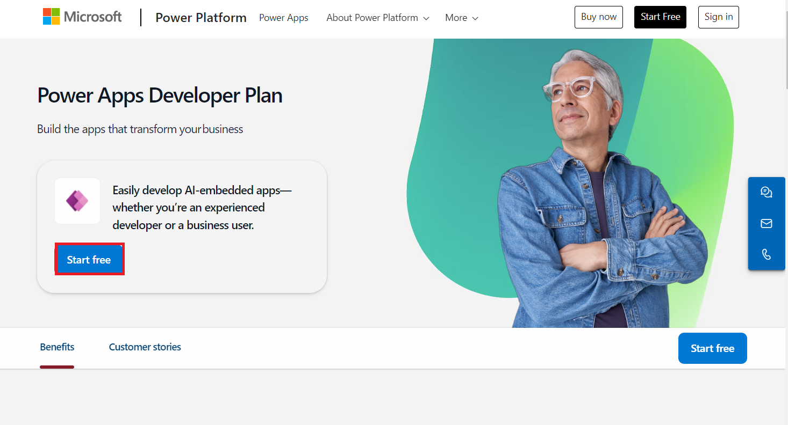

3.  Enter your **Office 365 admin credential**, check the checkbox to
    **accept the agreement** and click on **Start your free trial**.

    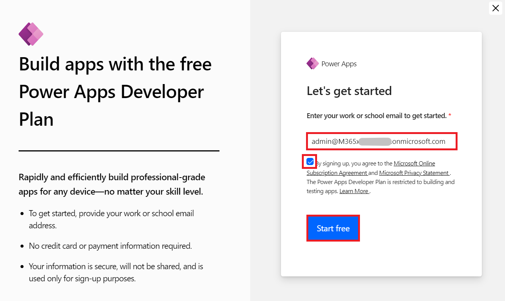

4.  Enter **password of your Office 365 tenant id** and then select
    **Sign in**.

    

5.  Select **Yes** on **Stay signed in?** pop-up window.

    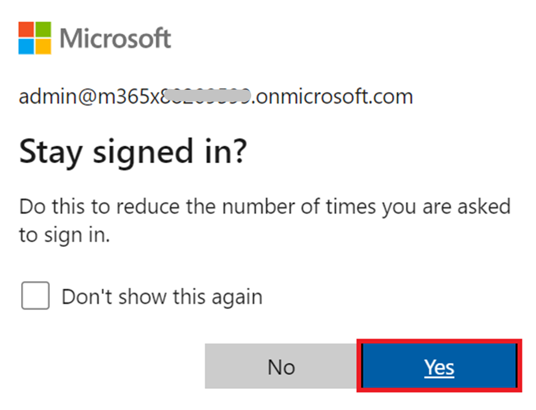

6.  If pop-up appears, provide **Contact Information** as below and then
    select **Submit**.

    - Email: **Office 365 admin tenant credentials**
    - Country/region: **United States**
    - Phone number: **Your phone number**

    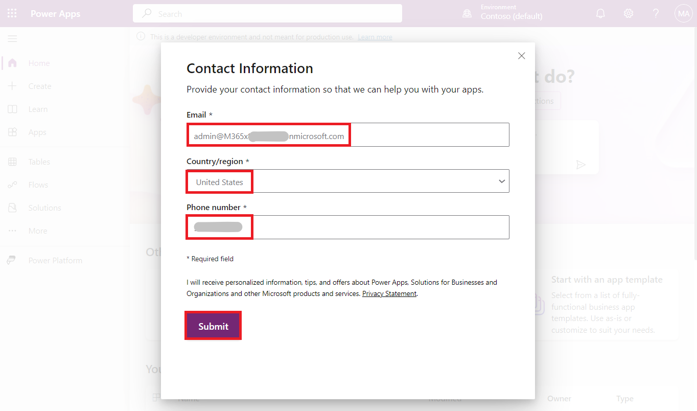

7.  You can now see **Home page of Power Apps.** From the environment
    selector, select the developer environment – **Dev One** which is
    created for you.

    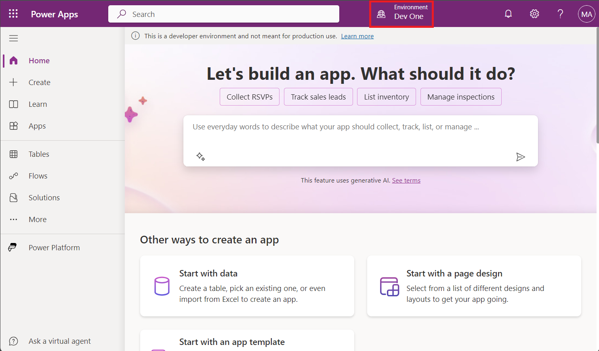

8.  Open the new tab and go to Power Platform admin center by navigating
    to <https://admin.powerplatform.microsoft.comand if required, sign
    in using your given Office 365 tenant admin credentials. **Close**
    the **Pop-up window** saying, ‘Welcome 
    

9.  From the left navigation pane, select **Environments** and then you
    can see, **Dev One** is your Dataverse environment.

    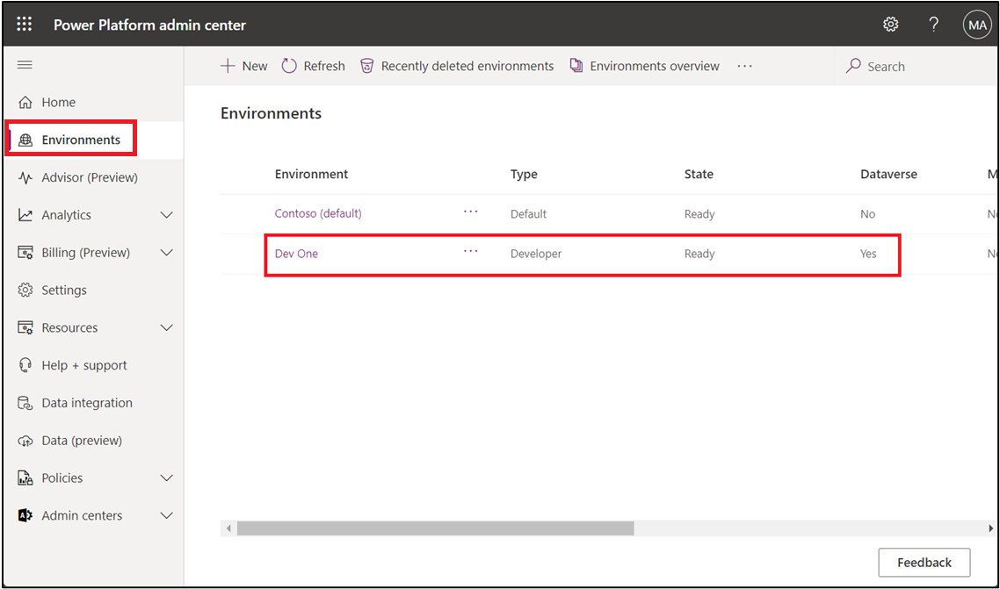

### Task 2: Create a team in Microsoft Teams

1.  Sign into the Microsoft Teams
    using +++**https://teams.microsoft.com**+++ with your
    Office 365 tenant credentials.

2.  On Welcome to Teams window, select **Get Started**. 

    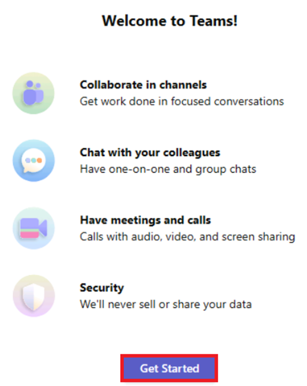

3.  Close the window which is asking for scanning QR code.

    
    

4.  On the left side of Teams, click **Teams**, click **+
    sign** to  **Join or create a team**.

    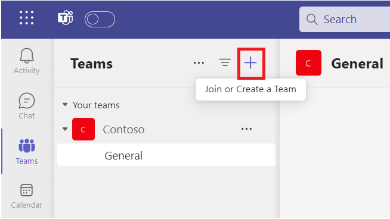

5.  Click on **Create team**.

    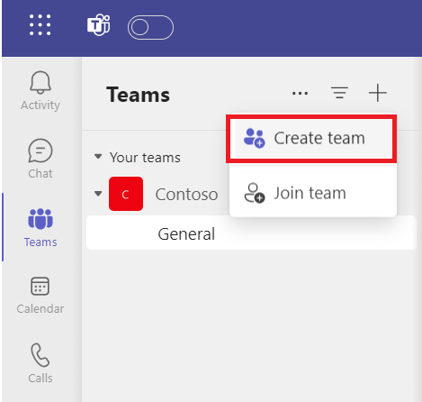

6.  Enter the Team name : +++**Test Team**+++, on Name the first
    channel
    as +++**[**TestChannel**](urn:gd:lg:a:send-vm-keys)**+++ and
    Click on **Private**.

    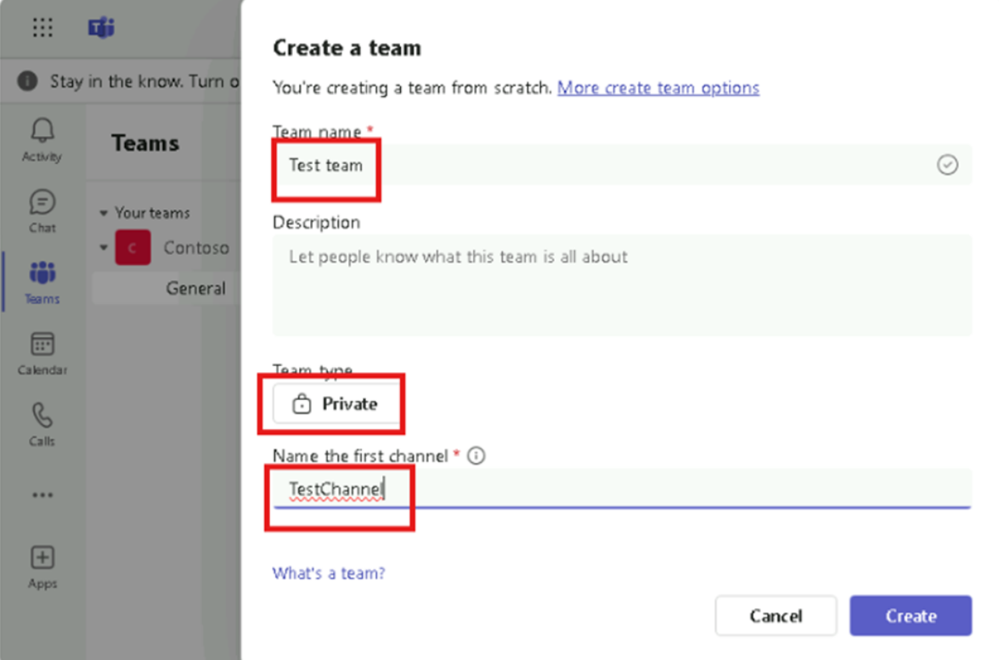

7.  Select **Org-wide**.

    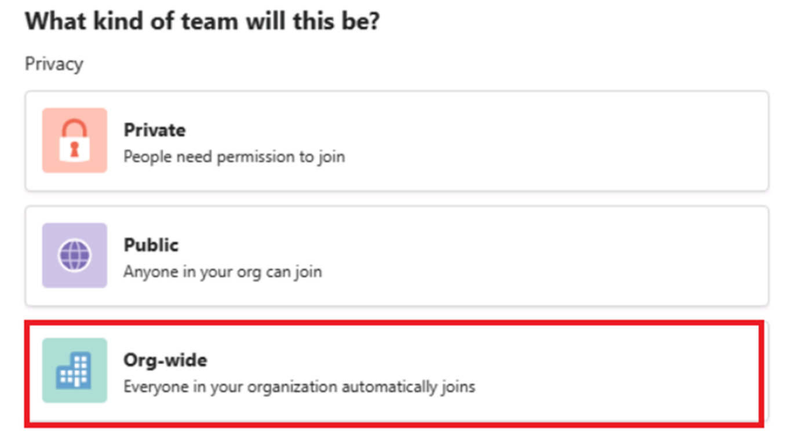

8.  Select **Create**.

    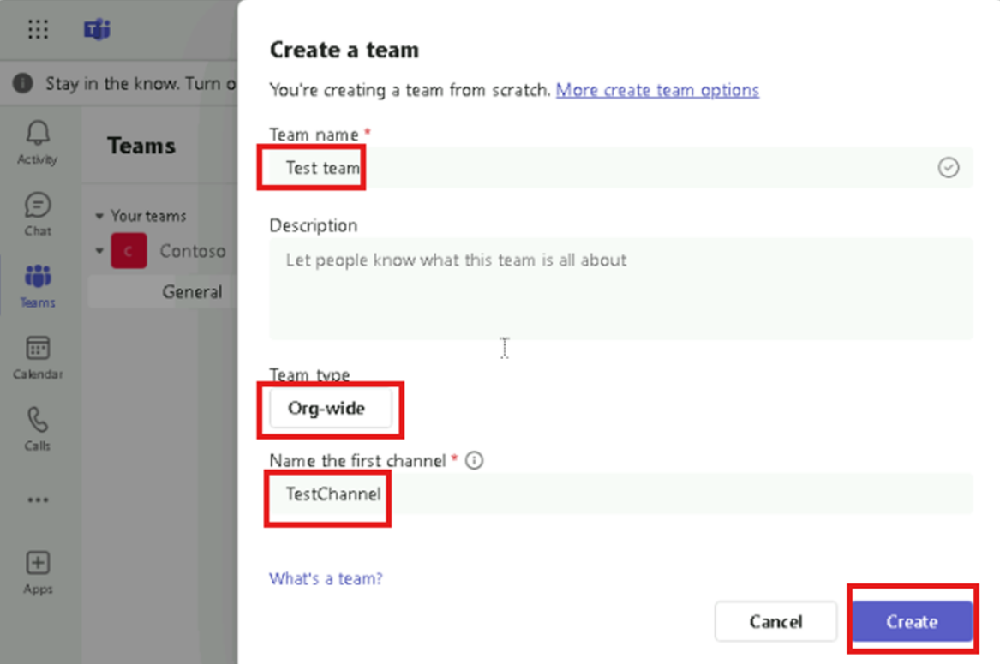

**Summary:** In this lab, you acquired Power Apps trial license and configure Microsoft Teams.
