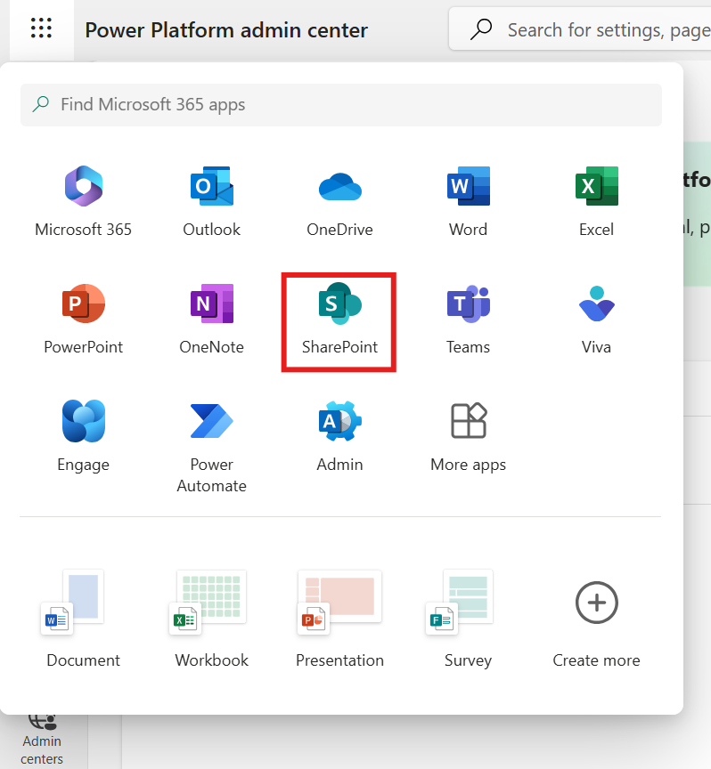
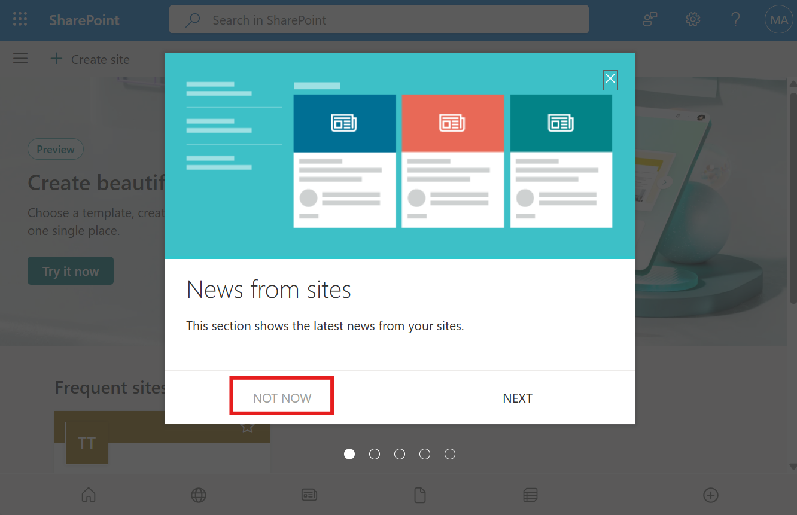
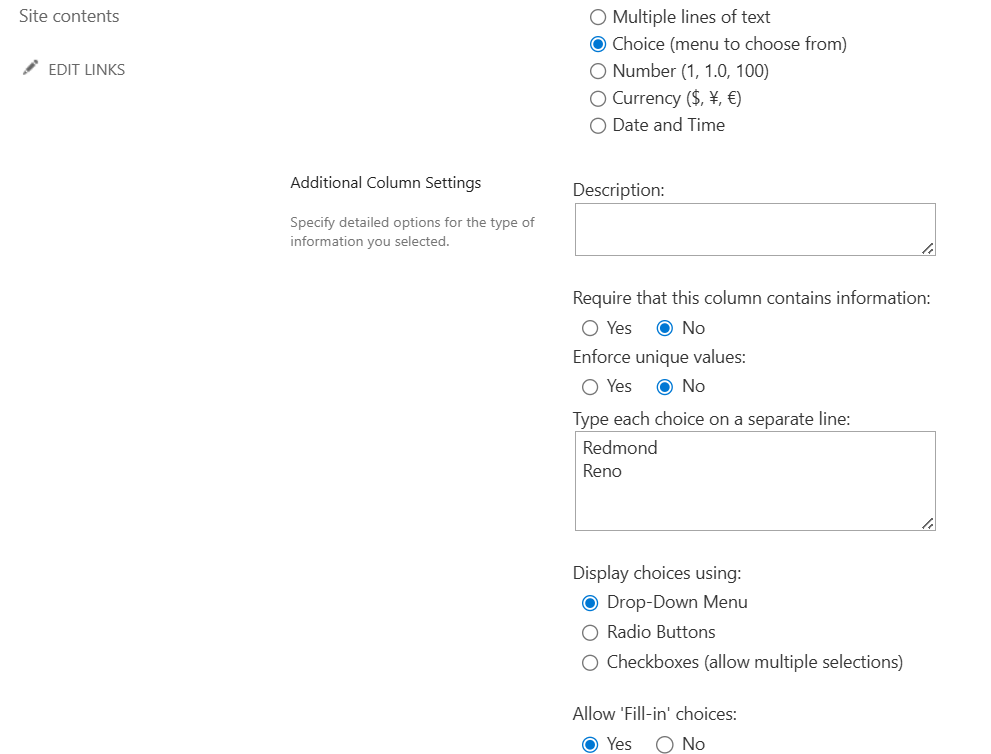
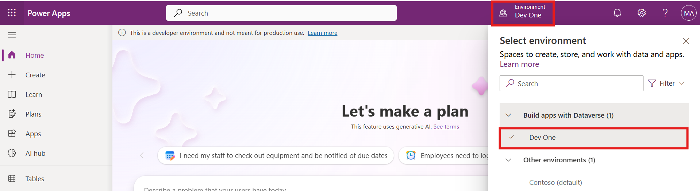
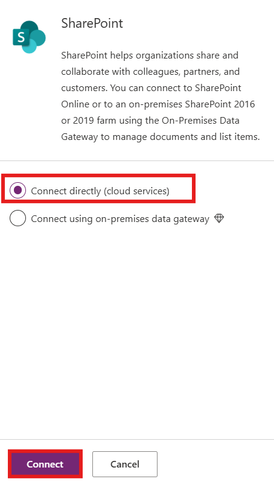
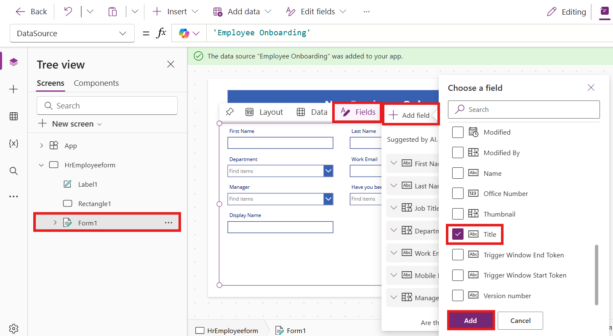
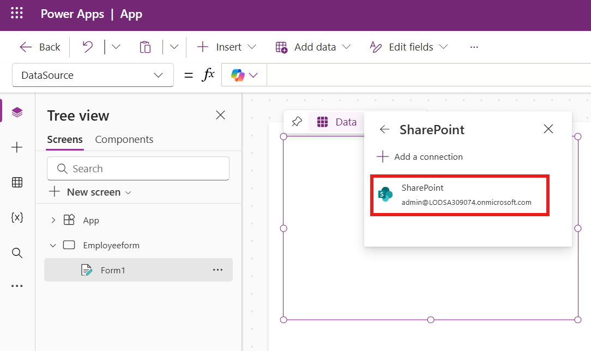
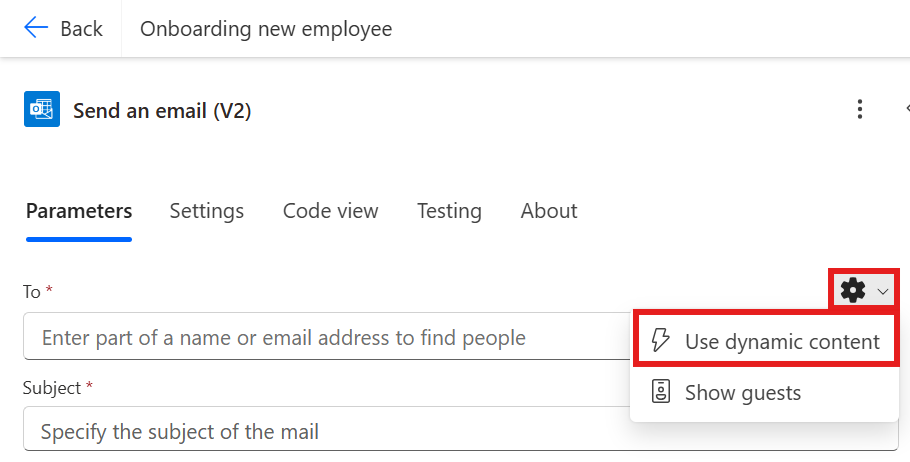

# **Lab 1 - Automate Onboarding of New Employee**

**Objective:** The primary objective of this lab is to guide
participants in automating the employee onboarding process using
Microsoft Power Platform. The exercises focus on creating SharePoint
lists to store employee and HR information, customizing forms in Power
Apps for data entry, and implementing automated workflows using Power
Automate. Participants will learn to leverage SharePoint for data
management, utilize Power Apps to enhance user experience, and integrate
automated processes to streamline onboarding tasks. This hands-on
experience aims to equip participants with practical skills to
effectively manage and automate HR processes within their organizations.

**Estimated time:** 60 mins

# Exercise 1: Create Employees, HR and Manager list in Share point.

## Task 1: Verifying your Dataverse environment 

1.  Open a browser and go to
    +++**https://admin.powerplatform.microsoft.com**+++. Sign in with your
    office 365 tenant credential.

2.  Select **Manage** > **Environments** on the left navigation. The **Dev One** Developer
    environment should have been created for you as shown in the image
    below.

    
    

3.  Use the same developer environment to execute all the exercises of
    this lab.

## Task 2: Create a site in SharePoint 

1.  On the **Power Platform admin center**, select App launcher from the top left corner. Select **SharePoint**
    from list of **apps**.

    

2.  Select **NOT NOW** on the **News from sites** pop-up.

    

3.  Click on **+Create site** on top menu.

    


4.  Select **Communication site** tile in **Create a site** window.

    


5.  Scroll down and select **Blank** template.

    


6.  Click on **Use template**.

    


7.  Enter Site name and description then click on **Next** button.

    - Site Name: +++**Contoso Corp**+++

    - Site Description: +++**Onboarding new employee.**+++


    


8.  Keep the default language and then click on **Create Site.**

    


    


## Task 3: Create an Employees list in SharePoint site from CSV file

1.  Click on **Home --> New --> List.**


    


2.  Select **From CSV** tile from **Create a list** window.

  

    


3.  Click on **Upload file** and browse to **C:\Lab Files** and select
    **Employee.csv** file.

    


4.  Change the **Work Email** column type to **single line of text** and
    then click on **Next**.


    


5.  Enter then Name as: +++**Employee Onboarding**+++ and if asked, enter Description: +++**New
    Contoso Corp employee**+++ and then click on **Create**.

  

    


   

    


6.  The Employees list is created for you now. Rename the **Title**
    column to +++**Emp_id**+++ by selecting **Title drop-down** > **Column settings** > **Rename**.


    


    


7.  Now the employee table should like this

    
    


8.  Click on **Settings -\>List settings.**

    


9.  Click on the **Department** column link.

    


10. Change the below values and then click on **Ok**.

    - Type of Column : **Choice**

    - Allow 'Fill-in' choices: **Yes**

  
    


11. Repeat the above step for the **Job title** column.

12. Select the **Have you been to orientation yet?** column and make below
    changes and then click **OK**.

    - Type of Column : **Choice**

    - Allow 'Fill-in' choices: **Yes**

    - Type each choice on a separate line : **Yes No**

    


13. Repeat the above step for **Orientation Location** with below properties and then select **Ok**.

    - Type of Column : **Choice**

    - Allow 'Fill-in' choices: **Yes**

    - Type each choice on a separate line : **Redmond Reno**


    


14. Repeat above step for **Manager** column with below properties add and then select **Ok**.

    - Type of Column : **Choice**

    - Allow 'Fill-in' choices: **Yes**


    

15. Click on **Home** to go back to the **Site**.

    

## Task 4: Create a HR list in SharePoint site from CSV file

1.  Click on **Home --> New --> List.**


    


2.  Select **From CSV tile** from **Create a list window.**


    


3.  Click on Upload **file** and browse **C:\Lab Files** and select
    **Import_HR_M365.CSV** and click **Open**.


    


4.  Change **Work Email** column type to **Single line of text** and
    then click on **Next**.


    


5.  Enter below details

    - Name : +++**Contoso HR**+++

    - Description (If asked) : +++**Contoso Human Resource**+++, then click on **Create**
      button.


    


6.  Click on **Title --> Column settings --> Rename** columnt to
    +++**Emp_id**+++.


    


    


7.  The HR table should like below image now.


    


# Exercise 2: Create Power Apps for SharePoint Lists

In this exercise, you will build your application to send an email to an employee with official information and asking them to fill and upload documents.

## Task 1: Customize Employee form with PowerApps for HRs to fill.

1.  From your SharePoint **Contoso Corp** site, select **Employee Onboarding** list from the horizontal palette, copy the URL and save it in Notepad. 


    


2.  Open a new tab and go to +++**https://make.powerapps.com/**+++. Sign in with your Microsoft 365 admin credentials and select your **Dev One** (Developer) environment. 

    

3.  Click on **Apps** from left navigation menu. Select **New App -->
    Start with a page design.**


    

4.  Select **Blank Canvas** tile.

    

5.  Select **Skip** on the **Welcome to Power Apps Studio**. Right click on **Screen1** and select **Rename.**

    


6.  Rename to **HrEmployeeform**


    


7.  Select the form and click on **Insert --> Edit form.**


    


8.  Search for **SharePoint** and select the **SharePoint connector** from
    **Select a data source** dropdown.


    


9.  Under the **SharePoint**, select **Connect deirectly** and then select **Connect.**


    


10. Enter the **SharePoint list URL** copied from step 1 into **Enter
    SharePoint URL** text field and then click on **Connect**.

    
    


11. Select the **Employee Onboarding** list and then click on **Connect**.

    
    


12. Drag and fit the form on the screen.

  
    


13. Reduce the size of the Form1 component as indicated in the image below and then click on **Insert** --> **Rectangle** to insert a header into the screen.

   
    


14. Adjust the rectangle to the screen width. Click on **Insert -->
    Text label**.


    


15. Adjust the width and location of the text field component so it's cantered within the rectangle and update the following properties.

    - **Text: New Employee Onboarding Form**

    - **Font Size:** 27

    - **Font weight:** Bold

    - **Text alignment:** Centre

    - **Color:** White


    


16. Select **Emp_Id** field and change value **required**. Click on
    **Advanced** under **Properties** and select **Unlock to change
    properties**.

    **Note**: If you don't see the **Emp_Id** field, select the **Form1** on the canvas, then select **Fields** > **Add fields**. Choose **Emp_Id** from the list. If **Emp_Id** isn’t available, select **Title** instead, and click **Add**.

    

    

17.  Now set the **Required** value to true. You should see a star next
    **Emp_id** field.


     


18.  Repeat the previous two steps for the **First Name** and **Last Name** fields. 

     **Note**: If you don't see these fields, then select **HrEmployeeform**, navigate to **Properties**, click **Edit field**, then proceed to add the fields and reorder accordingly. 


     


19. Click outside of the form control to deselect it and then click on **Insert** --> **Button**. 


    

20. Drag and place the button under **Department** field in the form and
    update below properties.

    **Text**: **Submit**


    


21. Click on **New Screen** and select the **Success** template.


    


22. Select the newly added screen, and rename it to **Success**, as indicated in the image 
below.


    


23. Select **Lb1Successmsg1** and change the **Text** property to **New employee
    added**.


    


24. Now, click on **Insert --> Icons --> Back arrow.**


    


25. Position and resize the new icon as you see fit. Then, select the newly added icon and update the properties as follows


- Tool Tip: **Go Back**

- OnSelect: +++**Back(ScreenTransition.CoverRight)**+++


    


26. Click on **HrEmployeeform.** Select the **Submit Button** you added in the step 20 and update the **OnSelect** property with the following formula. 

     **Note:** Update the formula with your SharePoint Form.

    +++**SubmitForm(*Form1*);ResetForm(*Form1*);Navigate(*Success*)**+++


    


27. Select **Form1**, ensure the **OnSuccess** property is selected in the dropdown and then update it using the formula below 

    +++**ResetForm(Self); RequestHide();Notify("New Employee
    added",NotificationType.Success)**+++


    


28. Click on the **Save --> Save as** button and enter the name as
    **EmpformforHr** and then click on **Save**.


    


29. Select the form and change the **Default mode** to **New** and then
    click on the **Save ->** **Preview** icon.


    


30. Enter a random **Emp id**, **First Name** and **Last Name** and then click
    on **Submit** button.


    


31. You should see the **New employee added** message. Click on the **Back**
    button.


    


32. Colse the **Preview mode** and select **Ok** on the pop-up theat appears on the Power Apps portal. Click on **Publish** button and then click on **Publish this
    version** button.


    


33. Go back to the SharePoint tab in a browser. You should see the employee
    record of the new employee added by you in the list.

## Task 2: Create employee onboarding Canvas app for the employee

1.  Open a new tab and go to +++**https://make.powerapps.com/**+++. Sign in with your Microsoft 365 admin credentials and select your **Dev One** (Developer) environment. 

2.  Click on the **Apps** from the left navigation menu. Select **New App** ->
    **Start with a page design.**


    

3.  Select **Blank Canvas** tile.


    


4.  Select **Skip** on the **Welcome to Power Apps Studio**. Right click on **Screen1** and select **Rename.**


    


5.  Rename to **Employeeform**

   

    


6.  Click on **Insert** and select **Edit** form.


    


7.  Search for **SharePoint** and select **SharePoint connector** from
    **Select a data source** dropdown.


    


8.  Select the **SharePoint** connection which is already created in the previous task.


    


9. Select the connection created in the previous task from the list.

10. Select **Employee Onboarding** list and then click on **Connect**.


    


11. Drag and fit the form into the screen.


    


12. Select the **Form 1** and Set the **Display mode**** to **New** under properties.


    


13. Reduce the size of the **Form1** component as indicated in the image below and then click on **Insert** --> **Rectangle** to insert a header into the screen. 


    


14. Change the width of the rectangle to the screen and select
    **Insert --> Text label**.


    


15. Select the Label and set below **properties.**

    - **Text: Employee Onboarding Form**

    - **Font Size: 25**

    - **Font weight: Bold**

    - **Text alignment: Centre**

    - **Colour: White**


    


16. Select the **Emp_Id** field name and change **Font size** to **16**
    and **Font weight** to **Bold** under Properties.

    **Note**: If you don't see the **Emp_Id** field, select the **Form1** on the canvas, then select **Fields** > **Add field**. Choose **Emp_Id** from the list. If **Emp_Id** isn’t available, select **Title** instead, and click **Add**.

    


17. Repeat above step for all fields.


    


18. Select **Orientation location** item and set **Visible** property to
    **Off**.


    


19. Select **Have you been to orientation yet**? text field and click on
    **edit** label.


    


20. Change label value to **Orientationdropdown**


    


21. Select **Orientation Location data card** from the **Tree view** and replace the **false** value of  **Visible**  property to the formula as shown in below image.

    +++**If(*Orientationdropdown*.Selected.Value="No",true,false)**+++


    


22. Click on **Save** and enter app name as: **EmployeeOnboardingForm**
    and then click on **Save** button.


    


23. Select the **Emp_Id**/**Title** field and click **on Advanced --> Unlock to change
    properties** and update **Display mode** to
    **Parent.DisplayMode.View**. Repeat this for **First Name**, **Last Name** fields too.


    


    


    


    


    


24. Select the **Work email** Field **Unlock property** and update
    **Required** property to **true.** Repeat for other fields if
    required.


    


25. Select the **Form1** and update **OnFailure** field value to

    +++**Notify("Required Fields can't be empty.",NotificationType.Error)**+++


    


26. Select **OnSuccess** and set the value to

    +++**Notify("Thank you for filling out the form",NotificationType.Success)**+++


    


27. Now, Let’s add button to submit at the end of the form. Click on
    **Insert --> Button.**


    


28. Change the Properties of the button and save the form.

    - Text: **Submit.**

    - Onselect: +++**SubmitForm(*Form1*);NewForm(*Form1*)**+++


    


29. Click on **Save** and then click on **Preview** app buttons.


    


30. Enter details and then click on **Submit**.


    


31. You should see success notification.


    


32. Close the preview window.

33. Click on **App** from **Tree View**. Select **OnStart** and enter
    the below formula.

    ```
    Set(
    
        onboardinglistitem,
    
        LookUp(
    
            'Employee Onboarding',
    
            ID = Value(Param("ItemID"))
    
        )
    
    )
    ```


    


34. Select the **Form1** from **Tree View**. Select **Item** and enter the
    value as: **onboardinglistitem**


    


35. Click on **Save** and **Publish --> Publish this version**.


    


36. Go back to the **Power Apps Home** page, Click on **Apps --> Your
    app (EmployeeOnboardingForm) --> Details**.


    


37. Copy the Weblink to use in next task.


    


38. Close the preview window and navigate to your SharePoint tab and
    check the above record in the list.


    


## Task 3: Create Power Automate flow to send a form to the new employee

1.  Go back to **SharePoint** tab and copy the URL of your **Contoso Corp** site.


    


2.  Open a new tab and go to +++https://make.powerautomate.com/+++ and sign in with
    your admin tenant account.

3.  Select your **Dev One** developer environment.

4.  Click on **My flows** from left navigation menu Click on **New
    Flow --> Automated Cloud flow.**


    


5.  Enter the flow name as: **Onboarding new employee**. Search for
    **When an item is created** and select it from SharePoint and then
    click on **Create**.


    


6.  Select the **When an item is created** step. Click on **Site Address --> Enter custom value.**


    


7.  Enter the Address copied in Step 1 and then select the **Employee
    Onboarding** list as shown in below image.


    


8.  Click on **+** to add new action.


    


9.  Seach for and select **Send an email (V2)**


    


10. Select **Settings** for the **To** field and select **Use dynamic content**.  Click on to text field and select **Enter the data from previous
    step**.

    

    


11. Select **Work email.**


    


12. Enter the Subject line as: +++**Welcome to Firm**+++ select **First Name**
    from previous step.


    


13. Enter below data in the **Body** of the email. Insert dynamic values as
    shown in image.

    +++Hi+++ **First name** (From dynamic content) **Last name** (From dynamic content),

    +++Please click on link below to complete your onboarding form+++

    


    


14. Enter the Weblink copied in Task 2 – and add **&itemID=** at the end
    of the link and select Dynamic ID as shown in below image.


    


    


15. Cut the link and then enter the text: **Onboarding Form** and select
    and click on link icon. paste the link copied from above step.


    


16. Save the flow now.


    


    


## Task 4: Test the flow.

1.  Go back to **Power Apps tab**, select **EmpformforHr** app.


    


2.  If asked then allow permissions.


    


3.  Fill the form with your details. Enter work email as your admin
    tenant id and **Submit** the form.


    


    


4.  Go back to the **Power Automate** portal, select **My flows** > **Onboarding new employee** flow and check flow **Status**. Click on the run to see the flow status in the designer.


    


    


5.  Open a new tab and go to +++**https:\\outlook.com**+++ and sign in with your
    Office 365 tenant account and check inbox. Click on the **Onboarding
    Form** link in the email generated from HR.


    


**Conclusion:** Upon completing this lab, participants will have
developed a comprehensive understanding of how to create and manage
employee onboarding workflows using Microsoft Power Platform tools. They
will successfully create and configure SharePoint lists to store
employee data, build customized Power Apps forms for HR use, and set up
automated Power Automate flows for seamless communication with new
employees. This experience will empower participants to enhance their
organizational onboarding processes, improve data accuracy, and foster a
more efficient workflow in HR management. Overall, the lab equips
participants with valuable skills that can be applied in real-world
scenarios to optimize business operations.
