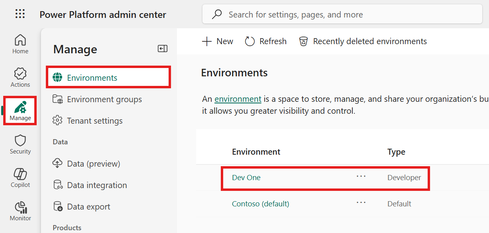
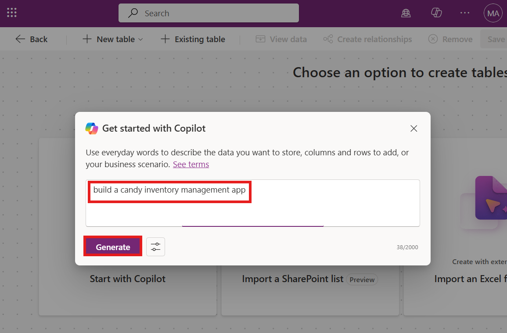
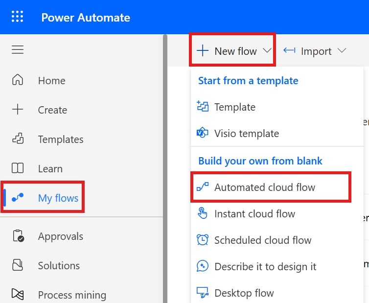
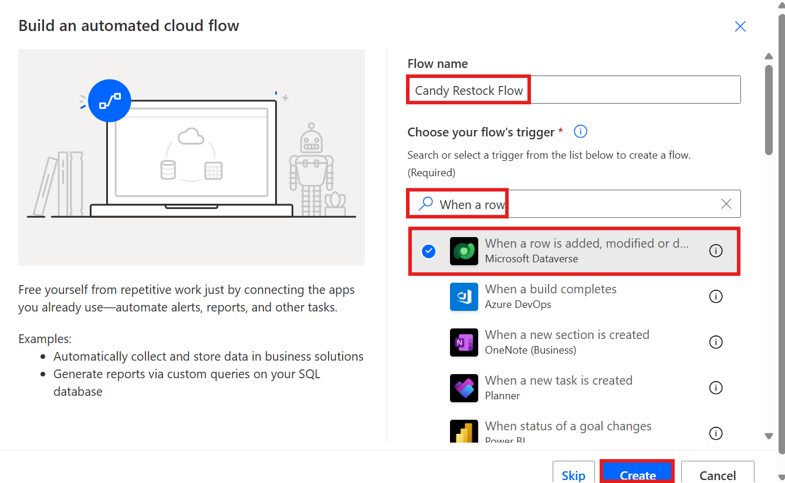

# **Lab 2 - Build an Inventory Management App**

**Objective:** The objective of this lab is to guide participants
through the creation of a functional inventory management application
using Microsoft Power Apps and Copilot. Participants will learn to set
up their Dataverse environment, design app screens, manage data, and
automate inventory restocking workflows with Power Automate.

**Estimated Time:** 40 min

## Exercise 1: Build Inventory Management App

### Task 1: Verifying your Dataverse environment 

1.  Open a browser and go to
    +++**https://admin.powerplatform.microsoft.com**+++. Sign in with your office 365 admin account.

2.  From the left navigation pane, select **Manage** > **Environments**. The **Dev one** - **Developer
    environment** should have been created for you as shown in the image.
   
    

3.  Use the same developer environment to execute all the exercises of
    this lab.

     **Note**: **Dev one** developer environment is used in this lab. The name of the environment can be different for different users. Make sure to select your developer environment.

### Task 2: Create inventory management app using Copilot.

1.  Open a browser and go to +++**https://make.powerapps.com**+++ sign in
    with office 365 admin tenant credentials.

2.  Click on the environment on right top corner and select **Dev One** environment. 

    

3.  From the left navigation pane, select **Apps** and then select **Start with Copilo**t. 

    

4.  Enter the below prompt and click on the **Generate** button.

    +++**build a candy inventory management app**+++

    

5.  Copilot generates the tables as shown in the below image.

    **Note**: Note that, Copilot may generate different tables for you. 

    

6.  Click on three dots next to **Candy** and then click on **View data.**

    


7.  The data in the Candy table should have data as shown in the image
    below. Again note that, your data may differ 

    


8.  Click on **Supplier --> View data** and explore the data and then
    close the view window.

    


9. Update one of the Supplier email/Contact Email ids with your work/personal working
    email id

    


10. Click on **Order --> View data**. Note that your table name may differ. For example it can be Inventory.

    


11. Enter below prompt in the text box and click on Enter. This column is
    required to notify when the quantity went below the reorder point.

    +++**Add reorder point column to Candy table**+++

    


12. Add candyInStock column with type as Number. If Quantity is less
    than reorder points, then Quantity column will automate add with
    candyInStock.

    +++Add candyInStock column to Candy table with sample stock count+++

    

13. The table has been updated with reorder point column and Candy in
    Stock column 

    


14. Click on the **Save and open app** button

    

15. On **Done working?** window, click on **Save and open app** and wait
    for the app to be created.

    

    


16. Skip the welcome window.

    


17. The app gets created and should look like the image below.

    


18. Click on the **save** button and enter the name +++**MSCandy Inventory
    management app**+++, then click on **Save** button.

    


    


19. Explore the app. Click on **the Candy screen** from Tree view. You
    can update the label of the screen to **Candy Inventory management**

    


20. Explore the Supplier screen and update as per your requirements.

    


### Task 3: Create candy quality Screen

1.  Click on **New Screen** and select **Blank** template.

    

2.  Select the new screen and right click **Rename**

    


3.  Name the screen as +++**Candy quality screen**+++

    


4.  Click on Screen area and select **With data** then select **Create new tables**

    


5.  Click on **New table --> Add columns and data.**

    


6.  Click on **New column -> Edit column.**

    


7.  Enter the Display name as +++**Candy ID**+++ and then click on **Update**
    button.

    


8.  Click on **New column** and enter below details and then click on
    **Save**.

    - **Display Name:** +++Candy Name++
    - **Data Type:** Choice
    - **Required:** Yes.
    - **Choices:** add below choices

        - ++Chocolate Bar++

        - ++Gummy Bears++

        - ++Jellybeans++

        - ++Lollipop++

        - ++Sour Patch Kids++

    


9.  Click on **New Column** and add a column with below details and then
    click on **Save**.

    - **Display Name:** ++Candy Quality++
    - **Data type:** Choice
    - **Required:** Yes
    - **Choice:** add below choices
      - ++Defective++
      - ++Nondefective++

    


     **Note:** You can add more columns as per your app requirements.

10.  To edit the table name, click on the **Properties** and update it with +++**Candy Quality check**+++. Select **Save**.
 
     


11.  Click on **Save and exit -> Save and exit**. Zoom out the screen for the button to become visible.

     

12.  You will navigate back to the Power Apps app page. Select the newly
    added screen and click on Insert and select **Edit form** as shown
    in below image.
    


13.  Click the container and select the data source table as +++**Candy
    Qualities table**+++.
    

14.  You should see the form like below image.
    


15. Adjust the Form control to the middle of the page. Click on **Insert >
    Text label.**
    


16.  Adjust the text label and enter the text as: +++**Candy Quality check**+++
    and update the styles of text.
    


17.  Select the **Form**. Click on **Insert** and select **Button**.
    


18. Drag the Submit button and place it in the middle of the container.
    Select the button and change the **properties** text to **Submit**
    as shown in below image.
    

19.  Select the **Submit** button and select **OnSelect** function and
    enter below function.

    +++SubmitForm(Form4);NewForm(Form4)+++

     **Note:** Form4 in the formula should be replaced with your form name .


20. Select the **Form**, under properties, select **Default** mode to
    **New**.
  
    


21. Click on **Save** and then click on **Preview app** button as shown
    in below image.

    

22. Enter Candy details and then click on the **Submit** button.
 
    


23. Close the preview window.

24. On the Power Apps portal, click on the **Back** to go back to the **Home** page. From the left navigation pane, select **Tables** and then select **Candy quality check** table from the list and
    you should see the record added above.
  
    


## Exercise 2: Create a Power Automate flow to restock the inventory.

### Task 1: Create a Power platform flow to trigger restock email

1.  Switch back to Power Automate tab and click on **My flows** -\>
    **New flow -\Automated cloud flow.**

    


2.  Enter the flow name as: +++**Candy Restock Flow**+++. Search for +++**When a
    row**+++ is and select Dataverse’s **When a row is added or modified**
    action and then click on **Create**.

    


3.  Select the step and set the parameters below.

    - **Change Type**: Added or Modified
    - **Table Name**: Candies
    - **Scope**: Organization

      


5.  Add an action after an action **“when a row is added, modified or
    deleted”.**
 
    


6.  Search for **Condition** and select **Control’s Condition** action.

      

8.  Click on Chose value and select choose from previous step dynamic
    action.

    


9.  Search for +++**Quantity**+++ column and select it. If you dont see **Quantity** in you list then select other appropriate field. For example **candyInStock**.
 
    


10.  Select a condition that **is less than** and click on Enter data
    from previous action.
    


11.  Search for the +++**Reorder points**+++ column and select it.
    


12.  **Add an action** under **True** condition.
    


13.  Select +++**Approvals**+++ action.
    


14.  Select +++**Start and wait for an Approvals**+++ .
    


15. If asked, create a new connection. Select Approval Type as: **Approve/Reject – First to Respond**.
    Enter Title as: +++**Approve to Restock**+++ - and click on Dynamic button
    to select the data from previous step.
    


16.  Search for +++**Candy Name**+++ and select it.
    

17.  Enter below details.
   
       
        **Assigned to**: Start typing Admin, and select **MOD ADmin** from the suggestion.
        
        **Details**:
         ```
        Hi Sir,  
        
        **Candy Name** (Select from dynamic content) is out of stock - for customers to place an order. Please approve to
        restock.  
        
        Thanks
        ```

> **Note:** You can customize the details section as per your requirements.


16. **Add an action** after **approval** action.
    


17. Search for +++**condition**+++ and select **Control – Condition**.
    


18. Click on Choose value and select **Outcome** from Start and wait for
    an Approval action.
    


19. Select the condition as **is equal to** and enter the value as
    +++**Approve**+++.
    

20. Under **True** condition, **add an action**.
    


21. Search for +++**Update Row**+++ and select it from **Microsoft Dataverse**
    section.
    


22. Select your **Candies** table and Click on **Row Id** select Dynamic
    action.
    


23. Search for a unique identifier column from your table and select it.
    


24. Click on **Advanced Parameters** drop down and select **Quantity**
    column. Note that, here your column can be different. 
    

25. Enter the below function (you type in your app) and collapse the
    action.

    > **Note:** The below function does not work for you as your column schema name might be different. Go to table --> column and copy schema name.

    +++add(triggerBody()?\['cr8a3_Quantity'\],triggerBody()?\['cr8a3_CandyInStock'\])+++
        
    


26. Click on **the Save** button to save the Power Automate flow.
    


### Task 2: Test the restock flow

1.  Switch back to **PowerApps** tab and click on **Candy** screen from
    left Tree view and select **play**.

    > **Note:** You can update the Title of the screen
        
    


2.  Select the Candy and click on **Edit**.
    


3.  Enter the **Quantity** value **less than reorder points** and
    **commit** changes.
    


4.  Switch back to Power Automate flow tab and click on My flows -\>
    Your flow.
    

5.  Flow is running and is at condition.
    


6.  Open a new tab and go to +++**https://outlook.com**+++ and sign in with your office 365 admin account. You should have got an email to restock.
    **Approve** and **submit**.
    

    


7.  The flow is successful now.
    

    


8.  Switch back to PowerApps and check the above product quantity. It
    should have been updated (Candy in stock+ Quantity when its less
    than reorder point)
    


### Conclusion:

By the end of this lab, participants will be able to
verify their Dataverse environment, build an inventory management app
utilizing Copilot, design a Candy Quality Check screen with custom
fields, and implement Power Automate flows to trigger restock requests
based on inventory levels. Additionally, they will gain skills in
testing and validating automated workflows to ensure accurate inventory
updates following approval processes. This structured approach will
empower participants to effectively leverage the capabilities of Power
Apps and Power Automate, enhancing their skills in app development and
process automation.
