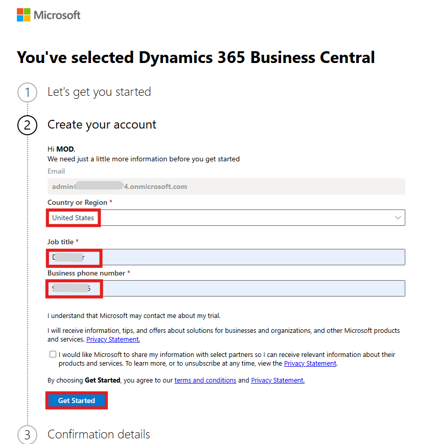
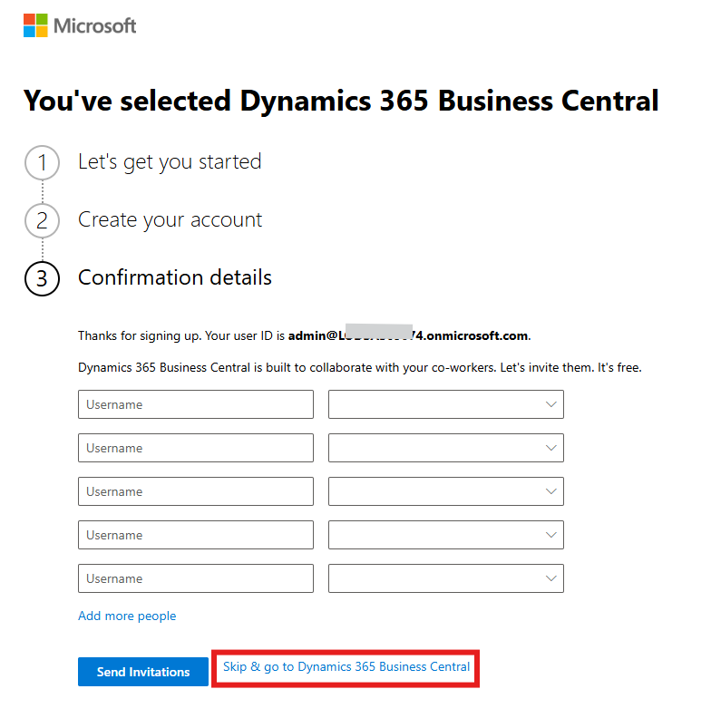
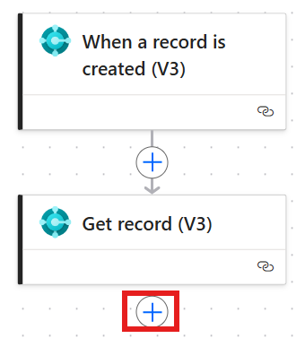

# Lab 3 - Build an Automated Flow to Notify Manager When a New Item is Created in Dynamics 365 Business Central

**Objective:** In this lab, participants will learn how to create an
automated flow in Power Automate that sends an email notification
whenever a new item is created in Microsoft Dynamics 365 Business
Central. By following a structured process, participants will become
familiar with triggering flows based on Business Central data,
collecting relevant item information, applying conditional logic, and
executing actions to send email alerts. This hands-on experience will
empower participants to leverage Power Automate for enhancing business
processes and notifications.

**Estimated Time:** 15 mins

### Task 1: Sign up in Microsoft Dynamic 365 Business Central

1.  Navigate to
    +++**https://www.microsoft.com/en-us/dynamics-365/products/business-central**+++
    and click on the **Try for Free.**

    

2.  If asked, complete the verification process by solving the puzzle and if asked, enter your Office 365 tenant ID and click **Next**.

    

3.  Then click on the **Sign in** and enter the credentials.

    

4. Select **United states** as country or region, enter your **Job title** and the **phone number** and then select **Get started**.

    

 
5.  Select **Skip & go to Dynamics 365 Business Central**.

    
    

6.  Then click on **Get started** to access Business Central.

    

7.  Select the **Skip Survey** button to proceed.

    

8. You will be directed to the Dynamics 365 Business Central home page.

    

  
### Task 2: Start Power Automate

1.  Open a new tab next to Dynamic 365 business central and Navigate to
    +++**https://make.powerautomate.com/**+++ in your browser.
    
    

3.  If asked, enter the **Microsoft 365 tenant id** in the respected field and
    click on the **Next** button.  

    

4.  Enter the **password** in the respected field and click on the
    **Sign in.**

    

5.  From the top navigation bar select the environment **Dev One.**

    

6.  Click **+Create** in the left menu.

    

7.  Select the **Automated cloud flow** tile.

    

### Task 3: Create the Trigger Based on Business Central Data

1.  In the **Flow name** box, enter +++**Email notification for new
    furniture**+++.

    

2.  In **Choose your flow's trigger search bar**, enter **business
    central**. Scroll down to view the triggers and select **When a
    record is created (V3)** trigger.

3.  Click **Create**.

    

4.  Fill in the trigger details:

    1.  **Environment name**: Enter +++**PRODUCTION**+++.

    2.  **Company name**: Select **CRONUS USA, Inc.** from the list.

    3.  **Table name**: Select **items**.

    

### Task 4: Collect Data from Business Central

1.  Click **+ button** add then select **Add an action**.

    

2.  In the **Add an action** window, type +++**Dynamics 365 Business
    Central**+++ in the search box and choose the **Get record (V3)**
    action.

    

3.  Enter the following information:

    1.  **Environment**: +++**PRODUCTION**+++.

    2.  **Company name**: Select **CRONUS USA, Inc.**.

    3.  **Table name**: Select **items**.

    4.  **Row id**: Select the **Row Id** token from Dynamic content.

    

### Task 5: Make the Condition

1.  Click on the **+ button** below Get record and select **Add an
    action**.

    

2.  In the **Add an action** search bar, Enter **Control**. Choose the
    **Condition** action.

    

3.  Set the condition:

    1.  In the first **Choose a value** box, select the **Item Category
        Code** token from Dynamic content.

    2.  Keep the **is equal to** option.

    3.  In the second **Choose a value** box, enter +++**FURNITURE**+++.

    

### Task 6: Create an Action Based on the Condition

1.  In the **If yes or True** condition window, click **Add an action**.

    

2.  Search for +++**office 365 outlook**+++ in the Add an action window and
    click on see more. In the office 365 outlook trigger select **Send
    an Email (V2).**

    

    

3.  Fill in the email details:

    1.  **To**: Enter ‘Admin’ and select **Mod Admin** from the suggestion i.e. Office 365 tenant email Id which you are using in this lab. 

    2.  **Subject**: Enter +++**New furniture released**+++.

    3.  **Body**:

        1.  Add the text **New** **furniture**.

        2.  Add the token **Number** from Dynamic content.

        3.  Add the token **displayName** from Dynamic content.

        4.  Add the text +++**has just released.**+++

    

4.  Click **Save** to finalize your flow.

    

### Task 7: Test the Flow

1. From the top bar, click on the **Test** button.

    

2. Select the **Manual** Process and then click on **Test**.

    

3.  Navigate back to the **Business Central website** and from the top
    bar, go to **Sales** 🡪 **Items**.

    

4.  Click on the **+ New button**

    

5.  Select **ITEM**, and then click **OK**.

    

6.  In the Item Category Code field, select **FURNITURE** and in the
    Description field, write **Office Chair.**

    

7.  Click on the **Save** button.

    

8.  On the Power Automate portal, click on **App launcher** located at the upper left corner. Select **Outlook** and then you can see the automated response is received on MOD Admin’s provided **Email**.

    

### Conclusion: 

By the end of this lab, participants will have
successfully created an automated email notification flow in Power
Automate for new items in Business Central. They will have gained
practical experience in setting up triggers, actions, and conditions,
which are essential skills for automating workflows. Participants will
also understand how to gather and manipulate data from Business
Central effectively, enabling them to streamline communications and
enhance productivity in their respective organizations. This knowledge
will serve as a foundation for further exploration of Power Automate
capabilities in automating various business processes.
