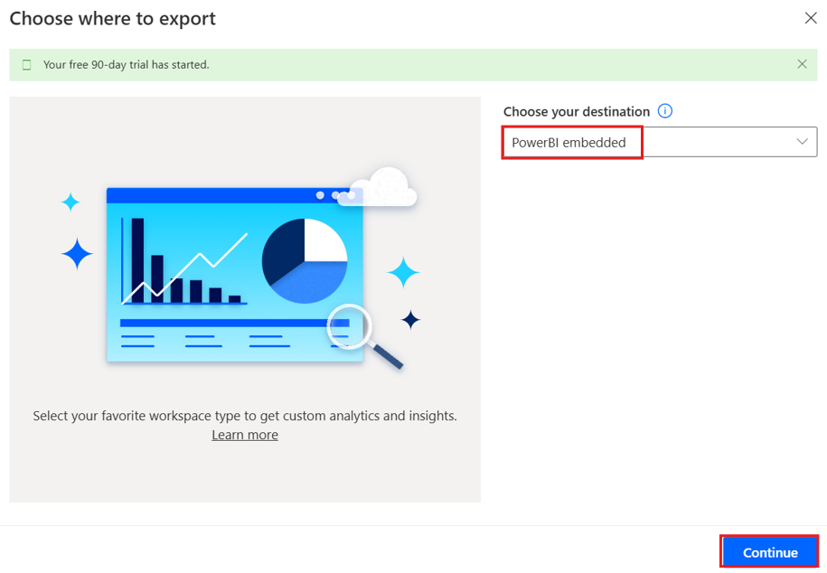
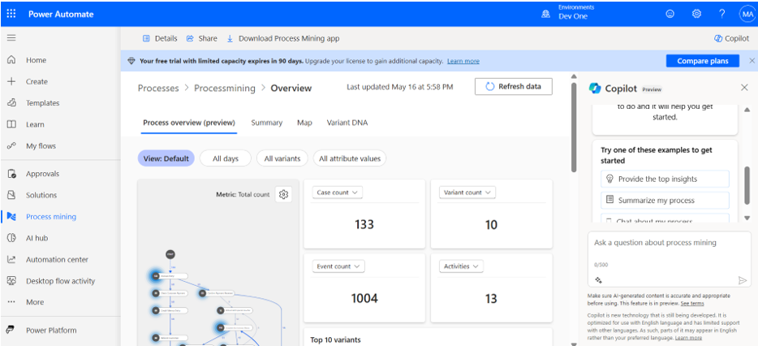

# **Lab 5 - Creating and Analyzing the Accounts Payable Refund Process**

**Objective:** The objective of this lab is to create and analyze an
accounts payable refund process using Power Automate Process Mining
capabilities. Participants will learn to import data from a CSV file,
create a new process, and utilize the Process Mining desktop app to
analyze key performance indicators (KPIs) and other metrics to gain
insights into the efficiency and performance of the accounts payable
refund process.

**Estimated Time:** 30 mins

### Task 1: Create a process

1.  Go to +++**https://make.powerautomate.com/**+++. If asked, sign in with your Office 365 tenant credentials. Select **United States** as country/region and then select **Get started**.

    

2.  Select your environment – **Dev One**.

    

3.  On the navigation pane to the left, select **More** 🡪 **Process
    mining**.

    

4.  In the **Create new process** section, select **Start here**.

    

5.  In the **Create a new process** screen, enter a process name –
    +++**Processmining**+++, and then select **Import data**, select **Data flow** and then select
    **Continue**. (Optional) Enter a description for your process.

    

6. If you are asked to **choose where to export** then select **Power Bi embedded** from **Choose your destination** drop-down and then select **Continue**.

    

### Task 2: Import data

1.  In the **Choose a data source** screen, select **Text/CSV**.

    

2.  Under the **Connection settings** heading, select **Upload file**.

    

3.  Select **Browse**.

    

4.  Find and select **SampleData_AP_Refunds_Financial_EventLog.csv**.
    Location: **C:\Lab Files**

5.  Select **Open**.

    

6.  If you're asked to authenticate, select **Sign in** and follow the
    prompts. (Configure Pop-up blocker to allow.)

    

7.  Select **Next**.

    

8.  Preview file data and select **Next**.

    

9.  When you see the power query, which allows you to transform your
    data, select **Next**.

    

10. Match the **Attribute Name** from sample data to the **Attribute
    Type** as metioned in the next step.

    

11. In this sample, the data attributes you’ll change
    are **InvoiceValue**, **Resource**, **StartTimestamp**, **EndTimestamp**, **CaseId**,
    and **ActivityName** as follow.
    
    **InvoiceValue** – Financial per case (first event)
    
    **Resource** – Resource
    
    **StartTimestamp** – Event Start
    
    **EndTimestamp** – Event End
    
    **CaseId** – Case ID
    
    **ActivityName** - Activity

    

12. When you're **finished**, the attribute mapping should look like the
    following screenshot.

    

13. Select **Save and analyze**. The analysis might take a few minutes
    to run.

    

14. When the **analysis process is complete**, you’ll see a process map
    and a dashboard with other insights about your process. On the
    dashboard, you can view many metrics that will help you **analyze
    your process.**

    

### Task 3: Analyze a process

Let’s take the analysis of our process beyond KPIs. We'll use the Power
Automate Process Mining desktop app, where you can edit and analyze your
processes created in the process mining capability.

1.  From the top bar, click on the **Download process Mining app**.

    

2.  Double click on **PowerAutomateProcessMining** App installer file in
    Downloads.

    

3.  Click on **Install**.

    

4. After Installing Processmining app, the app is automatically launched, if not please please launch app manually. After launching app, select **English** as language and click on **Next Step**.

    

5. Select all the **check boxes** as shown in image and click on the **Next Step**.

    

6. Then click on **Apply and mine** button.

    

7. If the following screen appears, then select **Use** button, it will navigate to login window.

    

8. Enter you admin tenant Id and click on the **Sign In** button.

    

9. Then enter your admin tenant password and click on **Sign in**.

    

10. If pop up appears saying ‘Stay signed in to all your apps’ then select **No, sign in to this app only**.

    

11. On the Power Automate Process Mining app toolbar, select the
    environment – **Dev** **One** from the top right.

    

12. Search for the process that you created with the process mining
    capability in Power Automate (**Processmining**).

13. Select **Default** to display the default view. You’re ready to use
    the advanced capabilities of the Process Mining desktop app.

    **Note**: If you get an error - '**Loading process model failed**' then close the **Process Mining** app and **reopen** it from the **Start** menu of the VM.

    

    **Note**: If It shows an message related to **Model size is too large for your PC configuration** and give Yes and No option for execution, select **Yes**.

    

14. On the **Customize** panel toolbar, select **Frequency** (the first
    icon), and then select **Case count** in the **Metric** dropdown
    menu.

    

    > The process map displays the number of cases of the process that
include the activity specified at each node.

15. On the **Customize** panel, select the **Performance** (clock icon),
    and then select **Mean duration** from the dropdown menu.

    

    > Notice that the **Refund with special voucher** step has a long mean
duration compared to other steps.

     

17. On the **Customize** panel, select **Finance** (the piece of paper
    icon), and then select **Mean** from the **Metric** dropdown menu.

    

    > Notice that the same **Refund with Special Voucher** step involves
only \$631.11 in invoice value, which is less than half of most of the
other steps.

    

18. Select **Save**.

    

### Conclusion:

In this lab, participants created and analyzed an
accounts payable refund process using Power Automate Process Mining
capabilities. By importing CSV data, they constructed a detailed process
map and dashboard, allowing them to examine key performance indicators
(KPIs) and process metrics. Through the Power Automate Process Mining
desktop app, participants performed deeper analysis, identifying
inefficiencies such as long durations and lower invoice values in
specific steps. This lab demonstrated how Process Mining can help
organizations optimize financial workflows, improve efficiency, and
streamline accounts payable operations.
