# Lab 6 - Using Task Mining Capability to Analyze the Order Fulfillment Process

**Objective:** The lab focuses on utilizing Power Automate task mining
capabilities to analyse and optimize the order fulfilment process.
Participants will learn how to import a solution containing sample
recordings, explore task mining features, and perform process analysis
to identify bottlenecks. Additionally, the lab covers automating process
steps and using analytics to gain insights into the process efficiency.

**Estimated Time:** 30 mins

### Task 1: Get ready for task mining

1.  **Sign in** to Power Automate using
    <https://make.powerautomate.com/> with your Office 365 tenant
    credentials.

2.  Select your environment – **Dev One**.

    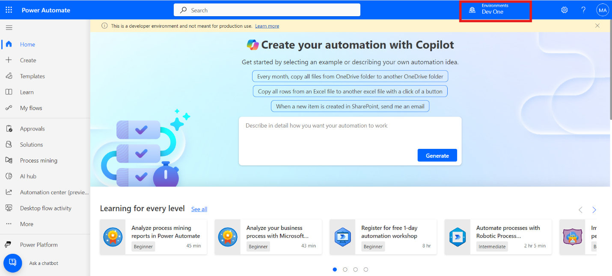

### Task 2: Import a solution

1.  On the navigation pane to the left, select **Solutions** and then in
    the toolbar at the top, select **Import solution**.

    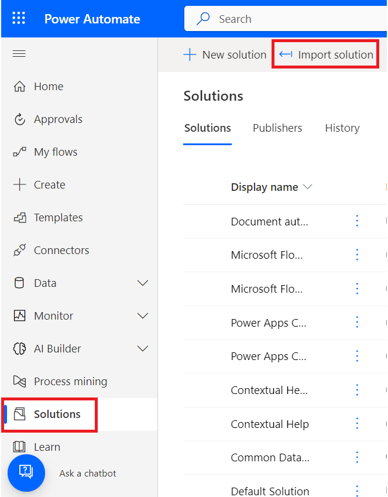

2.  Select **Browse**.

    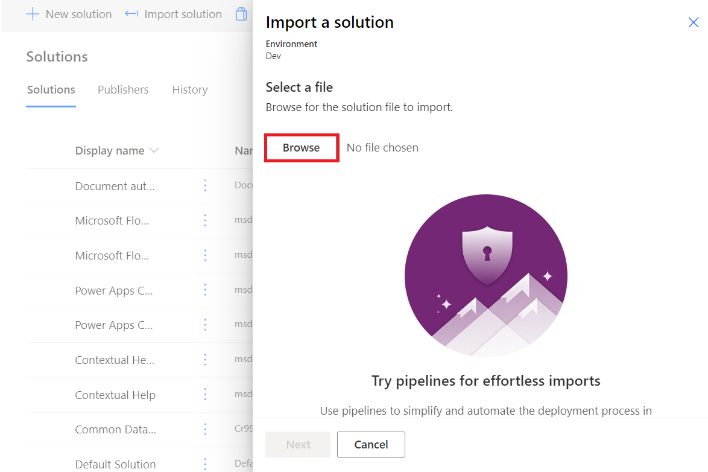

3.  Select the **Processmining.zip** file from C:\Labfiles and open it.

    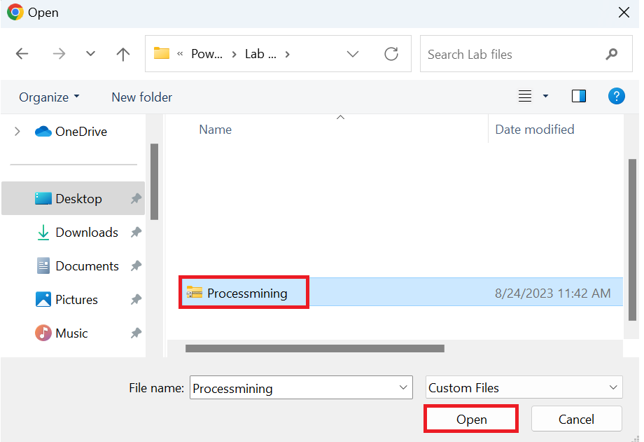

4.  Select **Next**.

    

5.  Select **Import** and wait for the solution to import.

    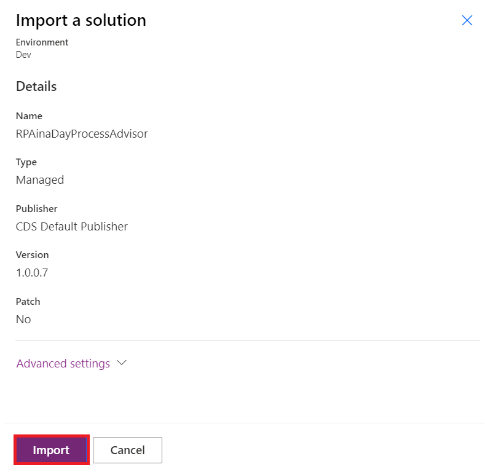

### Task 3: View sample recordings

1.  Once you've successfully imported the .zip file, on the navigation
    pane to the left, select **Process mining** and then select
    the **Invoice submission process**.

    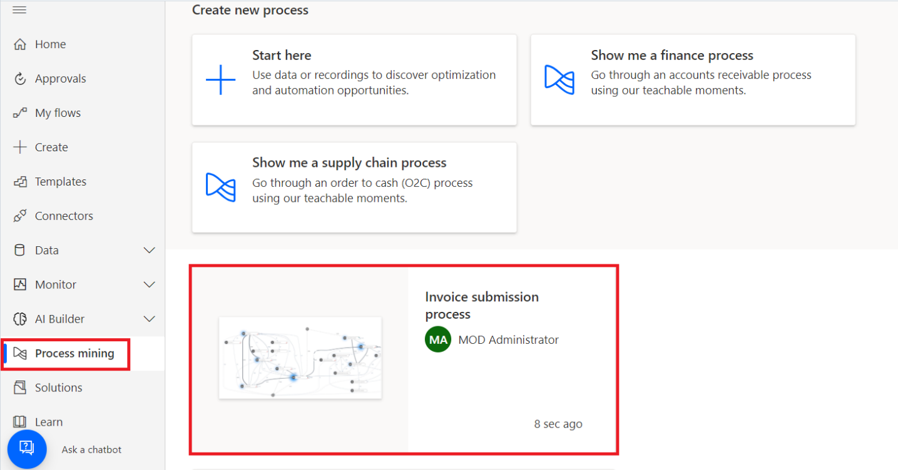

2.  If you navigate to Analytics tab, then go one step back. Go back to
    the **Invoice submission process** by selecting it from the
    breadcrumbs at the top of the page.

    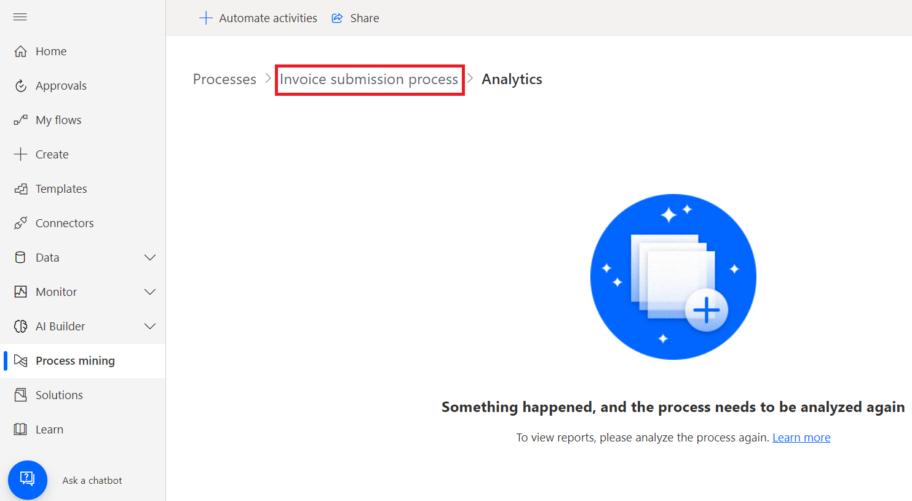

3.  You can see some of the existing recordings under **Recordings**.

    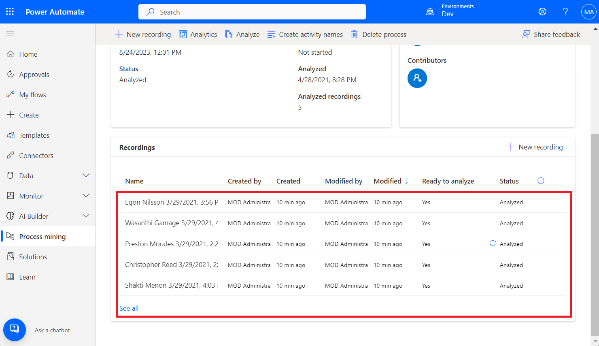

4.  To be sure you see the entire list of existing recordings,
    select **See all**.

### Task 4: Explore the features

You'll see the following features:

- **New recording**: Create a new recording.
- **Analytics**: See the process map and insights
- **Analyze**: Analyze a process.
- **Create activity names**: Create activity names for your process.
- **Delete process**: Delete your process.

    

### Task 5: Analyze a process

When you analyze a process, the process mining capability analyzes
existing recordings to identify any bottlenecks within the business
process.

1.  Select **Analyze**.

    > **Note:** The analysis will take a few minutes to complete. During this
process, a status message displays under the **New recording** button.

    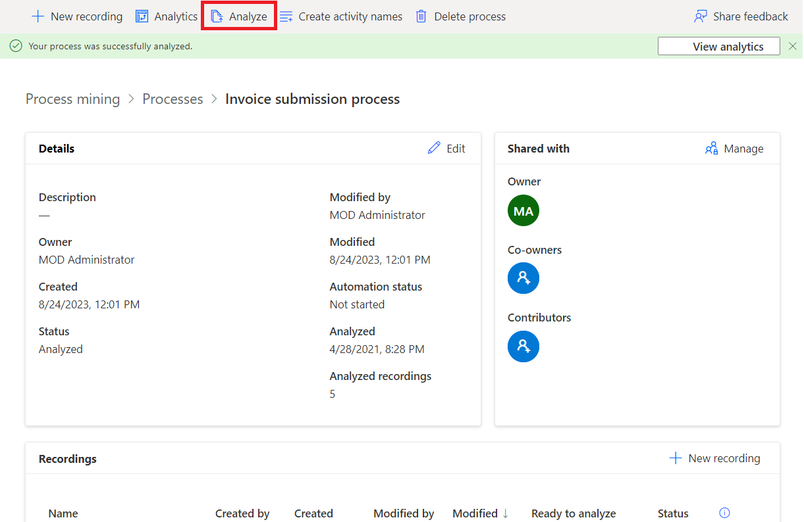

2.  If you run into an error during the analysis stage,
    select **Analyze** to trigger this action again.

3.  Once it's done, you see the **Process analysis status** change
    to **Analyzed**. Select **Analytics** to see the process map and
    insights.

    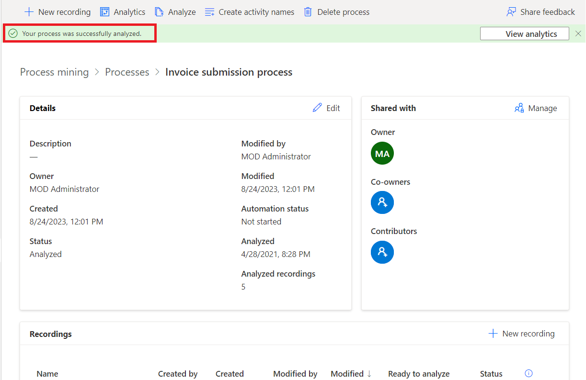

    > **Note:** This step may take a couple minutes to complete after the    
analysis has been performed.

### Task 6: Analytics page layout

This section explains what you can do on the **Analytics** screen.

    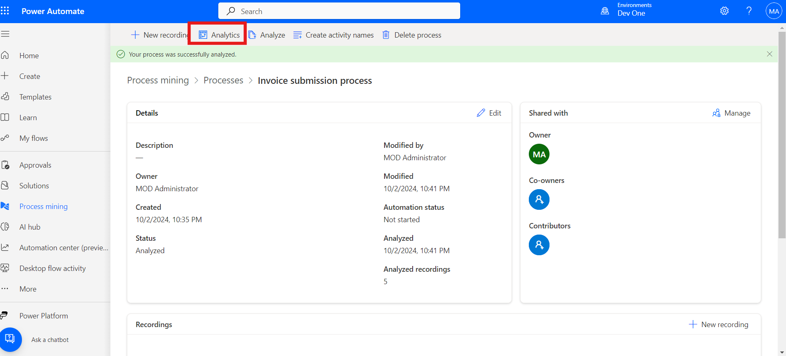

    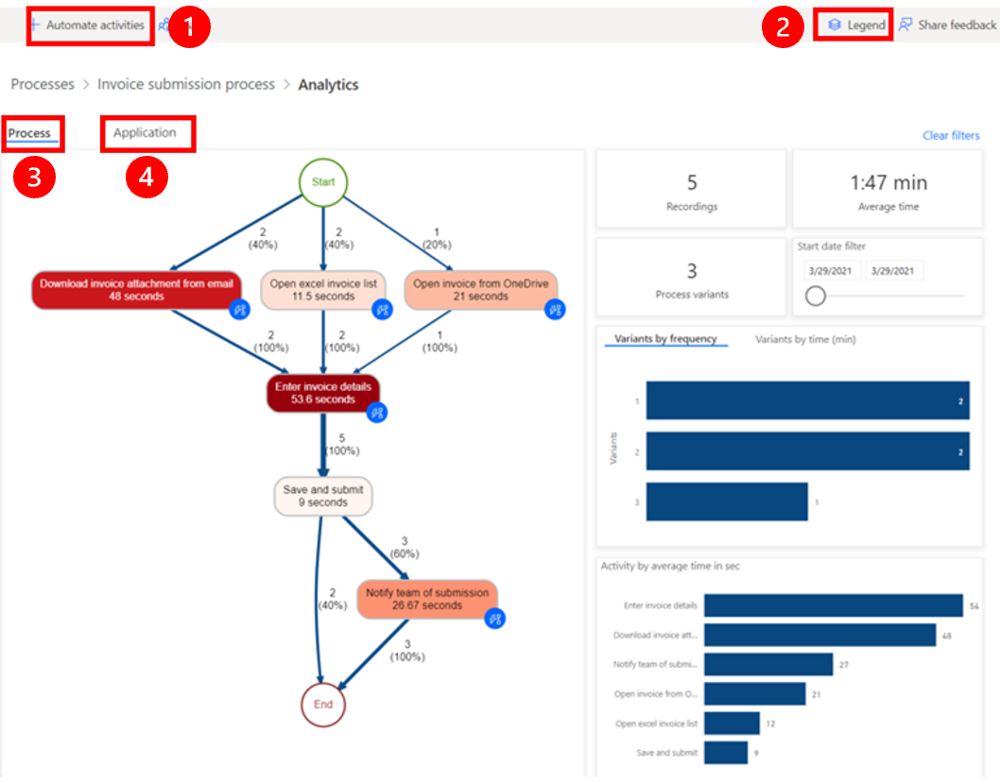

**Legend:**

1.  **Automate activities**: To streamline the automation process, you
    can use the **Automate activities** feature. This feature detects if
    the user performed actions using an application that has Power
    Automate actions available, such as Microsoft Outlook or Excel. Upon
    selecting **Automate activities**, a draft Power Automate process
    containing the relevant actions is generated. The user can then
    modify and customize the draft process to create the final automated
    process.

2.  **Legend**: Additional information about the report, helping them to
    better understand the visualizations and data presented.

3.  **Process**: In-depth information about the analyzed process,
    including the process map, time analytics for each variant and each
    recording author.

4.  **Application**: Information about the apps used in recordings. This
    includes what apps were used by authors, how often they were used,
    and what the transitions were between them. This report explains
    which connectors should be used when implementing automation for the
    process, and where to potentially use desktop flows, as there’s no
    existing connector.

### Task 7: Business process step relationships

You see the various steps in the business process and their related
durations. These steps include:

- Download invoice attachment from email (48 seconds)
- Open Excel invoice list (11.5 seconds)
- Open invoice from OneDrive (21 seconds)
- Enter invoice details (53.6 seconds)
- Save and submit (9 seconds)
- Notify team of submission (26.67 seconds)

    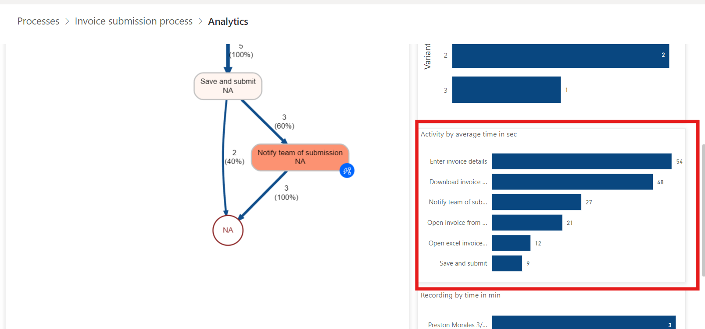

### Task 8: View analytics data

1.  Look at the top analytics data. The average process time is 1.47
    minutes out of five recordings.

    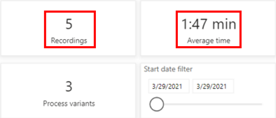

2.  Analyze other time-based metrics dashboards.

    > **Activity by average time in sec**: Notice that **Enter invoice
details** and **Download invoice** are taking the most time.

    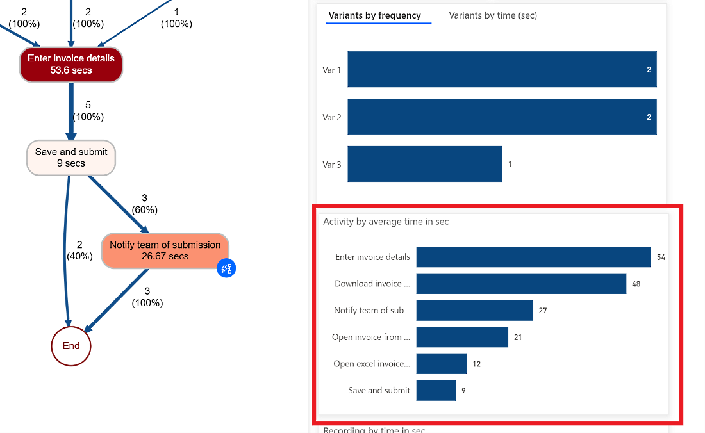

    > **Recording by average time in min**: Notice that some people
(**Preston Morales** and **Shakti Menon**) are taking more time than
others.

    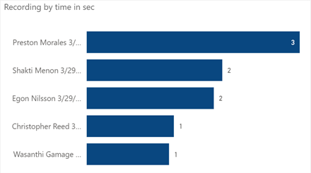

3.  Select the **Application** tab to see details on which applications
    were used.

    It might take a while to load the reports.

    - By providing information on the applications utilized in a business
      process, their frequency of usage, and the amount of time spent on
      each application, this report is crucial for gaining insights into the
      process.
    
    - For example, the dashboard shows that a legacy invoicing app, Outlook,
      and Excel have significant contributions to time spent and actions by
      applications.
    
    - Take time to get familiar with the different reports.

    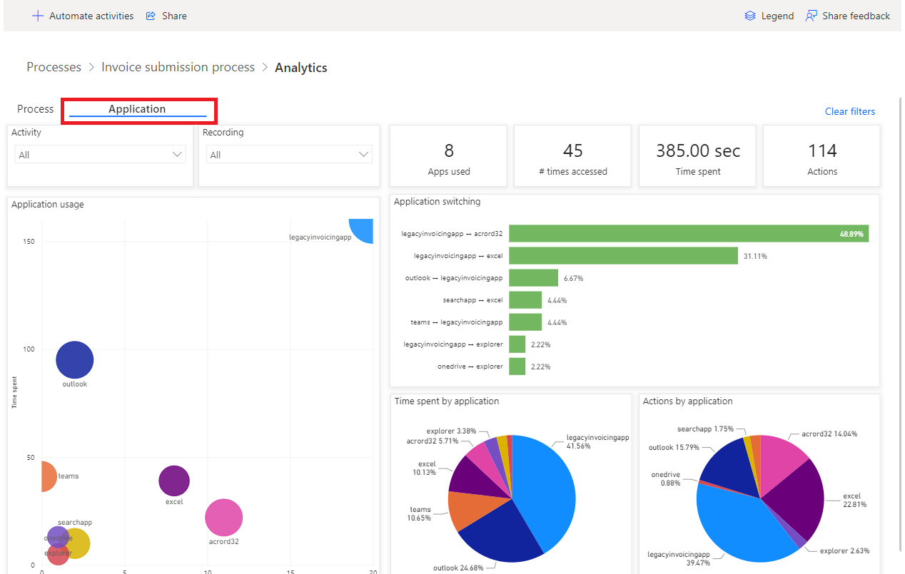

4.  Go back to the process map by selecting **Process**.

5.  Look at the automated activities feature. From the process map, you
    can see that the process mining capability has highlighted several
    activities as potential candidates for automation based on
    applications.

6.  Start to create a flow for automation by selecting **Automate
    activities** at the top.

    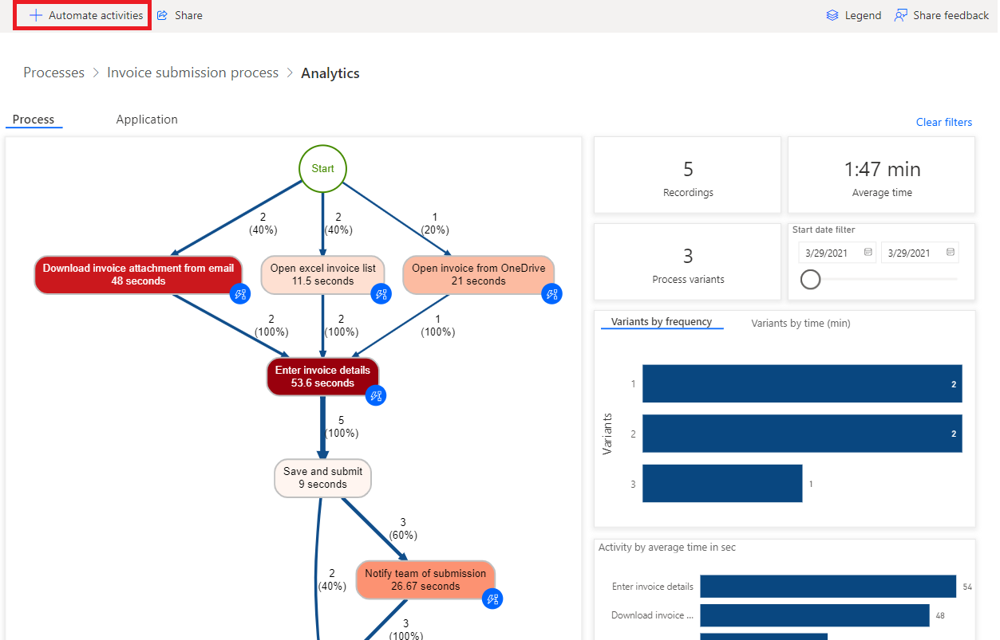

    A tab opens in the browser and shows the flow designer. The
recommended actions that match the activities from the process map
automatically appear on the right panel. For example, several email
connectors are suggested for you to use in order to automate
the **Download invoice attachment from email** activity.

    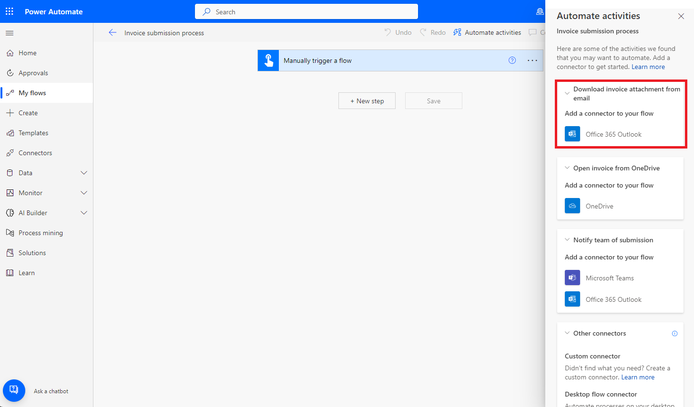

### Conclusion:

In this lab, participants utilized Power Automate task
mining capabilities to analyze and optimize the order fulfillment
process. By importing a pre-built solution with sample recordings, they
explored key features of task mining, including process analysis,
identifying bottlenecks, and generating automation recommendations.
Participants learned how to assess process efficiency through detailed
analytics on time spent across various tasks and applications. The lab
highlighted how task mining can streamline business processes by
identifying automation opportunities, ultimately improving operational
efficiency and reducing manual workloads in the order fulfillment
process.
