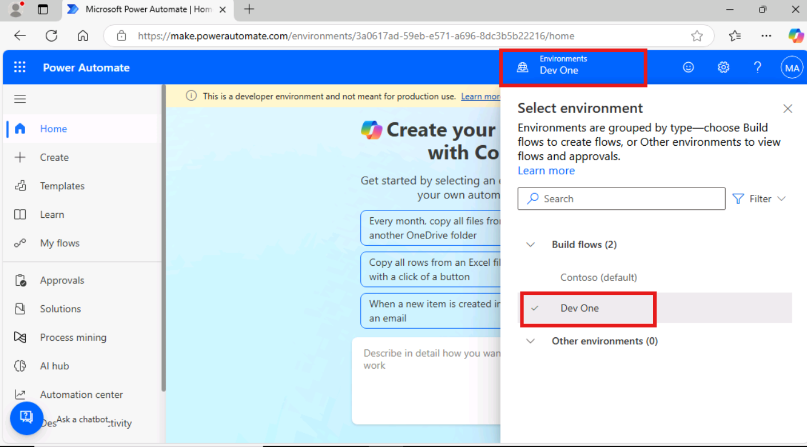
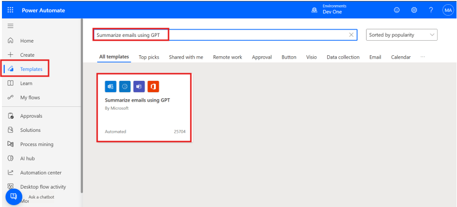
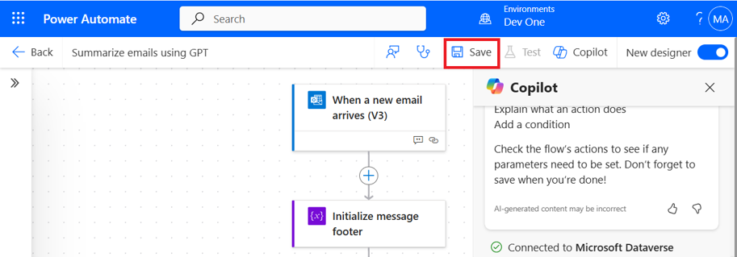
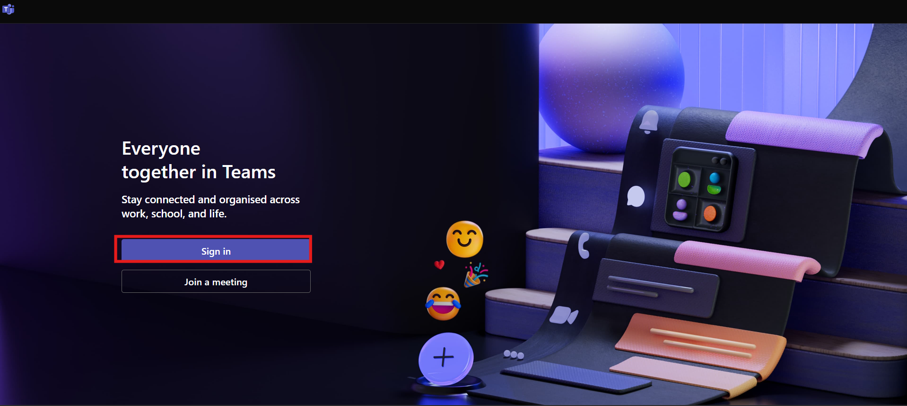
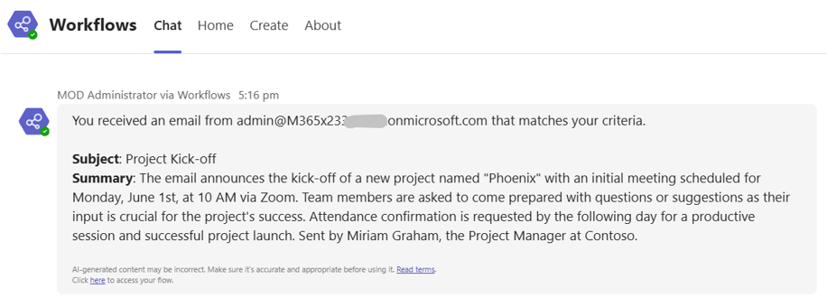

# **Lab 7 - Create a Flow to Route Helpdesk Requests to Different Mailboxes Based on Language**

**Objective:** The objective of this lab is to guide participants
through the process of creating a Power Automate flow that routes
helpdesk requests to different mailboxes based on language detection.
The flow integrates with GPT capabilities to summarize incoming emails
and automate the routing process based on specific triggers, helping
streamline communication workflows within the organization.

**Estimated Time:** 15 mins

### **Task 1: Create a flow to route Helpdesk requests to different mailboxes based on language**

1.  Sign in to  +++https://make.powerautomate.com/using+++ with office 365 admin tenant account.

2. From the top bar click on the environment and select **dev one** environment.

    


2.  Select **Templates** from left navigation pane, enter +++**Summarize emails using GPT**+++ in the search box at the top, press enter and select the flow when it appears.

    


3.  Next, the template shows you which connections will be used in this
    flow. If they don't have a green check mark next to them, fix the
    connection by selecting 'Sign in' next to the connection and then select **Continue**.

    


4.  Select the trigger, **when a new email arrives (V3).** The
    properties panel will open from the left with a note to update the
    Subject Filter parameter. Currently, the **Subject filter** is AI
    Builder.

5.  Update the subject filter to +++**Project Kick-off**+++.

    


6.  **Save** the flow in the top right-hand corner. Now we can run the
    flow.

    


    > Note: Ignore if you see the given warning: The 'Create text with GPT using a prompt' action doesn't have a content approval action after it.

### **Task 2: Test the flow**

1.  Send an email from MOD Admin's tenant id or your email id to MOD Admin's tenant id with the subject
    +++**Project Kick-off**+++ and the following in the body of the email:

    ```
    Dear Team,
    
    I hope this email finds you well. We are excited to announce the
    kick-off of our new project, "Phoenix". The initial meeting is scheduled
    for Monday, June 1st, at 10 AM via Zoom. Please come prepared with any
    questions or suggestions. Your input is vital for the project's success.
    
    Kindly confirm your attendance by the end of the day tomorrow. Looking
    forward to a productive session and a successful project launch.
    
    Best regards,
    
    Miriam Graham
    
    Project Manager
    
    Contoso
    ```
2. Open edge browser new tab and navigate to +++https://teams.microsoft.com/v2/+++ microsoft teams and click on the **sign in** button. If required use the admin tenant credentials for sign in.

    


3. You'll receive a message in Teams with a summary of the email. In
    the bottom right-hand corner, you can find a link to go to your
    flow.

    


4. This unit uses a GPT to summarize incoming emails. AI detection
    information can be inaccurate. Always make sure to verify the
    information from the GPT.

### Conclusion:

In this lab, participants successfully created a Power
Automate flow to streamline helpdesk requests by routing emails based on
language detection and using GPT to summarize the content. By
integrating automation into the email workflow, the lab demonstrated how
to efficiently manage communication across multiple teams or departments
based on language triggers. The exercise also showed how to use GPT
within Power Automate to enhance productivity and reduce manual sorting.
This solution helps organizations improve workflow efficiency and reduce
the response time for helpdesk inquiries.
