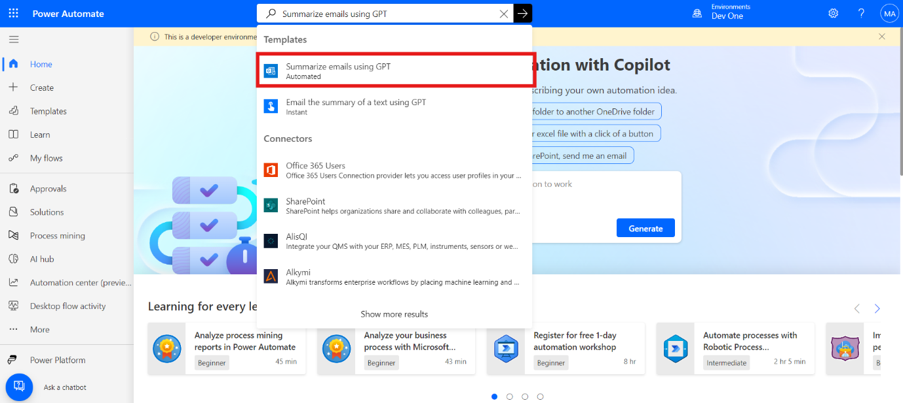
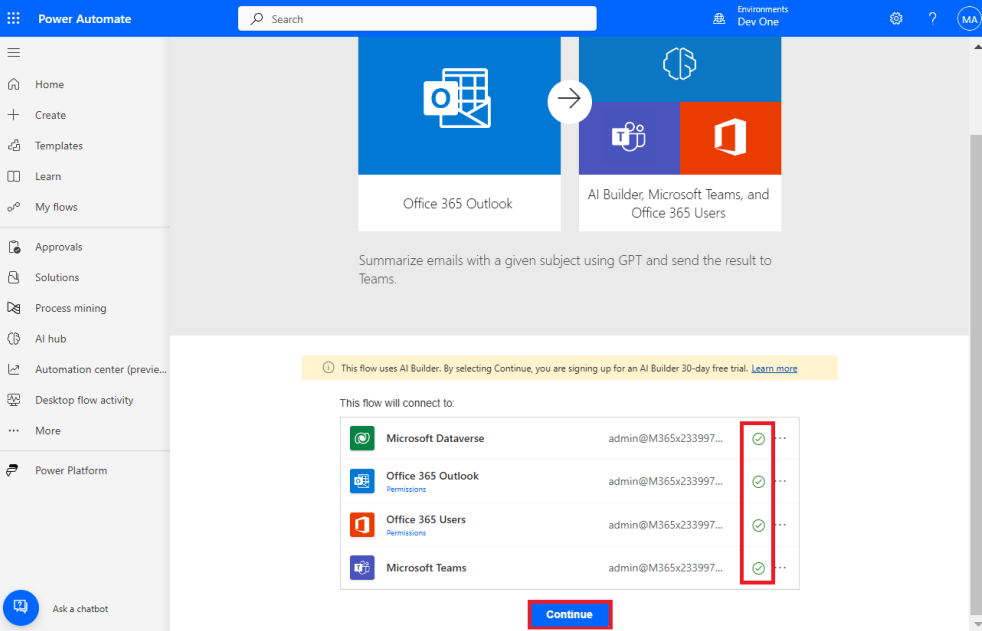
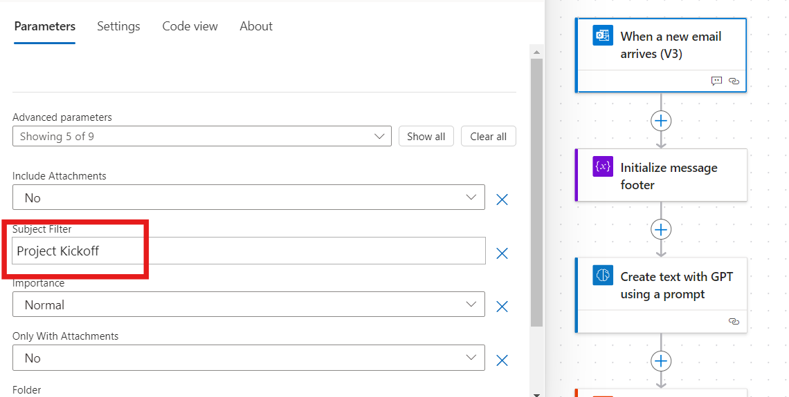
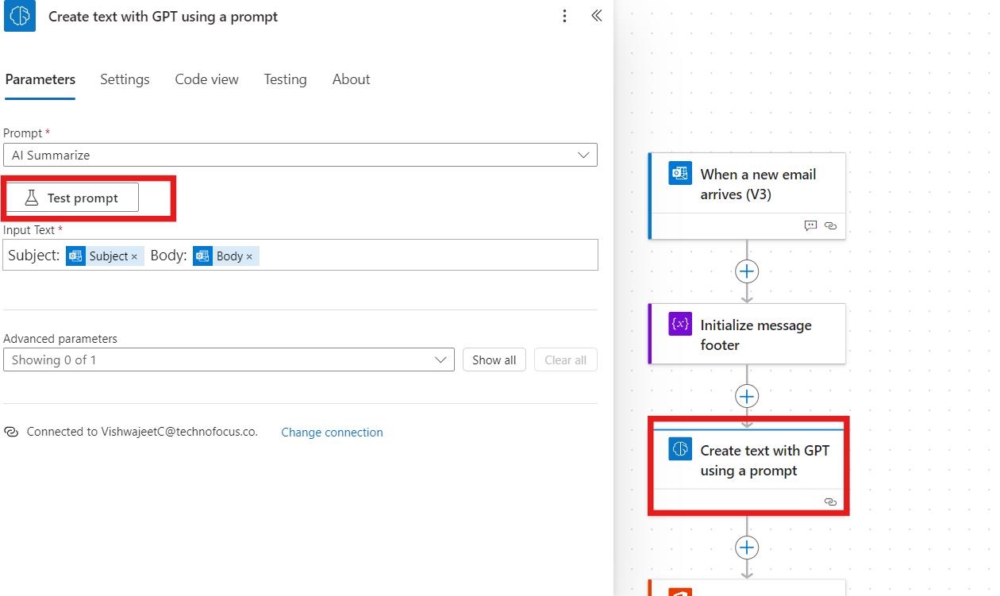
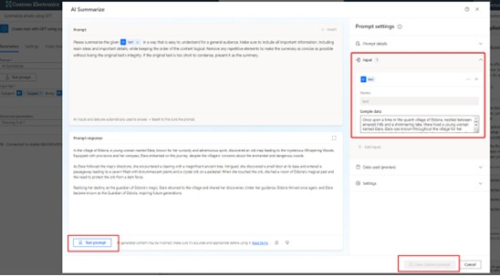
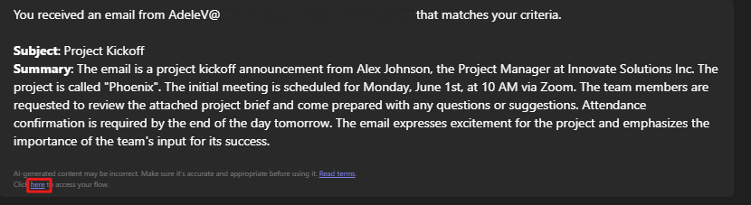

# Lab 7 - Create a flow to route Helpdesk requests to different mailboxes based on language

**Objective:** The objective of this lab is to guide participants
through the process of creating a Power Automate flow that routes
helpdesk requests to different mailboxes based on language detection.
The flow integrates with GPT capabilities to summarize incoming emails
and automate the routing process based on specific triggers, helping
streamline communication workflows within the organization.

**Estimated Time:** 15 mins

## Exercise 1: Create a flow to route Helpdesk requests to different mailboxes based on language

1.  Sign in to  <https://make.powerautomate.com/using> **office 365
    admin tenant account**.

2.  Type **Summarize emails using GPT** in the search box at the top and
    select the flow when it appears.

    

3.  Next, the template shows you which connections will be used in this
    flow. If they don't have a green check mark next to them, fix the
    connection and then select **Continue**.

    

4.  Select the trigger, **when a new email arrives (V3).** The
    properties panel will open from the left with a note to update the
    Subject Filter parameter. Currently, the **Subject filter** is AI
    Builder.

5.  Update the subject filter to **Project Kick-off**.

    

6.  Select the **Create text with a GPT using a prompt** action for the
    properties panel to open on the left. In the properties panel, the
    Prompt field shows **AI Summarize**.

7.  Select **Test prompt** to open the Prompt settings.

    

8.  The template has a predefined prompt that the GPT will use, but you
    can update and test a new prompt in this window.

9.  To test a prompt, enter sample data in the **Input** section. Then
    select **Test prompt** at the bottom of the Prompt response section.
    If you wanted to save your custom prompt, you would select Save
    custom prompt.

    

10. For this exercise, we'll leave everything as it was when we opened
    the Prompt Settings.

    > **Note:** Since we didn't change the prompt the save custom prompt
button is greyed out in the image above.

11.  **Save** the flow in the top right-hand corner. Now we can run the
    flow.

### Test the flow

1.  Send an email to the trigger's email address with the subject
    Project Kick-off and the following in the body of the email:

        Dear Team,

        I hope this email finds you well. We are excited to announce the
        kick-off of our new project, "Phoenix". The initial meeting is scheduled
        for Monday, June 1st, at 10 AM via Zoom. Please come prepared with any
        questions or suggestions. Your input is vital for the project's success.

        Kindly confirm your attendance by the end of the day tomorrow. Looking
        forward to a productive session and a successful project launch.

        Best regards,

        Miriam Graham

        Project Manager

        Contoso

2. You'll receive a message in Teams with a summary of the email. In
    the bottom right-hand corner, you can find a link to go to your
    flow.

    

3. This unit uses a GPT to summarize incoming emails. AI detection
    information can be inaccurate. Always make sure to verify the
    information from the GPT.

### Conclusion:

In this lab, participants successfully created a Power
Automate flow to streamline helpdesk requests by routing emails based on
language detection and using GPT to summarize the content. By
integrating automation into the email workflow, the lab demonstrated how
to efficiently manage communication across multiple teams or departments
based on language triggers. The exercise also showed how to use GPT
within Power Automate to enhance productivity and reduce manual sorting.
This solution helps organizations improve workflow efficiency and reduce
the response time for helpdesk inquiries.
