# Lab 9 - Setting Up Lab Environment for Power Automate Desktop 

**Objective:** The objective of this lab is to guide participants
through the process of setting up the Power Automate Desktop
environment. By the end of the lab, participants will have successfully
installed Power Automate for Desktop, configured browser extensions, and
logged in with their Office 365 credentials.

**Estimated Time:** 15 mins

### Task 1 - Sign into Power Automate Desktop application

1.  **Sign in** to +++**https://www.microsoft.com/en-us/power-platform/products/power-automate**+++ with your Office
    365 tenant credentials.

    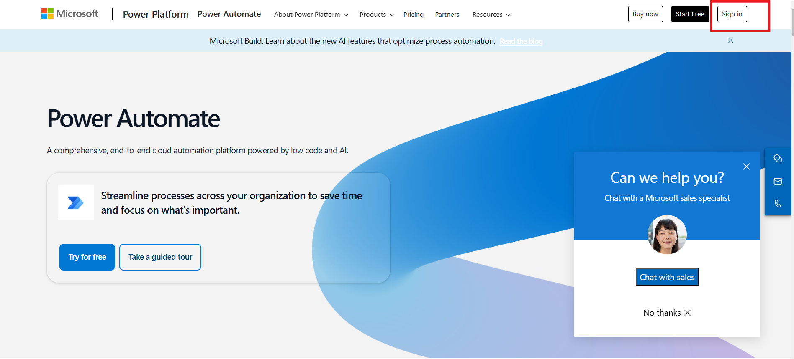

2. Click **My flows** from left pane and then select **Desktop flows**.

    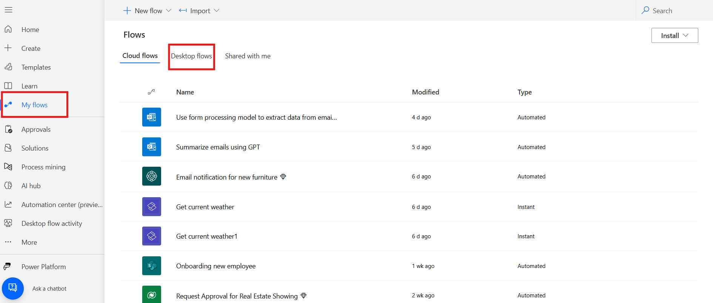

3. On the Desktop flow window select **Start a free trail**. If it required, please enter your admin tenant id and login again.

    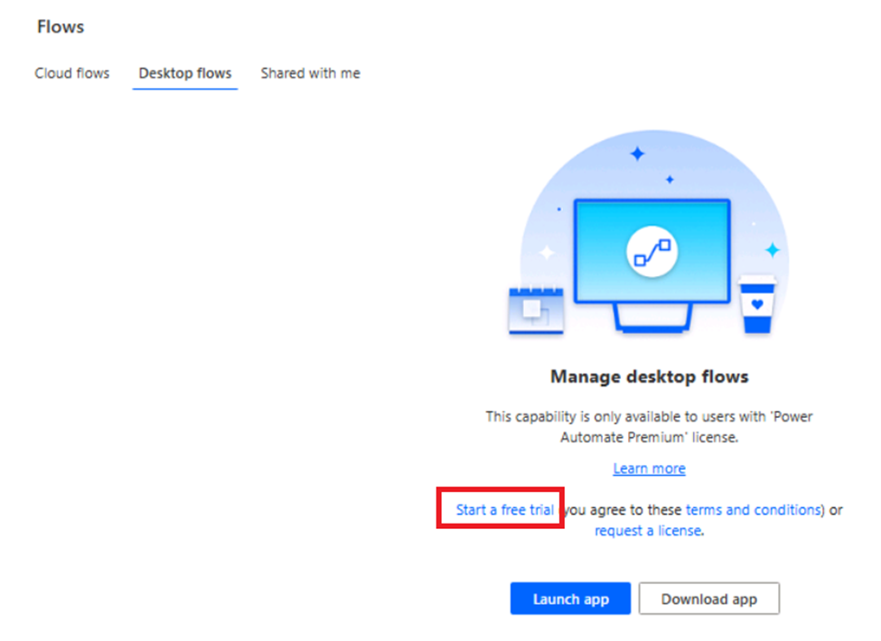

    
5.  Click **My flows** from left pane. Click **Desktop flows** then
    click **Install -> Power Automate for Desktop.**

    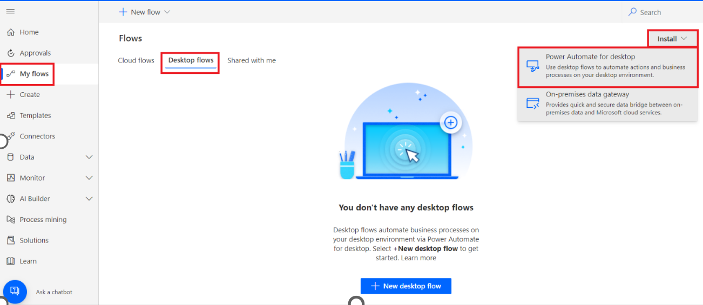

6.  Navigate to **File Explorer** and click **Downloads** from left pane
    then double click **Setup.Microsoft.PowerAutomate.exe**.

    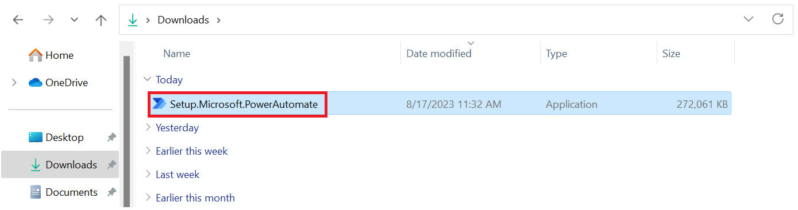

7.  Click **Next** on **Install Power Automate package** pane.

    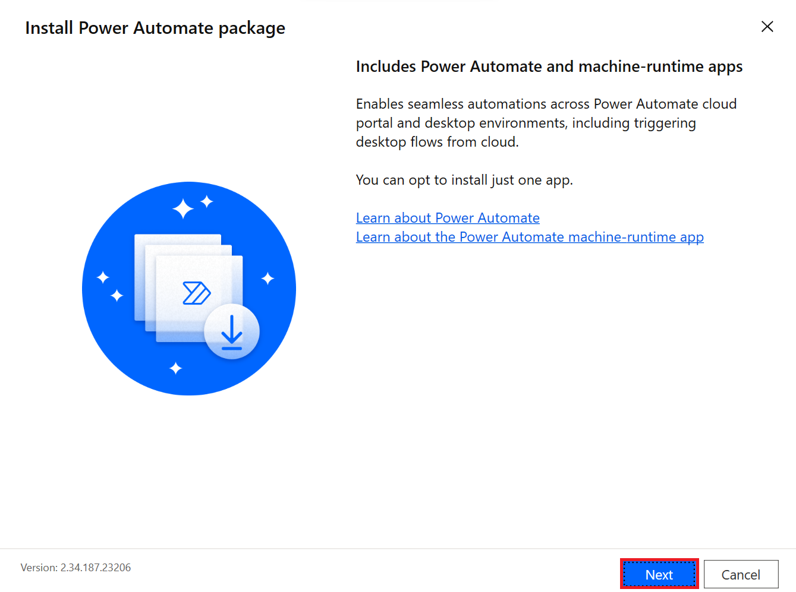

8.  Click check box for **By selecting Install you agree to Microsoft’s
    terms of use**. Click **Install** on Installation details pane.

    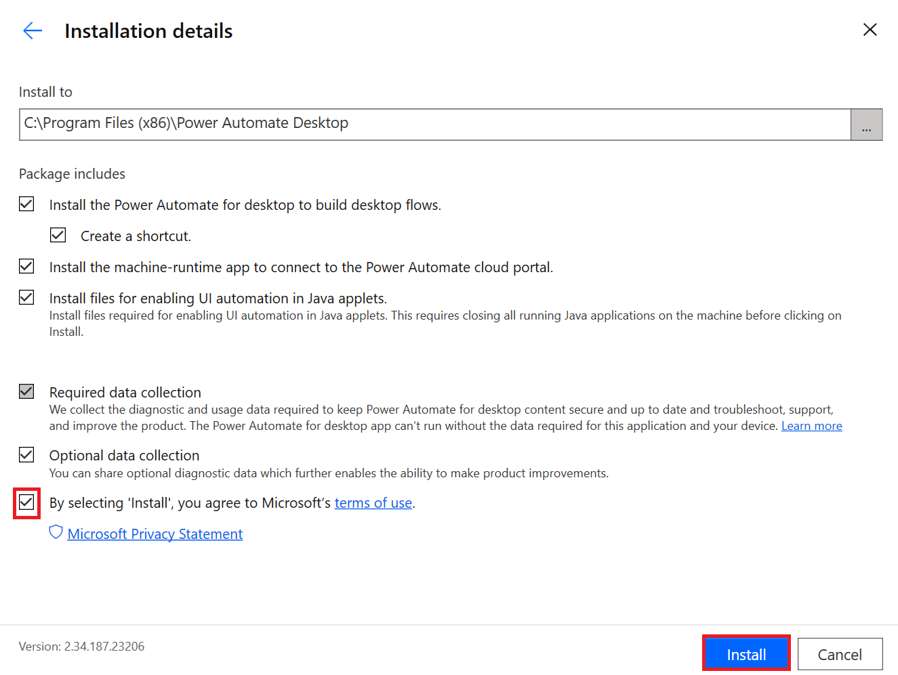

9.  Click **Yes** on Do you want to allow this app to make changes to
    your device? dialog.

    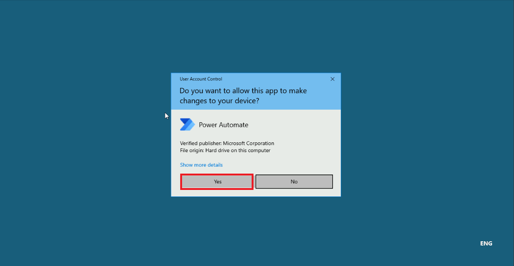

10.  After the installation is finished, select the **hyperlinks** in
    step 1 within the **Installation successful** dialog to navigate to
    a chosen browser(s) to enable Power Automate for desktop extensions.
    After your extensions have been set up, you can launch Power
    Automate for desktop in step 2 within the **Installation
    successful** dialog.

    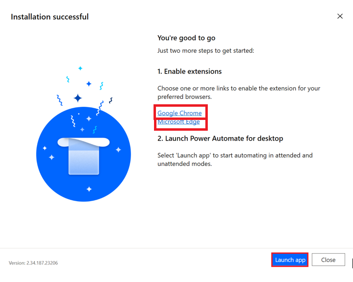

> Note: If the Lauch button is not available, select close and restart you VM.

10. After installation of browser extension select **Launch app**.

    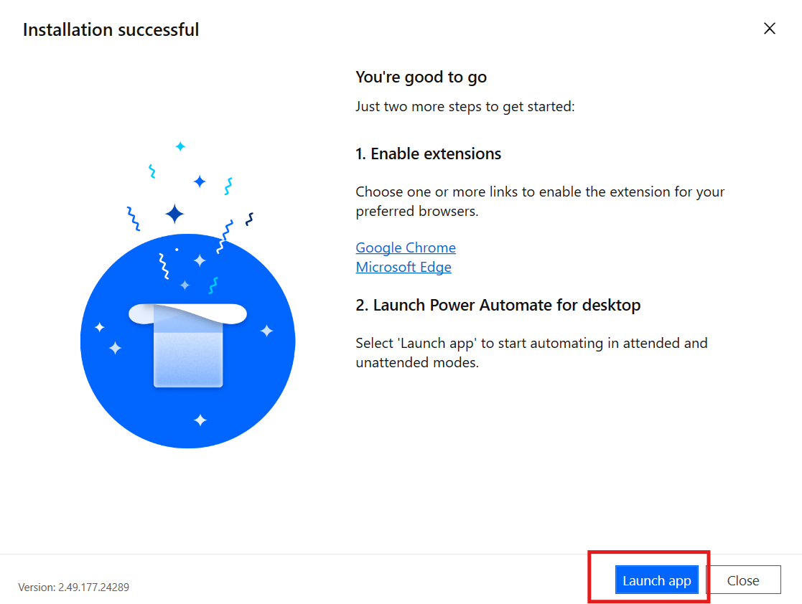

11.  **Sign in** with your Office 365 tenant credentials.

    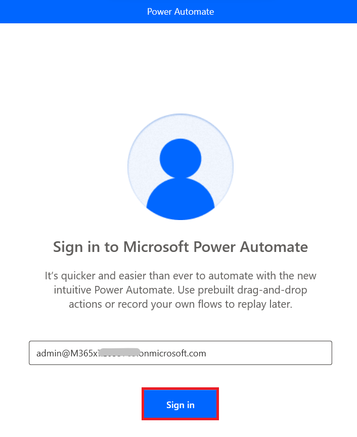

12.  You will be navigated to **Power Automate** for Desktop Home page.

### Conclusion:

In this lab, participants successfully set up the Power
Automate Desktop environment by installing the application, configuring
browser extensions, and logging in with their Office 365 credentials. By
completing the setup process, participants are now ready to use Power
Automate Desktop to automate workflows and tasks. This lab provides the
foundational step to explore automation, ensuring that the environment
is configured correctly for future desktop automation tasks.
