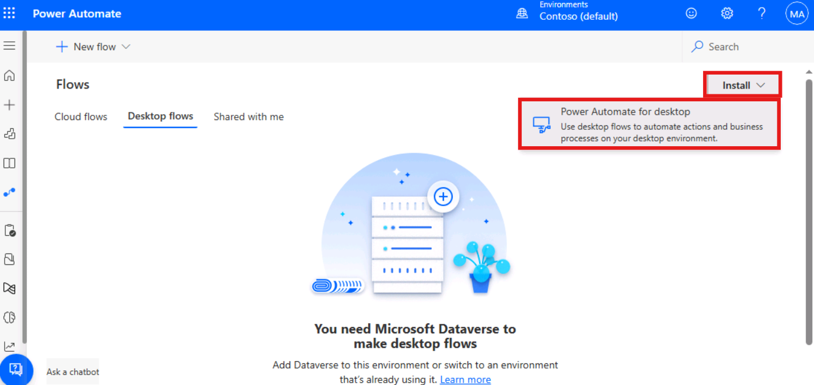
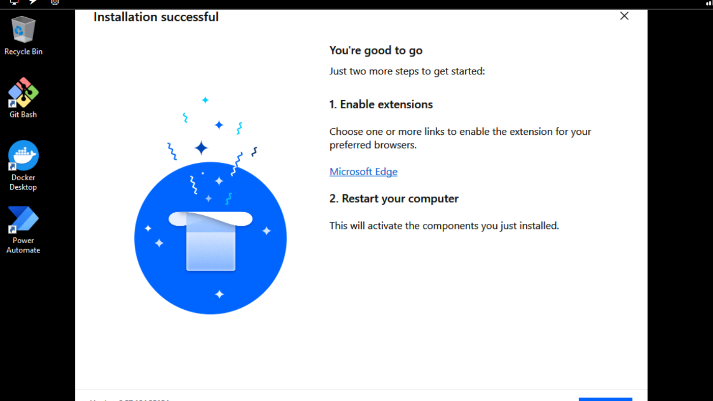
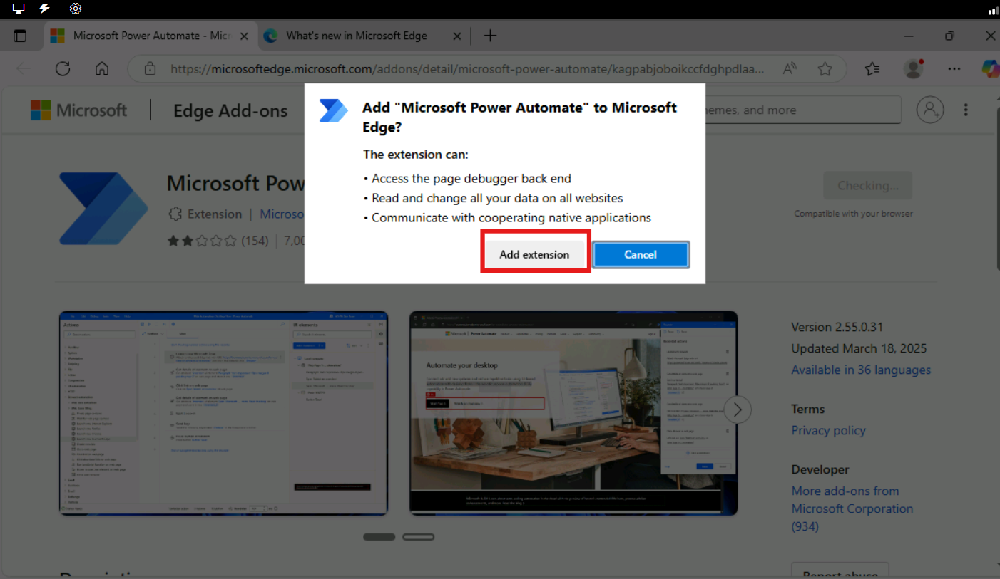
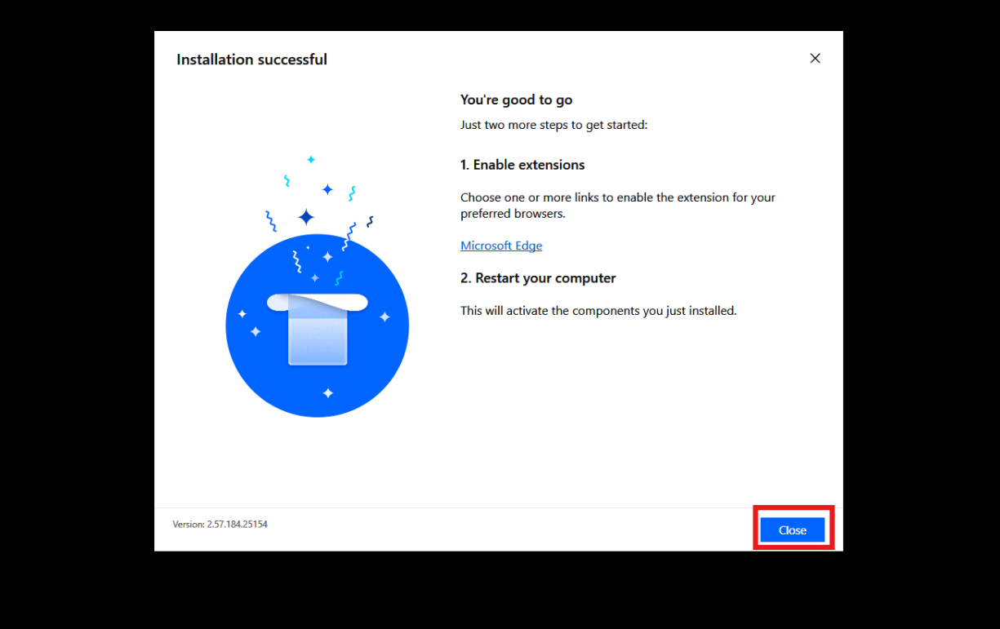
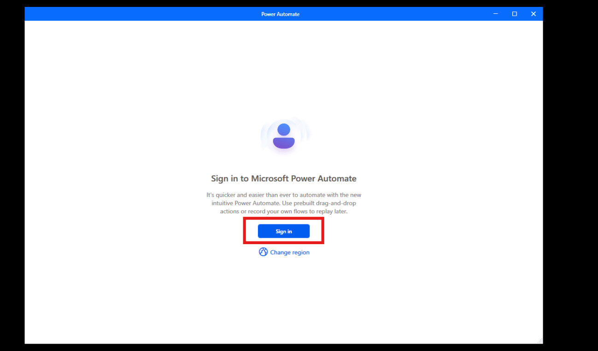
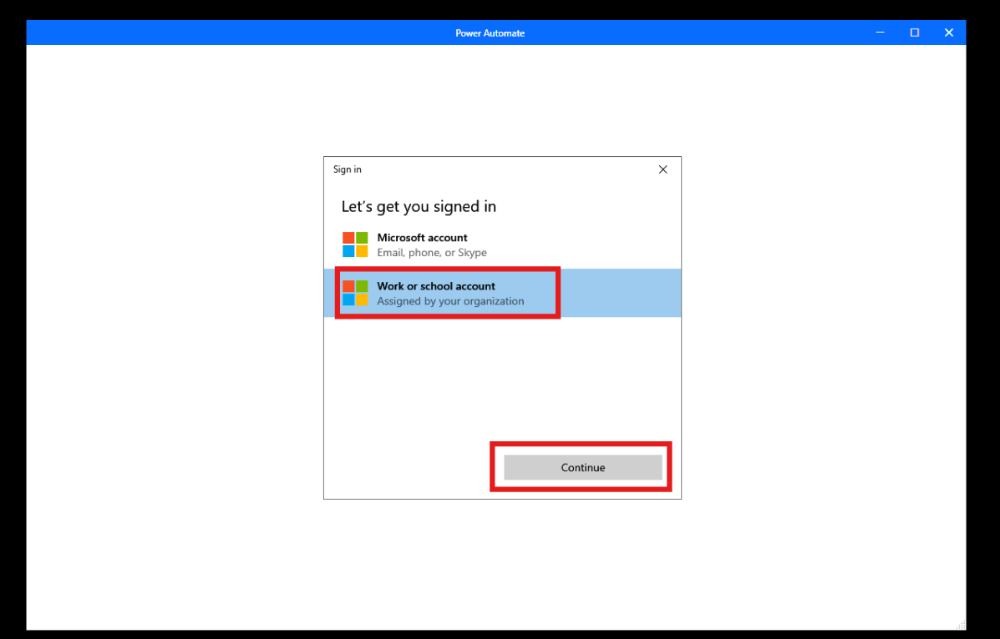
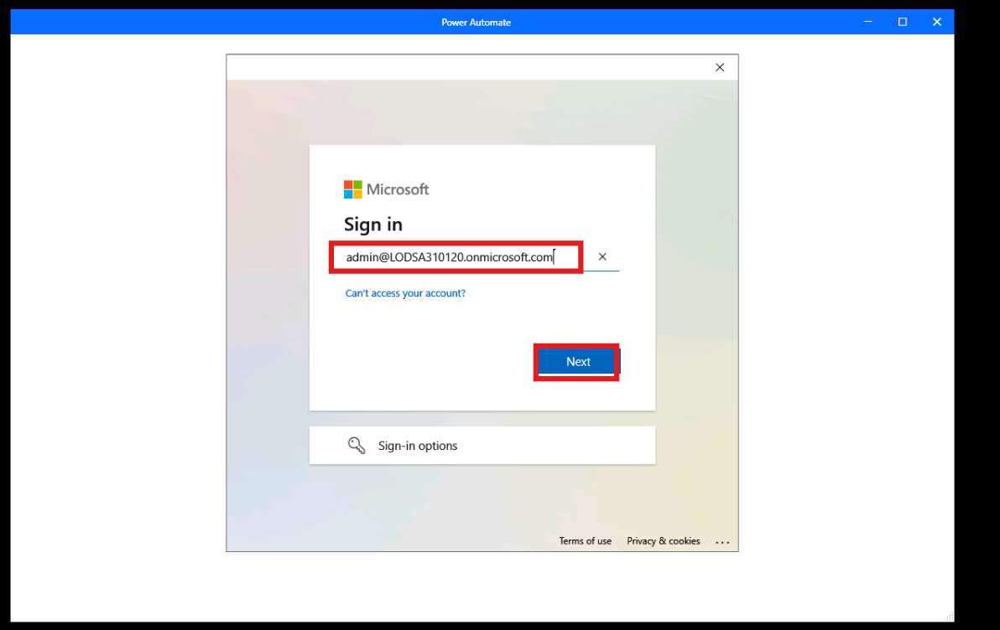
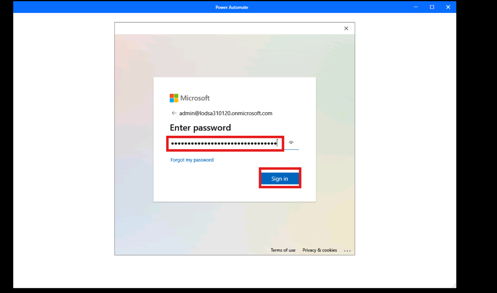
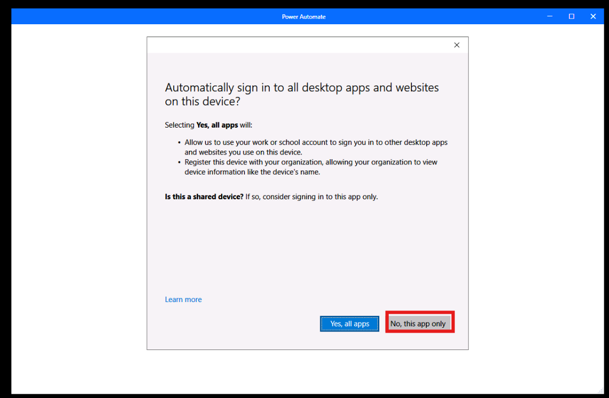
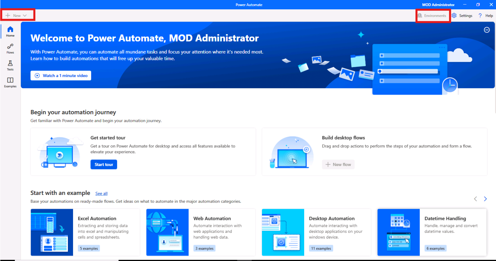

# **Lab 9 - Setting Up Lab Environment for Power Automate Desktop** 

**Objective:** The objective of this lab is to guide participants
through the process of setting up the Power Automate Desktop
environment. By the end of the lab, participants will have successfully
installed Power Automate for Desktop, configured browser extensions, and
logged in with their Office 365 credentials.

**Estimated Time:** 15 mins

### **Task 1 - Sign into Power Automate Desktop application**

1.  Navigate to +++**https://make.powerautomate.com/**+++ and if required, sign in with your Office
    365 tenant credentials.

  
2. Select **My flows** from the left pane and then select **Desktop flows**.

    

3. On the Desktop flow window, if you see **Start a free trial** as shown in the image below then select it . If required, please enter your admin tenant credentials and login again.

    

    
4.  Select **My flows** from the left pane. Click on the **Desktop flows** then
    click on the **Install -> Power Automate for Desktop.**

    

5.  Navigate to the **File Explorer** and select **Downloads** from the left pane
    then double click ont the **Setup.Microsoft.PowerAutomate.exe**.

    

6.  Select **Next** on the **Install Power Automate package** pane.

    

7.  Click the check box for **By selecting Install you agree to Microsoft’s
    terms of use**. Click on the **Install** button on the Installation details pane.

    

8.  Click **Yes** on **Do you want to allow this app to make changes to
    your device?** dialog.

    

9. Click on the **Microsoft Edge** to install microsoft desktop

    

10. Click on the **Get** button to install extension and then click on the **Add extension**.

    

    

11. Navigate back to the Power Automate desktop installation window then click on the **close** button.

    

12. Open the Power Automate desktop app and click on the **Sign in** button.

    

13. Select **Work or school account** type and then click on the **Continue** button.

    

14. Enter then admin tenant credentials in the field and then click on the **Sign in** button.

    

    

15. Click on the **No, this app only** option.

    

16. Wait for few minutes while Power Automate prepares Dataverse. Once the Dataverse installation is complete, the environment becomes active and the + New option is enabled.

    

### Conclusion:

In this lab, participants successfully set up the Power
Automate Desktop environment by installing the application, configuring
browser extensions, and logging in with their Office 365 credentials. By
completing the setup process, participants are now ready to use Power
Automate Desktop to automate workflows and tasks. This lab provides the
foundational step to explore automation, ensuring that the environment
is configured correctly for future desktop automation tasks.
