# Lab 10 - Design a flow to generate username and password​

**Objective:** The objective of this lab is to create and test a Power
Automate Desktop flow that generates a username, and a random password
based on user input. By completing this lab, participants will learn how
to design and automate a flow using Power Automate Desktop actions,
including handling text manipulation and generating random text.

**Estimated Time:** 20 mins

# Task 1: Create a Power Automate Desktop Flow

1.  Login and open **Power Automate Desktop with office 365 tenant** and
    choose an environment (**Contoso**). From the top left corner select
    **+ New flow.**

    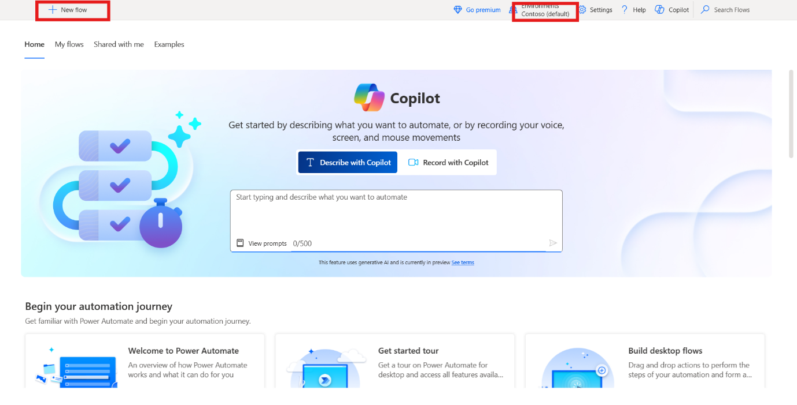

2.  Enter the Flow name +++**Generate Username and Password**+++, turn on
    the **Power Fx** and click on the **Create**.

    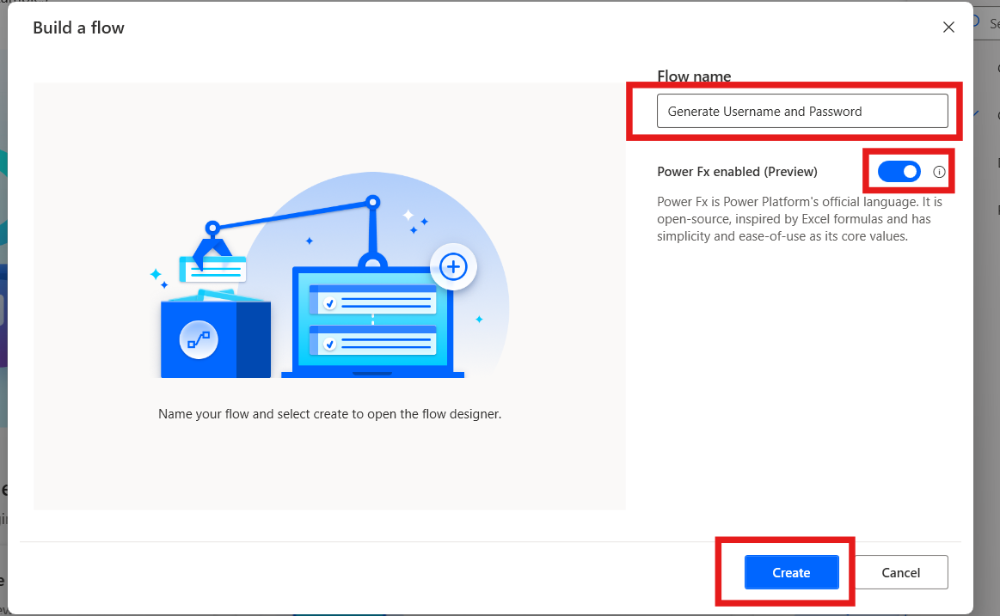

3.  From left Actions bar search +++**Display input dialog**+++ action and
    double click on the action to select.

    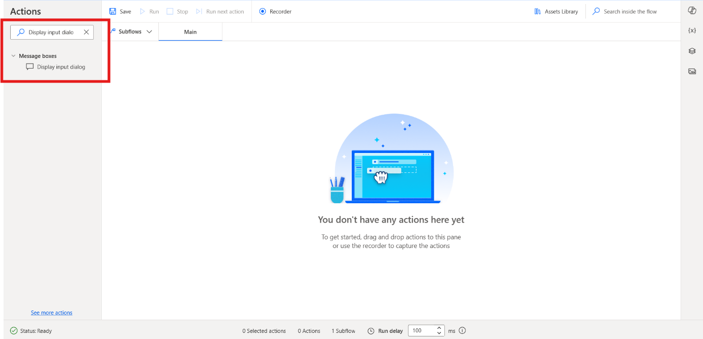

4.  Set the **Input dialog title** property to +++**Name Input**+++ and
    the **Input dialog message** property to +++**Please enter your first
    and last name (for example, Adele Vance)**+++. This action displays a
    message that prompts the user for input. Click on the **Save**
    button.

    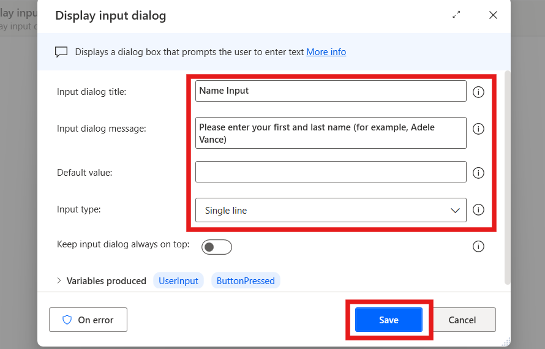

5.  From left Actions bar search +++**Split text**+++ action and double click
    on the action to select.

     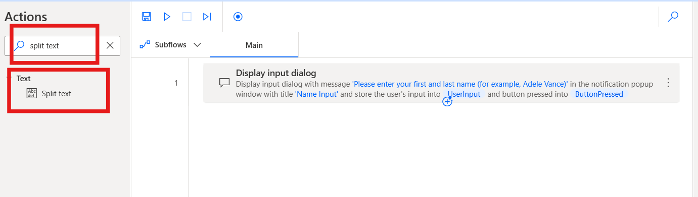

6.  In the **Text to split** field of Split text action,
    enter +++**=UserInput**+++ and then click on **Save**.

    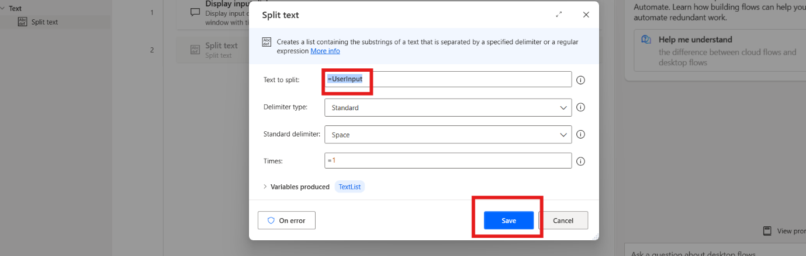

7.  From left Actions bar search +++**Change text case**+++ action and double
    click on the action to select.

    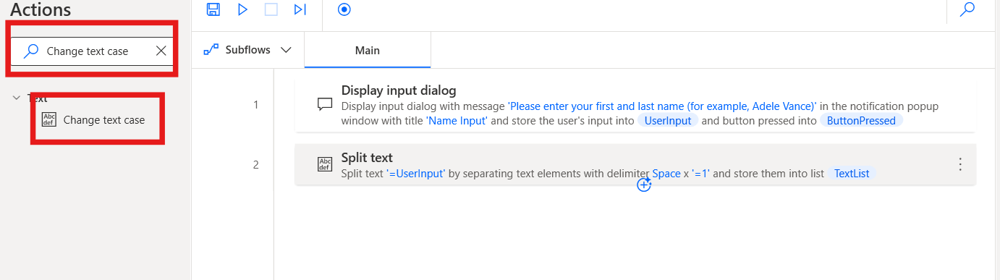

8.  In the Text to convert field, enter +++**%TextList\[0\]%**+++. 

9.  With the index of a list type variable, provide the first item of
    the list, which is the first name. Set the Convert to as **Lower
    case** and then click on the **Save**.

    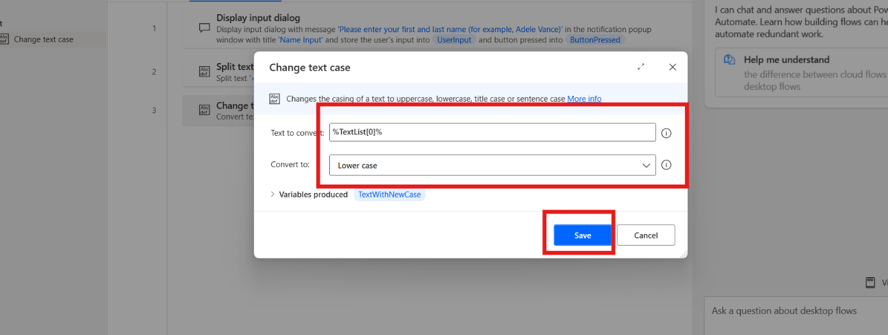

10. From left Actions bar search +++**Change text case**+++ action and double
    click on the action to select.

    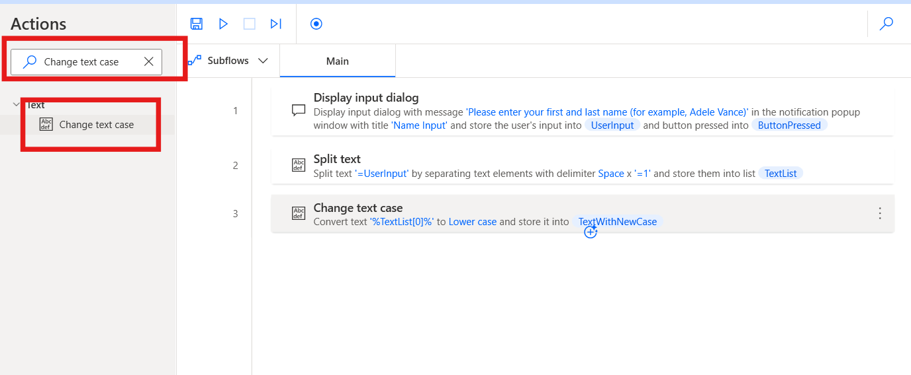

11. In the **Text to convert** field of action, enter
    +++**%TextList[1]%**+++.

12. With the index of a list type variable, provide the first item of
    the list, which is the first name. Set the Convert to property to
    **Lower case** and then click on **Save**.

    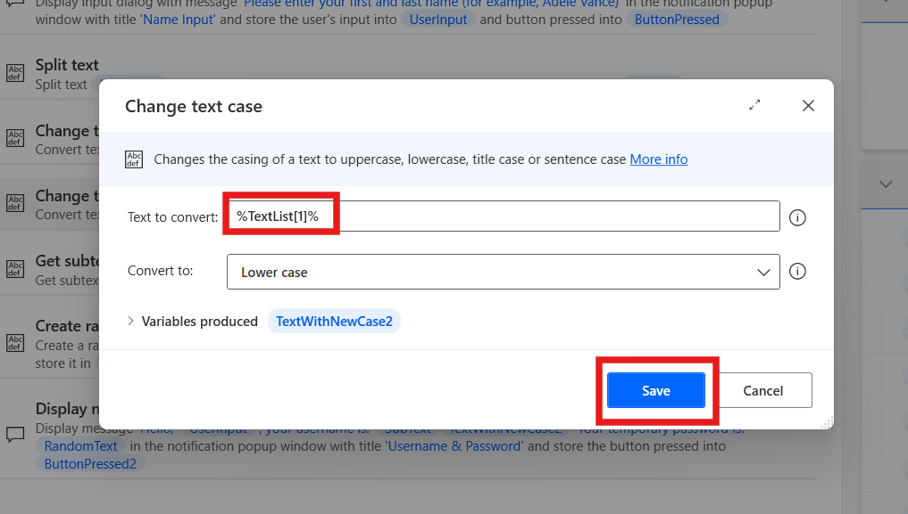

13. From left Actions bar search +++**Get subtext**+++ action and double click
    on the action to select.

    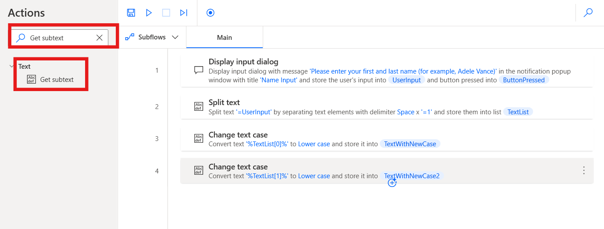

14. In the Original text field, enter +++**%TextWithNewCase%**+++, In the
    Start index section, set Character position to +++**0**+++

15. In the Length section, set Number of chars to +++**1**+++. This setting
    gets the first character of the text string.

16. Click on the **Save**.

    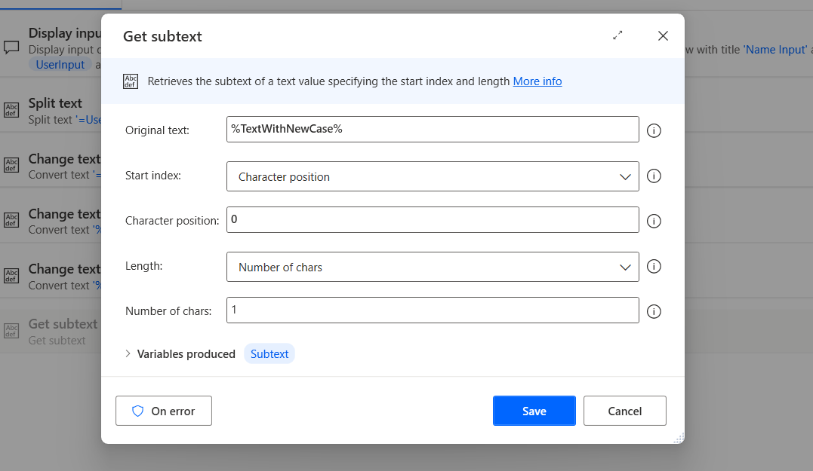

17. To generate a random password, add a **Create random text** action.
    The action’s properties can be left at their default values. Then
    click on **Save.**

    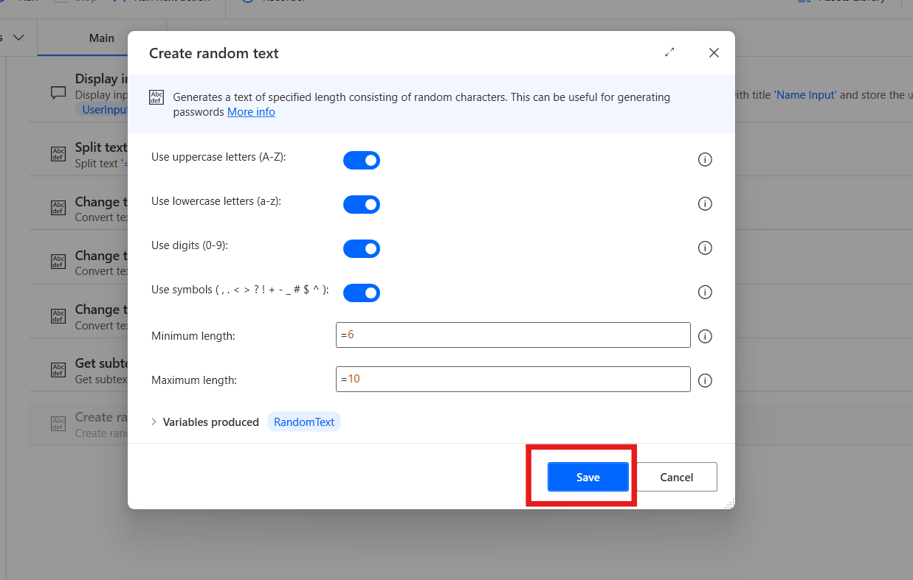

18. From left Actions bar search +++**Display message**+++ action and double
    click on the action to select.

    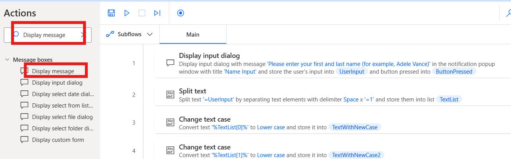

19. In the **Message box title** field, enter +++**Username & Password**+++,
    and in the **Message to display** field, enter the following
    content:

        +++Hello, %UserInput%, your username is: %SubText%%TextWithNewCase2% Your temporary password is: %RandomText%+++

20. The username (first letter of first name, combined with family name)
    is displayed and the result of the **Generate random text** action
    shows as the user’s password. Click on the **save** button.

    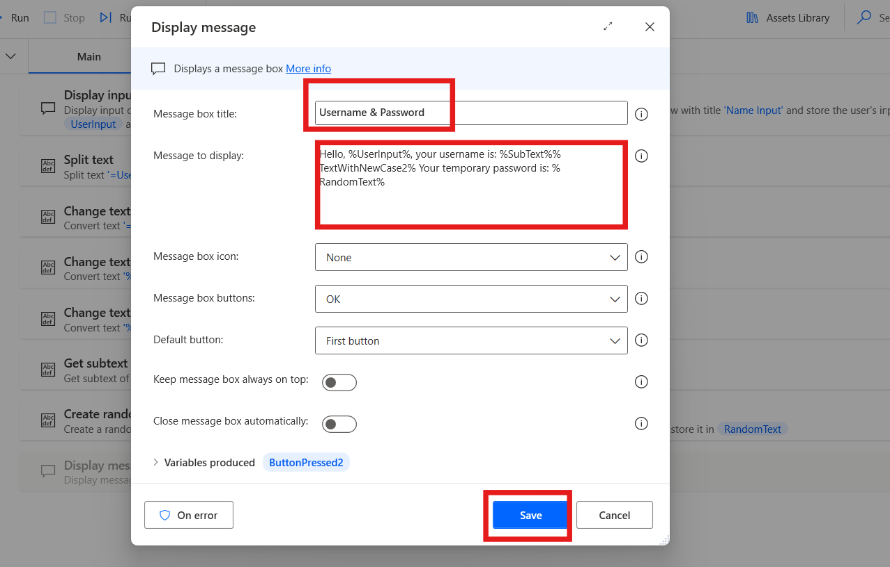

21. The **completed flow** should look like the following figure.

    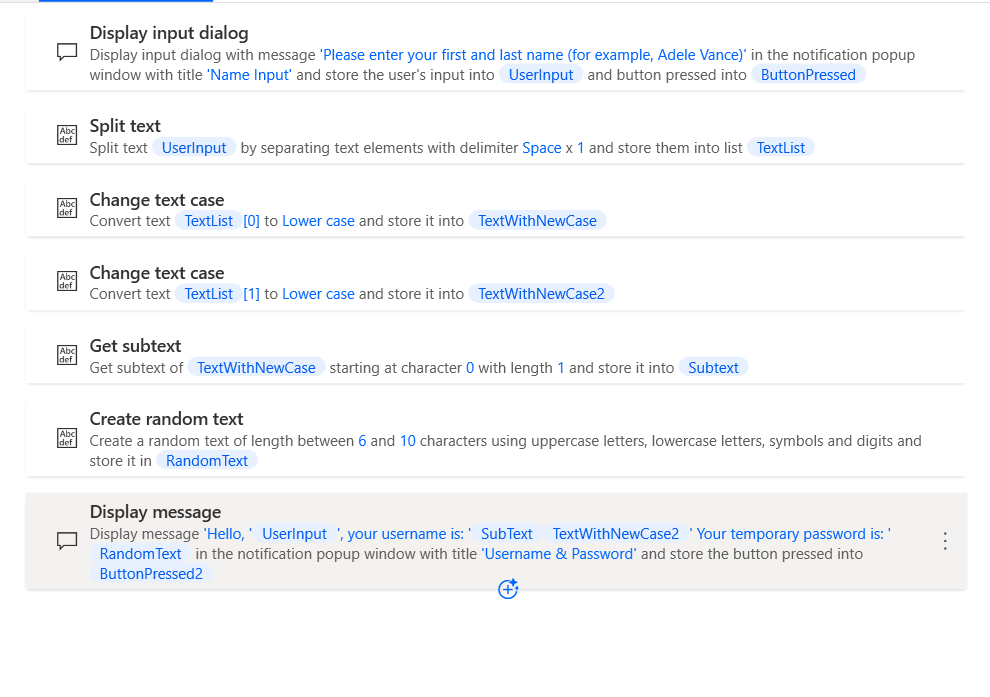

# Task 2: Test the flow

1.  Click on the **Run** button for test the flow.

    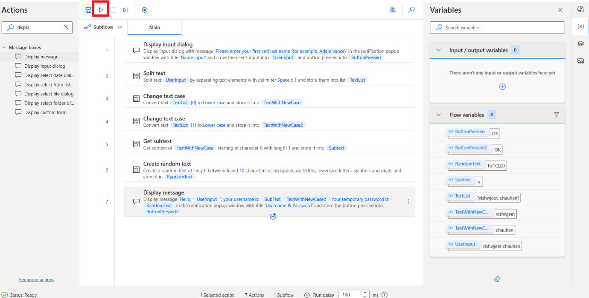

2.  Enter the **First and Last Name** for the testing purpose and click
    on the **Ok** Button.

    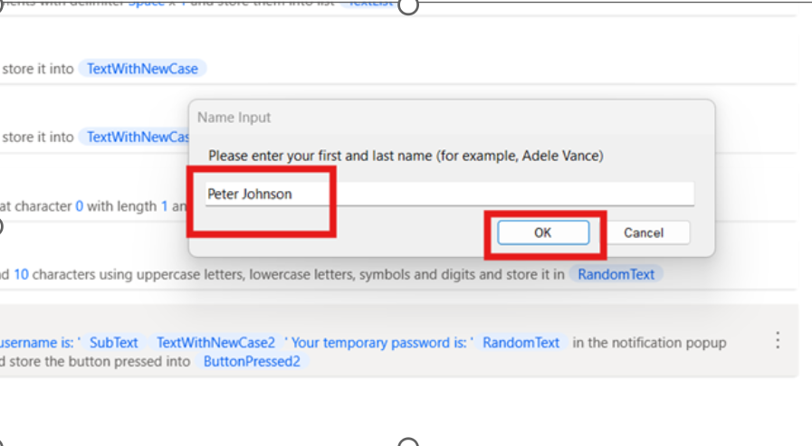

3.  The **Final output** of the test case look like below once.

      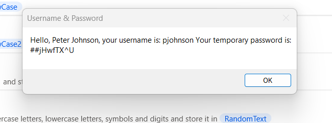

**Conclusion:** In this lab, participants successfully designed and
tested a Power Automate Desktop flow that generates a username and
random password based on user input. By utilizing text manipulation
actions, such as splitting, changing case, and generating random text,
participants gained practical experience in automating user-specific
tasks. The flow demonstrates how to dynamically create a username and
password using basic Power Automate Desktop features. This lab lays
the foundation for building more complex automation flows in future
tasks.
