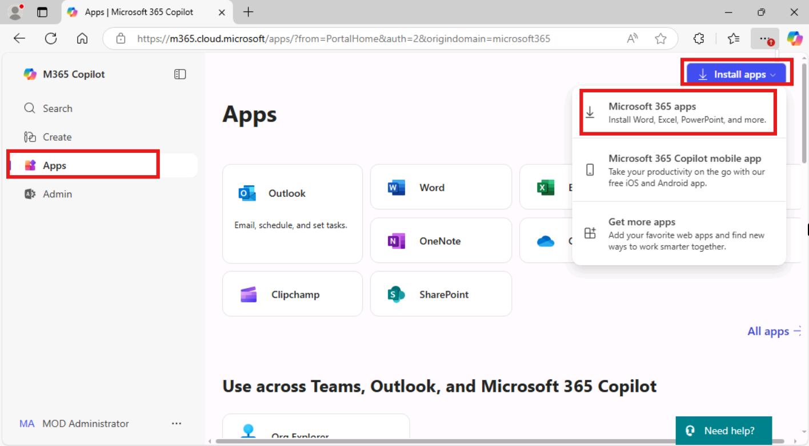

# **Lab 11 - Develop an Attended Flow that Reads Orders and Prompts Users to Select a Discount**

**Objective:** The objective of this lab is to develop an **attended
Power Automate Desktop flow** that automates the process of reading
orders from an Excel file and prompts users to apply a discount based on
certain conditions. Participants will create a flow that reads data,
checks if the order amount exceeds a specific threshold, and prompts the
user to decide whether to apply a discount, with the option to enter the
discount value. The flow will then update the Excel sheet with the
applied discount.

**Estimated Time:** 25 mins

### Task 0: Install Microsoft Excel

1. Open edge browse and navigate to +++https://www.office.com+++ office 365 portal. Enter admin tenant ID and Password in the respected field and click on the **Sign in** button.

    

    

2. Click on the **Yes** button to stay signed in.

    

3. After login, click on the **Apps** from left menu bar the click on the **Install apps** and select **Microsoft 365 apps**. It will navigate to different portal. If required please sign in again.

    

4. Click on the **Install Office** button.

    

5. Navigate to **Download** folder in VM and Click on the **OfficeSetup.exe** and install Office.

    

5. Wait for few minutes while system installing Office 365 in the VM.

    

### Task 1: Create Power Automate desktop flow

1.  Open **Power automate desktop** and login with **office 365 tenant
    credential**.

2.  Choose the environment **Contoso** and click on the **+ New** then
    **Flow** and start creating new flow.

- 

3.  Enter +++**Message Box Communication**+++ as flow name and Confirm that Power Fx enable (Preview) is turn off. Then click on the **Create**.

- 

4.  Start by prompting the user to select an Excel file. Add the +++**Display select file dialog**+++ action and configure the File
    filter field to allow only xlsx files.

- 

5.  Enter +++Select Excel+++ in the **Dialog Title** field, Enter the location of the folder in the **initial folder** as +++C:\LabFiles\Orders+++, filter as +++*.xlsx+++ and then click on the **Save** button.

- 

6.  Before reading any data from the selected file, you have to launch
    it using the **Launch Excel** action. Add +++Launch Excel+++ from the
    action. Then configure the following setting.

    - Launch Excel: **add open the following document**

    - Document path: +++**%SelectedFile%**+++

    - Click on the **save** button

- 

7.  To read the data from the Excel file, search +++**Read from Excel worksheet**+++ action, double click to select action Enter +++**%ExcelInstance%**+++ in the excel instance and select **All available values from worksheet** in the Retrieve field. Click on the **Save** button.

- 

8.  Add the +++**Get first free column/row from Excel worksheet**+++ action to retrieve the first free column and row in the Excel worksheet. Enter +++**%ExcelInstance%**+++ in the Excel instance and then click on the **save** button.

- 

9.  Add +++Set Variable+++ from action named +++Counter+++ and enter +++1+++ into value field and then click on the **save**.

- 

10. Add +++**Display input dialog**+++ from the action and configure the following fields.

    - **Input Dialog Title**: +++**Header**+++

    - **Input Dialog Message**: +++**Enter the Header**+++

    - **Default Value**: +++**Discount**+++

    - Click on the **save** button.

- 

11. Add +++**Write to Excel worksheet**+++ from actions and configure it with following detail:

    - **Excel instance**: +++%ExcelInstance%+++

    - **Value to write**: +++**%UserInput%**+++

    - **Write role**: On specific cell

    - **Column**: +++**9**+++

    - **Row**: +++**%Counter%**+++

    - Click on the **save** button.

- 

12. Add a +++**For each**+++ loop for action to iterate through the retrieved data and add the +++**%ExcelData%**+++ into value to iterate section. Then click on **save**.

- 

13. To check the value of the **Gross** column (column G or the sixth column in the worksheet, in the sheet the name of the column is “6”), add +++**convert text to number**+++ action. Configure text to convert as +++**%CurrentItem\[6\]%**+++ and then click on the **save** button.

- 

14. Add an +++**If**+++ action to check whether it exceeds 100,000 and configure it as below details:

    - **First operand**: +++**%TextAsNumber%**+++

    - **Operator**: Greater than or equal to (\>=)

    - **Second Operand**: +++**100000**+++

- 

15. Add the +++**Display message**+++ action under **If**, to provide the necessary information to the user, and prompt them to choose **Yes** or **No**. Then click on the **Save** button. Enter the following detail in the it:

    - **Message Box title**: +++**Add discount**+++
    - **Message to display**:
      - +++**Product:** %CurrentItem\[2\]%+++
      - +++**Units**: %CurrentItem\[3\]%+++
      - +++**Gross:** %TextAsNumber%+++
    - **Message box button**: Yes – No

- 

16. Add a second +++**If**+++ action under Display message action to check which button was pressed in the previous step. Enter the following details in the respected field and then click on the **Save** button.

- **First** **operand**: +++%ButtonPressed3%+++

- **Operator:** Equal to (=)

- **Second operand:** +++Yes+++

- 

17. Under Second If Add +++**Display Input Dialog**+++ action. Add the given below parameter in the field and click on the **Save** button.

Input dialog title: +++Discount Value+++

Input dialog message: +++Enter the Discount Value+++

18. Add +++**Write to excel worksheet**+++ action below the second **IF** action and enter the following detail into it:

- **Excel instance:** +++%ExcelInstance%+++
- **Value to writer**: +++%UserInput2%+++
- **Write mode:** On specific cell
- **Column:** +++9+++
- **Row:** +++%Counter%+++  
    
  

20. Under First **IF End,** Add action +++**Increase Variable**+++, add variable name as +++**%Counter%**+++ ,Increase by **1** and then click on **Save** button.

> 

21. From the top bar **Save** the flow for the test.  
      
    

# Task 2: Test the Flow

1.  Click on the **Run** button to execute the test.

> 

2.  First sheet folder will open select the **excel** **file** from it.

> 

3.  Header window will pop up, as we set the **Discount** as default click on the **OK** button.

> 

4.  **Add Discount** window appear, which show this product is more then **100000**, select **yes** or **no**. In this test we select **yes** (**yes**, we give discount on this product.)

> 

5.  Then Enter the **Discount Value** For the test we enter +++**10000**+++ and then click **ok**.

> 

6.  In the Sheet the discount value is updated.

7.  The loop is running **continuously** for all the products.

### Conclusion:

In this lab, participants developed an attended Power Automate Desktop
flow that reads order data from an Excel file, checks if the order
amount exceeds a set threshold, and prompts the user to apply a
discount. The flow efficiently automates the decision-making process by
allowing users to interact with the flow through prompts and enter
discount values. This lab provides hands-on experience in automating
tasks involving Excel, user inputs, and conditional logic, empowering
participants to streamline similar business processes using Power
Automate Desktop.
